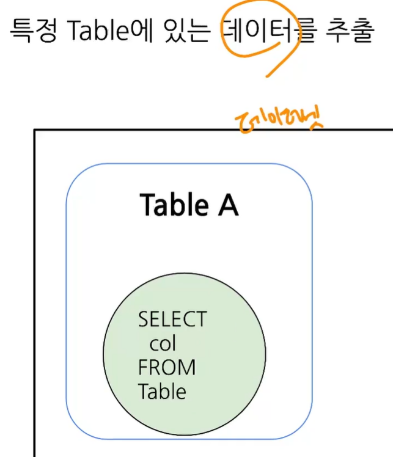
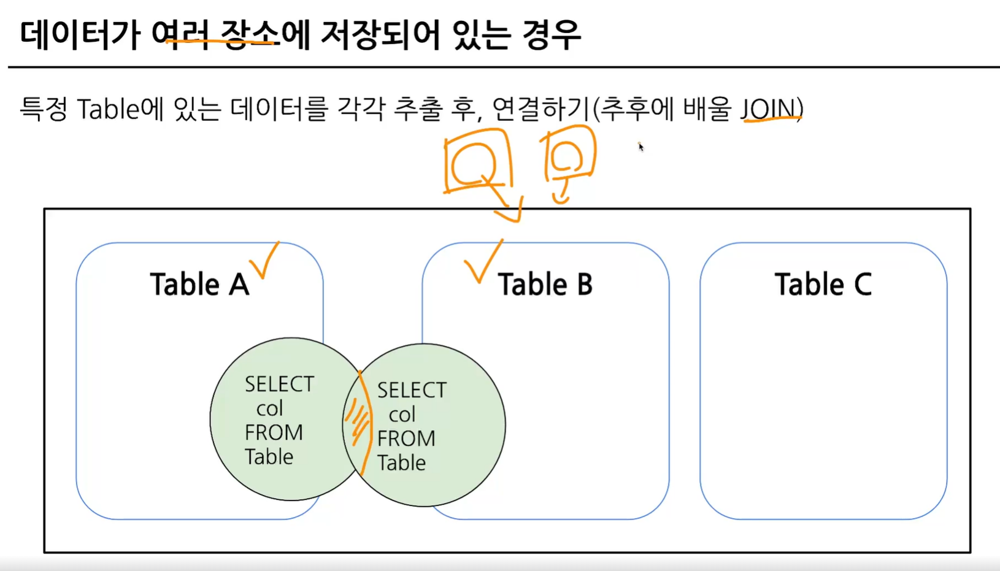
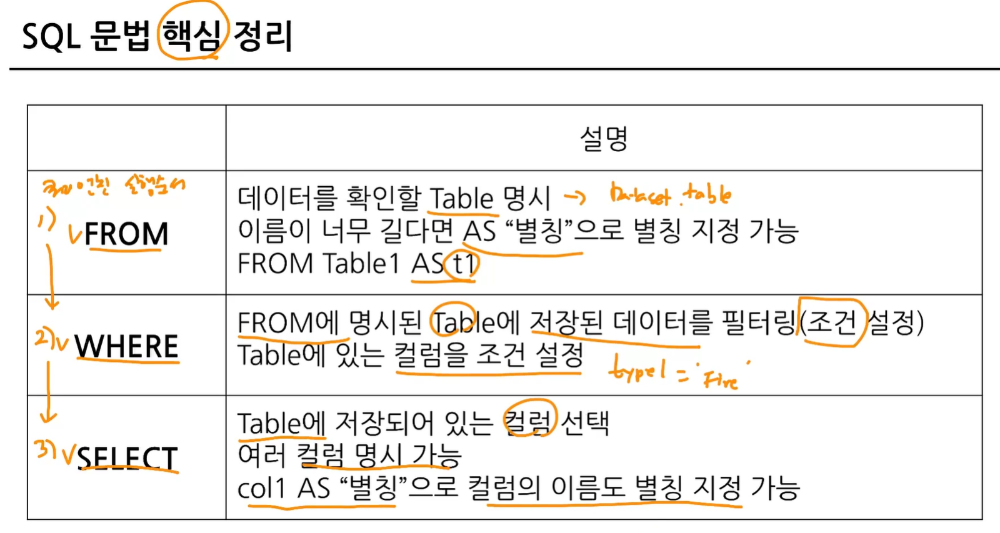
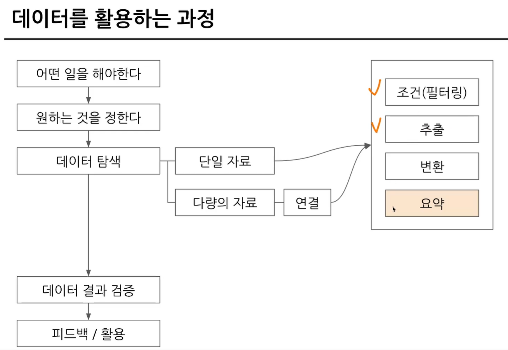
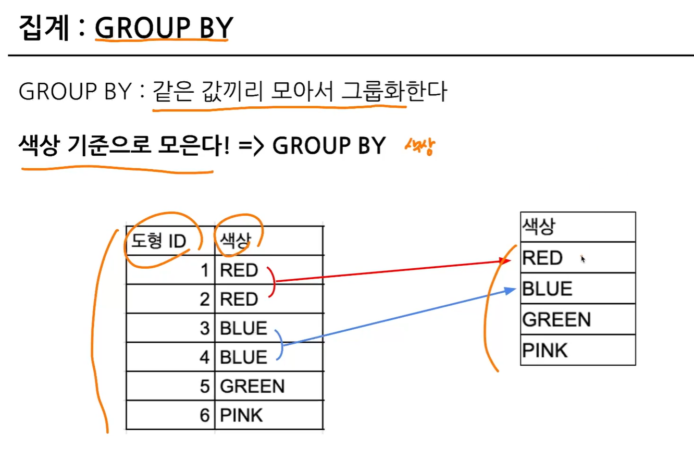
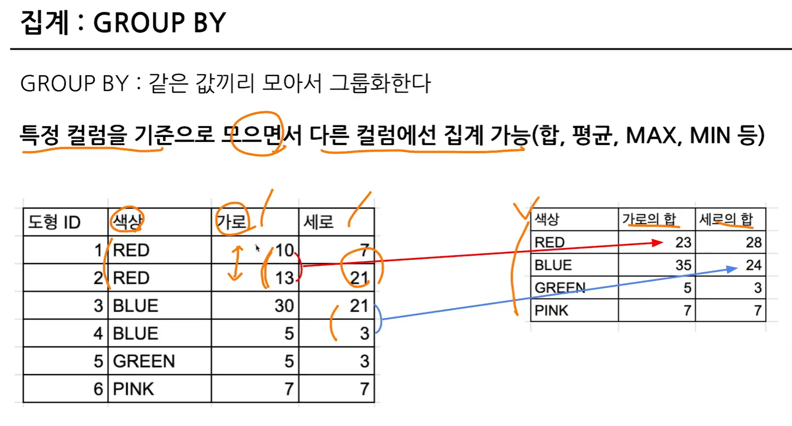
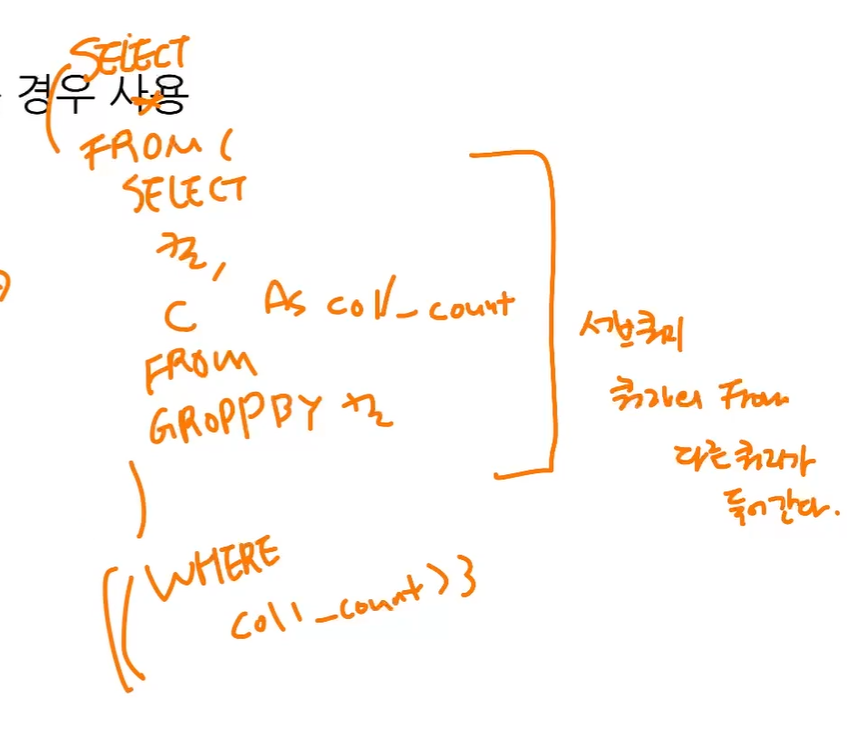
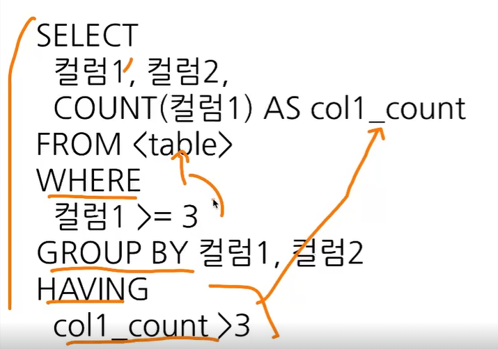

# 2-3. 데이터 탐색 (SELECT, FROM, WHERE)

## 포켓몬으로 SELECT 이해하기

이름/타입/공격력/특징 등의 정보와 데이터를 통해 포켓몬 SELECT 가능.  
Row/Column 별로 데이터베이스 테이블 형태로 데이터 소스 표현 가능.

**SQL 쿼리 구조**  
-> 빅쿼리 또한 SQL(구글 SQL) 사용.

### sql 쿼리문 작성 문법

우선 `SELECT`, `FROM`, `WHERE`

```sql
SELECT
 Col1 AS new_name, -- 'AS'를 통해 컬럼 이름을 변경할 수 있다.
 Col2,
 Col3
FROM Dataset.Table -- 어떤 테이블에서 데이터를 확인할 것인가?
-- 보통은 FROM 뒤에 Table만 입력하나, BigQuery의 경우 Dataset.Table로 작성.
WHERE
 Col1=1
 ```

## 포켓몬 타입이 '불'인 포켓몬을 찾는 SQL 쿼리
```
SELECT
 *
FROM basic.pokemon -- basic은 데이터셋, pokemon은 테이블
WHERE
 type1="Fire"
 ```

"*" : 모든 컬럼을 출력하겠다. (용량/데이터 등을 확인할 때)
-> 행이 적을 때는 크게 이슈 없음, 비용이슈 발생 가능.
-> 데이터 확인 용도로, 빅쿼리에서 '미리보기' 지원.


```

SELECT
 * EXCEPT(제외할 컬럼) -- 몇 칼럼을 제외하고 보고 싶을 때 활용, Join에서도 유용
 ```
 

## 주의할 점
```
SELECT
 id AS "pokemon_id" -- 칼럼 이름에 따옴표를 넣는 경우: 자주하는 실수
 ```

단, WHERE에서는 조건을 명시할 때 따옴표 사용.

## 가독성 있는 쿼리 작성
쿼리를 잘 읽을 수 있으려면 잘 작성해야 함 => 협업할 때 특히 중요!
";"를 기준으로 쿼리가 구분된다. 단, depth가 생겨서 단일 쿼리 추천.


쿼리 엔진 실행 순서: FROM → WHERE → SELECT
(How to 인지: 어디에서 데이터가 있지? → 거기서 어떤 필터를 적용해야 하지? → 필터링한 다음 SELECT에서 컬럼 출력)



## SQL 쿼리 구조 (SELECT-FROM-WHERE)

```
SELECT
 컬럼1,
 컬럼2,
 컬럼3
FROM 테이블
WHERE
 <조건문>
```


# 2-4. 연습 문제

## 1. Trainer 테이블에 있는 모든 데이터를 보여주는 SQL 쿼리를 작성해주세요.

- 1) Trainer 테이블에 어떤 데이터가 있는지 확인  
- 2) Trainer 테이블을 어디에 명시해야 할까? => `FROM`  
- 3) 필터링 조건이 있을까? => 모든 데이터 => 필터링을 할 필요가 없다.  
- 4) 모든 데이터 => 모든 데이터 = 모든 컬럼일 수도 있겠다(추측). 쿼리 작성 => 애매하면 모든 데이터의 정의가 무엇인지 확인 필요.

```sql
SELECT 
 *
FROM `inflearn-bigquery-435811.basic.trainer`
LIMIT 1000;
```

- **FROM 뒤에 있는 부분은 Trainer 테이블을 누르고 쿼리에서 새 탭에서 열기!**

---

## 2. Trainer 테이블에 있는 트레이너의 `name`을 출력하는 쿼리를 작성해주세요.

```sql
SELECT 
 name
FROM basic.trainer;
```

---

## 3. Trainer 테이블에 있는 트레이너의 `name`, `age`를 출력하는 쿼리를 작성해주세요.

```sql
SELECT 
 name,
 age
FROM basic.trainer;
```

---

## 4. Trainer 테이블에서 `id`가 3인 트레이너의 `name`, `age`, `hometown`을 출력하는 쿼리를 작성해주세요.

```sql
SELECT 
 name,
 age,
 hometown
FROM basic.trainer
WHERE id = 3;
```

- **name, age, hometown => 영어로 명시되어 있는 경우엔 편하다.**  
- **현업에서는 이름, 나이를 알려주세요라는 요청이 올 때 컬럼의 의미를 파악해서 작성해야 한다. 어떤 컬럼을 요구하는지 명확히 봐야 한다.**

---

## 5. pokemon 테이블에서 "피카츄"의 공격력과 체력을 확인할 수 있는 쿼리를 작성해주세요.

```sql
SELECT
 attack,
 hp
FROM basic.pokemon
WHERE kor_name = '피카츄';
```

---

## Q. FROM `inflearn-bigquery-435811.basic.trainer`와 FROM basic.pokemon의 차이는 무엇일까?

- **답변**: `FROM \`inflearn-bigquery-435811.basic.trainer\`` 처럼 백틱(```)을 사용해야 구문 오류를 피할 수 있다.


# 2-5. 집계 (GROUP BY + HAVING + SUM/COUNT)

## 1. 들어가며

- **집계하다**: 모을 집, 계산할 계  
  → 모아서(=그룹화) 계산하다  
  → **계산**  
    - 더하기, 빼기  
    - 최대값, 최소값  
    - 평균  
    - 갯수 세기

## 2. 집계
- **집계**: `GROUP BY` - 같은 값끼리 모아서 그룹화한다.

### 집계 예시


- 같은 색상 기준으로 모음 → 같은 색상 중 중복이 되는 칼럼은 합쳐서 나타난다.  
- 특정 칼럼을 기준으로 모을 수 있다.



### 집계 예시: '타입'을 기준으로 그룹화해서 '평균 공격력' 및 '포켓몬 수' 집계
```sql
SELECT
 type1,
 AVG(attack) AS avg_attack,
 COUNT(*) AS pokemon_count
FROM basic.pokemon
GROUP BY type1;
```

## 3. 정렬
- **정렬**: 출력되는 순서를 정할 수 있다. (`ORDER BY`)  
  → 오름차순 (`ASC`) 또는 내림차순 (`DESC`)으로 정렬 가능.
- **집계 후 조건**: `HAVING`을 사용하여 그룹화 후 조건을 걸 수 있다.

### 예시
```sql
SELECT
 generation,
 COUNT(*) AS cnt
FROM basic.pokemon
GROUP BY generation
ORDER BY cnt DESC;
```

## 4. 집계 함수 종류
- `COUNT`: 행(row) 세기
- `COUNTIF`: 특정 조건의 행(row) 세기

### DISTINCT: 고유값 추출
- **DISTINCT**: 고유값만 보고 싶은 경우 사용.

```sql
SELECT
 COUNT(DISTINCT user_id) AS unique_users
FROM basic.pokemon;
```

## 5. 연습문제

### 1) pokemon 테이블에 있는 포켓몬 수를 구하는 쿼리
```sql
SELECT
 COUNT(id) AS cnt,
 COUNT(*) AS cnt2
FROM basic.pokemon;
```

### 2) 세대별 포켓몬 수를 구하는 쿼리
```sql
SELECT
 generation,
 COUNT(id) AS cnt
FROM basic.pokemon
GROUP BY generation;
```

## 6. 그룹화(집계) 활용 포인트
- 데이터 분석 시, 그룹화는 일자별, 연령대별, 특정 타입별, 앱 화면별 등 다양하게 활용 가능.

## 7. WHERE vs HAVING

### WHERE
- 테이블 원본 데이터에 바로 조건 설정

```sql
SELECT
 컬럼1, 컬럼2,
 COUNT(컬럼1) AS col_count
FROM <table>
WHERE 컬럼1 >= 3;
```

### HAVING
- 그룹화 후 조건 설정

```sql
SELECT
 컬럼1, 컬럼2,
 COUNT(컬럼1) AS col1_count
FROM <table>
GROUP BY 컬럼1, 컬럼2
HAVING col1_count > 3;
```

```
다음처럼 서브 쿼리를 활용하는 부분을 HAVING을 이용해서 쉽게 표현이 가능.
```

```
최종적으로 WHERE과 HAVING의 차이를 보여주는 쿼리.
```
## 8. LIMIT
- 결과 Row 수를 제한 (`LIMIT`)  
  → `ORDER BY`와 함께 사용 가능.

```sql
SELECT
 col
FROM Table
LIMIT 10;
```

## 9. 연습문제

### 1) 타입별 포켓몬 수를 집계하고, 포켓몬 수가 10 이상인 타입만 남기고 포켓몬 수가 많은 순으로 정렬하는 쿼리
```sql
SELECT
 type1,
 COUNT(id) AS cnt
FROM basic.pokemon
GROUP BY type1
HAVING cnt >= 10
ORDER BY cnt DESC;
```


