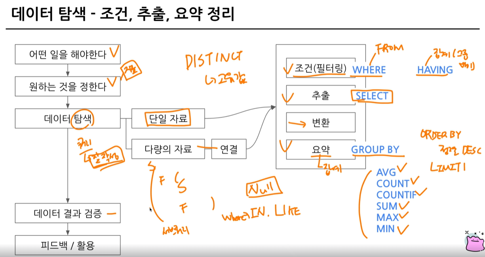
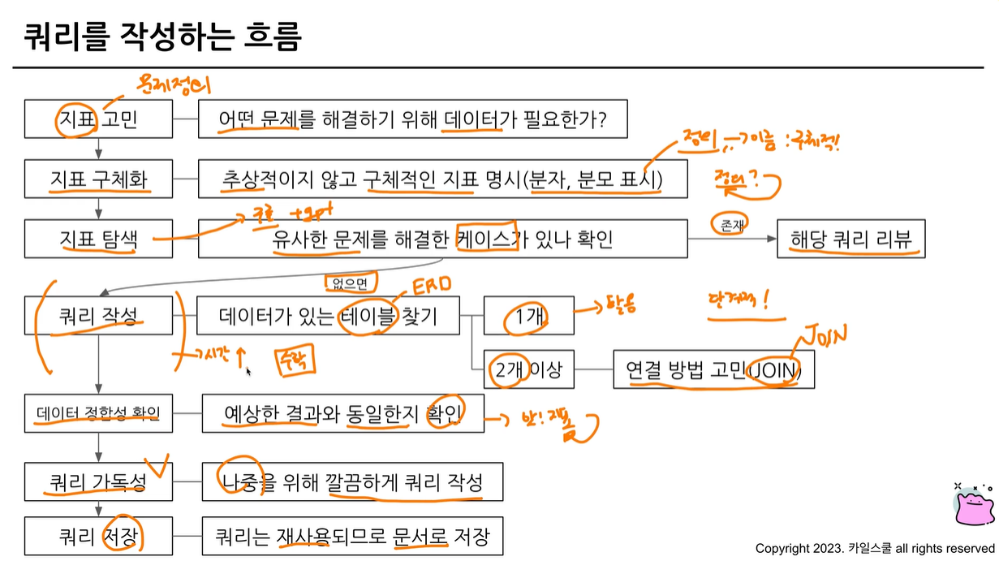
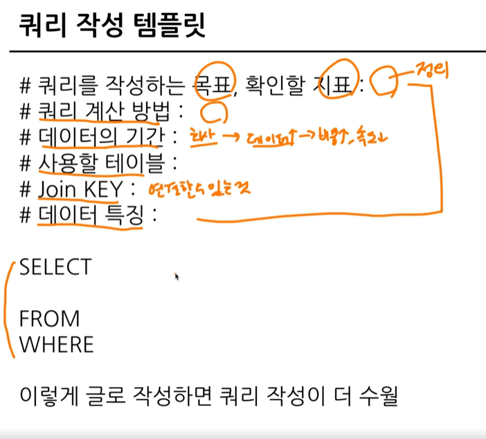

# 연습문제
 ## 1. 포켓몬 중에 type2가 없는 포켓몬의 수를 작성하는 쿼리.
```
(힌트) -가 없다 : 칼럼 IS NULL

*TIP
-조건 : type2(null, ice, dark..)가 없는
-> null : 아무것도 없는 값, 값이 존재하지 않을 때, 0과는 다른 개념, null은 다른 값과 직접 비교할 수 없음 // NULL은 IS 연산자를 사용한다!
=> type2 IS NULL / type2 IS NOT NULL
-어떤 테이블? pokemon
-어떤 컬럼
-어떻게 집계 : 포켓몬의 수 -> COUNT
```
```
SELECT
 *
FROM basic.pokemon
WHERE
 type2 IS NULL

SELECT
 COUNT(id) AS cnt
FROM basic.pokemon
WHERE
 type2 IS NULL

where 절에서 여러 조건을 연결하고 싶은 경우 -> and 조건 사용

SELECT
 COUNT(id) AS cnt
FROM basic.pokemon
WHERE
 type2 IS NULL
 AND type1="Fire"

or 조건 => ( ) OR ( ) 
```

## 2. type2가 없는 포켓몬의 type1과 type1의 포켓몬 수를 알려주는 쿼리.
단, type1의 포켓몬 수가 큰 순으로 정렬하기
```
테이블 : pokemon
조건 : type2가 없는 포켓몬
칼럼 : type1
집계 : 포켓몬 수 -> count
정렬 : type1의 포켓몬 수가 큰 순으로 정렬 -> order by, 내림차순(desc)
```
```
SELECT
 type1, 
 COUNT(id) AS cnt  // 집계 함수는 Group by와 같이 다님. 단, 집계하는 기준(칼럼)이 없으면 count만 쓸 수 있으나, 집계하는 기준이 있담녀 그 기준 칼럼을 group by에 써줘야 한다.
FROM basic.pokemon
WHERE
 type2 IS NULL
GROUP BY
 type1
ORDER BY
 pokemon_cnt DESC
```
## 3. type2 상관없이 type1의 포켓몬 수를 알 수 있는 쿼리
```
테이블 : pokemon
조건 : type2 상관없이 -> 조건인가 아닌가? -> 아님.
컬럼 : type1
집계 : 포켓몬 수 => count
```
```
SELECT
 type1,
 COUNT(id) AS pokemon_cnt // distinct id는 unique만. 애초에 id는 중복이 없게 설계됐으므로 distinct를 쓰든, 안 쓰든 결과는 same.
FROM basic.pokemon
GROUP BY
 type1
```
## 4. 전설 여부에 따른 포켓몬 수를 알 수 있는 쿼리.
```
테이블 : pokemon
조건 : 전설 여부 -> 컬럼
컬럼 : 전설(is_legendary)
집계 : 포켓몬 수
```
```
SELECT
 is_legendary,
 COUNT(id) AS pokemon_cnt
FROM basic.pokemon
 is_legendary
```
tip!
group by에 컬럼이 많이 있거나 그럴 때, 컬럼 번호로 대체O.

## 5. 동명이인이 있는 이름은 무엇일까요?
```
테이블 : trainer
조건 : 같은 이름이 2개 이상(동명이인)
칼럼 : 이름
집계 : count
```
```
SELECT
 name
 COUNT(name) AS trainer_cnt
FROM basic.trainer
GROUP BY
 name
HAVING
 trainer_cnt >=2
```
* where : 원본 데이터 from 절에 있는 데이터에 조건을 설정하고 싶은 경우
having : group by와 함께 집계 결과에 조건을 설정하고 싶은 경우
```
--서브쿼리 : 쿼리문을 한 번 감싸서 다른 쿼리문에서 사용할 수 있음.

SELECT
*
FROM(
SELECT
 name
 COUNT(name) AS trainer_cnt
FROM basic.trainer
GROUP BY
 name
)
WHERE
 trainer_cnt >=2
```
## 6. trainer 테이블에서 "Iris" 트레이너의 정보를 알 수 있는 쿼리.
```
테이블 : trainer
조건 : name = "Iris"
컬럼 : 정보-> 모든 컬럼
집계 : X
```
```
SELECT
 *
FROM basic.trainer
WHERE
 name = "Iris"
```
## 7. trianer 테이블에서 "Iris", "Whitney", "Cynthia" 트레이너의 정보를 알 수 있는 쿼리. 
```
힌트 : 컬럼 in ("Iris", "Whitney", "Cynthia")
테이블 : trainer
조건 : 이름 = "Iris", "Whitney", "Cynthia"
컬럼 : 정보 -> x
집계 : X
```
```
SELECT
 *
FROM basic.trainer
WHERE
 (name="Iris")
OR (name="Whitney")
OR (name="Cynthia")

=> OR 조건으로 쓰는 거 너무 길다 => IN => name에서 괄호 안의 Value가 있는 Row만 추출
name IN ("Iris", "Whitney", "Cynthia")
```
## 8. 전체 포켓몬 수는 어떻게 되나
```
테이블 : pokemon
집계 : 포켓몬 수 -> COUNT(name) -> COUNT(id)
```
```
SELECT
 COUNT(id) AS pokemon_cnt
FROM basic.pokemon
```
## 9. 세대별로 포켓몬 수가 얼마나 되는지 알 수 있는 쿼리.
```
테이블 : pokemon
조건 : X
컬럼 : 세대
집계 : 포켓몬 수 -> count
```
```
SELECT
 generation,
 COUNT(id) AS pokemon_cnt
FROM basic.pokemon
GROUP BY
 generation
```
## 10. type2가 존재하는 포켓몬의 수
```
테이블 : pokemon
조건 : type2가 존재하는 -> type2 IS NOT NULL
컬럼 : x
집계 : 포켓몬의 수 -> COUNT
전체 116행 -> COUNT(id) 
```
```
SELECT
 COUNT(id) AS pokemon_cnt
FROM basic.pokemon
WHERE
 type2 IS NOT NULL
```
## 11. type2가 있는 포켓몬 중에 제일 많은 type1은 무엇인가?
```
테이블 : pokemon
조건 : type2가 있는
컬럼 : type1
집계 : 제일 많은 -> count
```
```
SELECT
 type1,
 COUNT(id) AS pokemon_cnt
FROM basic.pokemon
WHERE type2 IS NOT NULL
GROUP BY
 type1
ORDER BY
 pokemon_cnt DESC
LIMIT 1 # 하나만 가져와라
```
## 12. 단일(하나의 타입만 있는) 타입 포켓몬 중 많은 type1은 무엇인지
```
테이블 : pokemon
조건 : 단일 타입 -> 하나의 타입만 존재 -> type2 is null
컬럼 : type1
집계 : count
```
```
SELECT
 type1,
 COUNT(id) AS pokemon_cnt
FROM basic.pokemon
WHERE
 type2 IS NULL
GROUP BY
 type1
ORDER BY
 pokemon_cnt DESC
LIMIT 1
```
## 13. 포켓몬의 이름에 "파"가 들어가는 포켓몬은 어떤 포켓몬이 있을까? 
```
힌트 : 컬럼 LIKE "파%"
테이블 : pokemon
조건 : name에 "파"가 들어가는 포켓몬
컬럼 : 어떤 포켓몬이 있을까? -> name
집계 : 없음
```
```
SELECT
 kor_name
FROM basic.pokemon
WHERE
 kor_name LIKE "%파%"
```
```
*컬럼 LIKE "특정단어%" : %는 앞에도 붙을 수 있고, 뒤에도 붙을 수 있다. 
"%파" : 파로 끝나는 단어, "파%" : 파로 시작하는 단어. "%파%" : 파가 들어간 단어

=> 문자열 컬럼에서 특정 단어가 포함되어 있는지 알고 싶은 경우엔 LIKE를 사용하면 편하다!
```
## 14. 뱃지가 6개 이상인 트레이너는 몇 명이 있나요?
```
테이블 : trainer
조건 : 뱃지 >= 6 -> (badge_count >=6)
집계 : 트레이너의 수(COUNT)
```
```
SELECT
 COUNT(id) AS trainer_cnt
FROM basic.trainer
WHERE
 badge_count >=6
```
## 15. 트레이너가 보유한 포켓몬이 제일 많은 트레이너는 누구일까요?
```
테이블 : trainer_pokemon
조건 : X
컬럼 : trainer_id
집계 : 포켓몬의 수 -> count
```
```
SELECT
 trainer_id,
 COUNT(pokemon_id) AS pokemon_cnt
FROM basic.trainer_pokemon
GROUP BY
 trainer_id
```
## 16. 포켓몬을 많이 풀어준 트레이너는 누구일까?
```
테이블 : trainer_pokemon
조건 : status = "Released"(풀어준)
컬럼 : trainer_id
집계 : 많이 풀어준 -> count
```
```
SELECT
 trainer_id,
 COUNT(pokemon_id) AS pokemon_cnt
FROM basic.trainer_pokemon
WHERE
 status = "Released"
GROUP BY
 trainer_id
```
## 17. 트레이너 별로 풀어준 포켓몬의 비율이 20%가 넘는 포켓몬 트레이너는 누구일까요? 풀어준 포켓몬의 비율 = (풀어준 포켓몬 수/전체 포켓몬 수)  
```
힌트 : countif(조건)
테이블 : trainer_pokemon
조건 : 풀어준 포켓몬의 비율이 20%가 넘어야 한다.
컬럼 : trainer_id
집계 : countif
--countif(조건) : countif(컬럼 = "3")
```
```
SELECT
 trainer_id,
 COUNTIF(status = "Released") AS released_cnt, 
 COUNT(pokemon_id) AS pokemon_cnt
 COUNTIF(status="Released")/COUNT(pokemon_id) AS released_ratio
FROM basic.trainer_pokemon
GROUP BY
 trainer_id
HAVING
 released_ratio >= 0.2
```

# 2-7. 정리


# 2-8. 
Group by all
-> group by에서 일일이 컬럼 명시했어야 하는 불편함 감소!

# 3-1.
```
[다룰 내용]
-sql 쿼리 작성하는 흐름
-쿼리 작성 템플릿과 생산성 도구(테이블, 조건 일일이 쓰는 거 불편)
-오류를 디버깅하는 방법
```
# 3-2. 쿼리를 작성하는 흐름

```
지표 구체화 - 우리가 해결해야 하는 문제의 정의 구체화.
Ex. 어떤 컬럼은 어떤 value만 써야한다..

지표 탐색 - 없을 경우 구글/GPT에서 탐색 
데이터 정합성 확인해야 하는 이유 : 맞는 지표를 뽑지 않았을 때 다시 지표를 
재정의해야하는 이슈가 발생할 수 있으므로 !
```
# 3-3. 쿼리 작성 템플릿과 생산성 도구


```
espanso !
-> 특정 단어가 감지되면 정의된 것으로 바꿔주는 것
```


