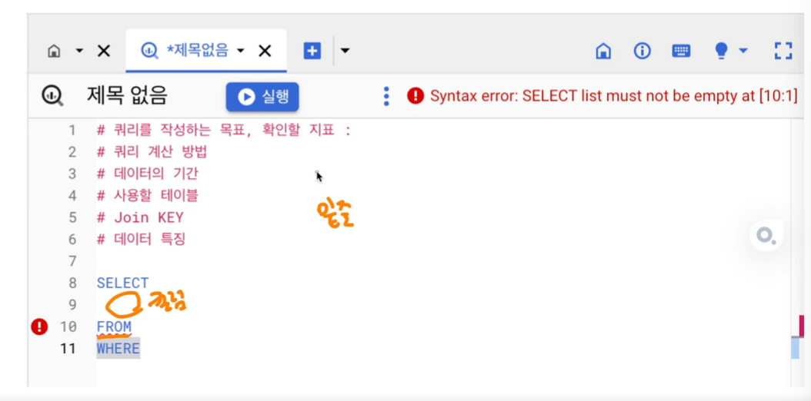
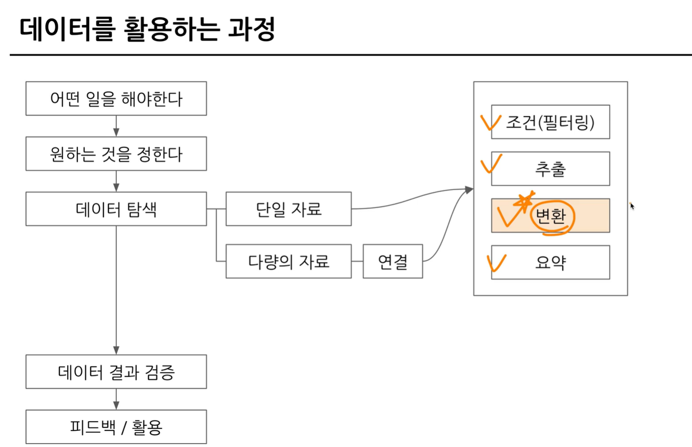
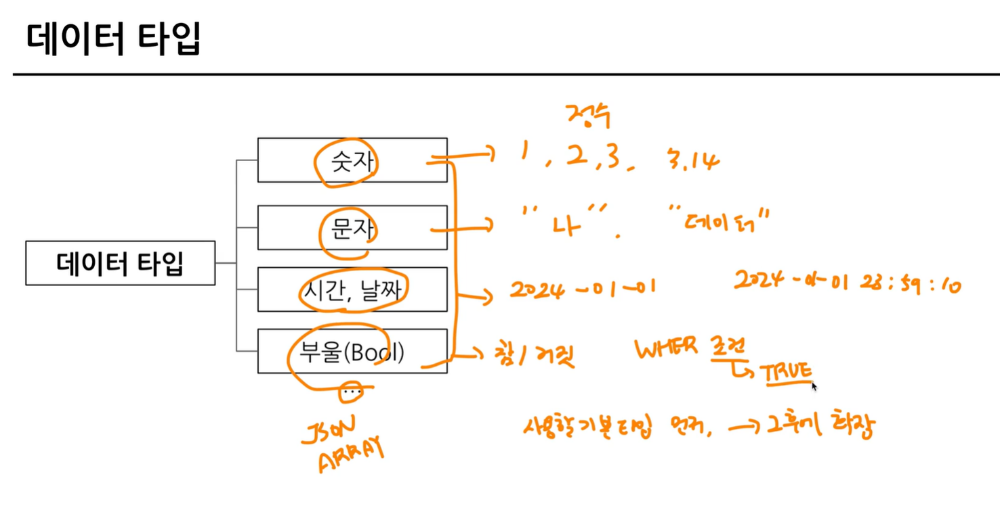
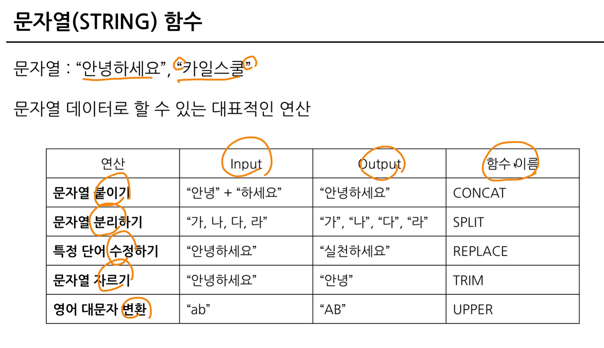
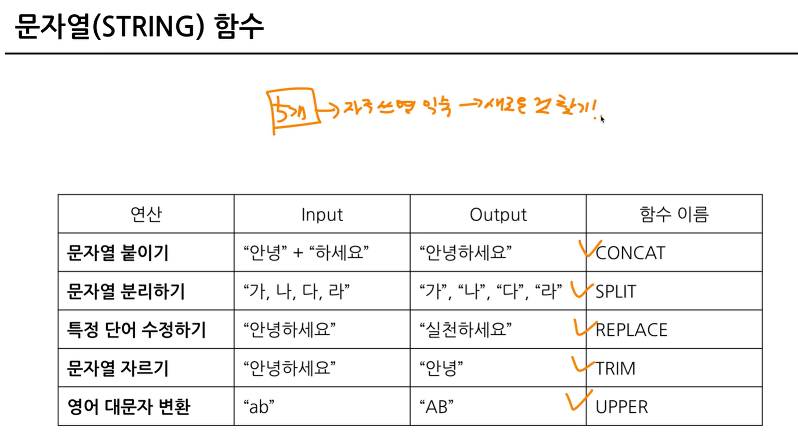
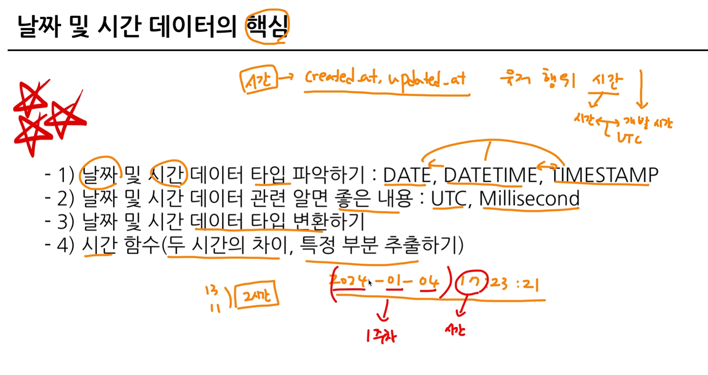
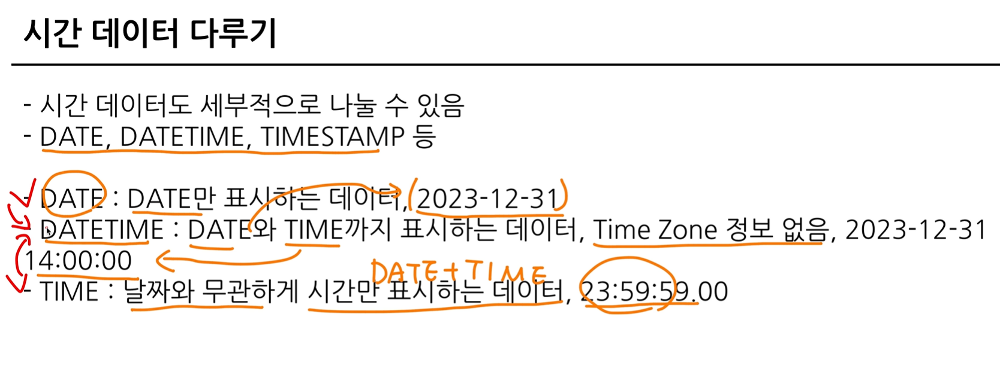
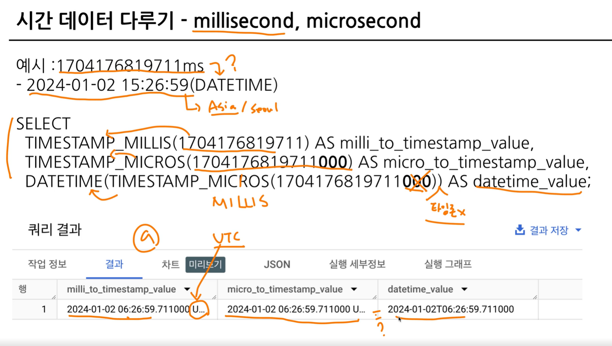
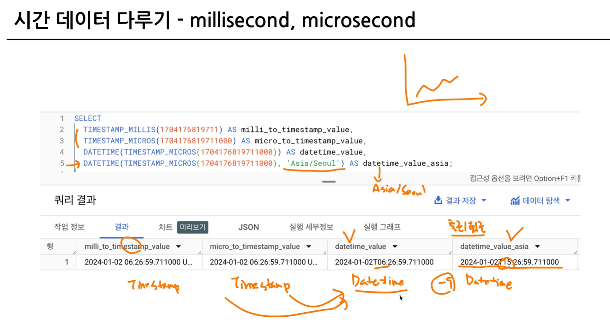
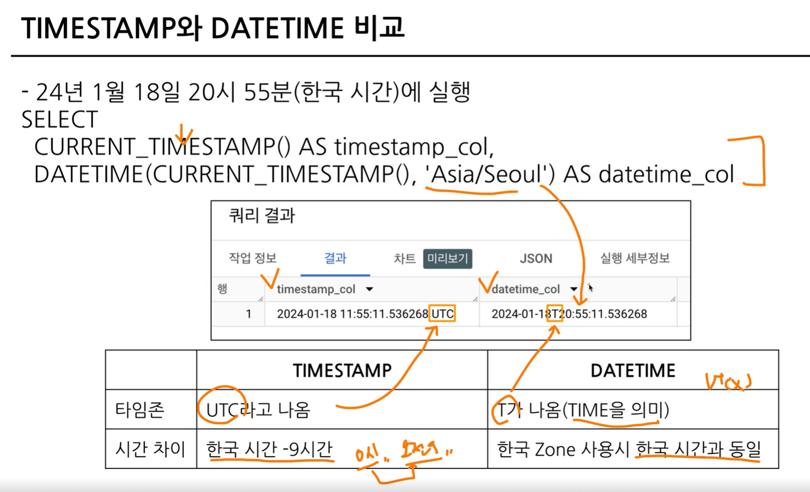

# 3-4. 오류를 디버깅하는 방법



오류 메세지
- 현재 작성한 방식으로 하면 답을 얻을 수 없다(길잡이)
- 어떤 부분에 문제가 있다(좌표, 문제 진단)


대표적인 오류 카테고리

= 'Syntax Error(문법 오류)'

- Error Message를 보고 번역/해석 후 해결
	- 구글 검색
	- Chat GPT
	- 지인/커뮤니티

### ex1. SELECT list must not be empty at [10:1]

 번역 : SELECT 목록은 [10:1]에서 비어 있으면 안된다.
```
SELECT
* <- 여기가 비어있으면 안된다는 의미.
FROM
```
### ex2. Number of arguments does not match for aggregate func COUNT

 번역 : 집계 함수 COUNT의 인자 수가 일치하지 않습니다.
```
SELECT
 COUNT(id, kor_name) <- COUNT(1개 지정) // 2개를 지정해서 오류.
FROM basic.pokemon
```
### ex3. SELECT list expression references column type 1 a which is neither grouped nor aggregated

 번역 : SELECT 목록 식은 다음에서 그룹화되거나 집계되지 않은 열을 참조합니다.
```
SELECT
 type 1,
 COUNT(id) AS cnt
FROM basic.pokemon
GROUP BY
 type 1	<- GROUP BY에 적절한 컬럼을 명시하지 않았을 경우 발생하는 오류.
```
### ex4. 세미콜론이 없고 전체를 실행하려고 할 때 발생하는 오류.
### Syntax error : Expected end of input but got keyword SELECT

 번역 : 입력이 끝날 것으로 예상되었지만 SELECT 키워드가 입력되었습니다.
```
SELECT
 type 1,
 COUNT(id) AS cnt
FROM basic.pokemon
GROUP BY
 type 1; <- 쿼리 입력이 끝났음을 알리는 ";"이 명시되지 않아 오류 발생.

SELECT
 *
FROM basic.trainer;
```
- SELECT 근처 확인하기
- 하나의 쿼리엔 SELECT가 1개만 있어야 한다.
- 혹은 쿼리가 끝나는 부분에 ";"를 붙이고 실행할 부분만 d&d 후 실행.

### ex5. Syntax error : Expected end of input but got keyword WHERE at [5:1]

 번역 : 입력이 끝날 것으로 예상되었지만 [5:1]에서 키워드 WHERE를 얻었습니다.
```
SELECT
 *
FROM basic.trainer LIMIT 10
WHERE
 id=3
<- 'LIMIT 10'와 같은 LIMIT 부분을 삭제 또는 맨 뒤로 위치해야 한다.
```
### ex6. Syntax error : Expected ")" but got end of script at [8:11]

 번역 : ")"가 예상되지만 [8:11]에 스크립트가 끝났습니다.
```
SELECT
 name,
FROM(
 SELECT
  *
 FROM basic.trainer
 WHERE
  id=3
) <- 괄호를 작성하지 않은 경우 발생하는 오류.
```

# 4-1. intro


### 이번 파트에서 다룰 내용

- 데이터 탐색 : *변환
- 자료형에 따른 여러 함수 소개
  - 문자열
  - 날짜 및 시간 데이터
- 조건문 함수
- BigQuery 공식 문서 확인하는 방법


# 4-2. 데이터 타입과 데이터 변환(CAST, SAFE_CAST)

- SELECT 문에서 데이터를 변환시킬 수 있음
    - 또는 WHERE의 조건문에도 사용할 수도 있음
- 데이터의 타입에 따라 다양한 함수가 존재
```
SELECT
 컬럼 1,
 컬럼 2,
 컬럼 3
FROM 테이블
WHERE <조건문>
GROUP BY <집계할 컬럼>
```
기본적으로 4개의 데이터 타입(숫자, 문자, 시간 및 날짜, 부울)에 대해 제대로 알고 그 이후에 JSON/ARRAY 등의 다른 데이터 타입을 공부하시라.



------

### 데이터 타입이 중요한 이유
- 보이는 것과 저장된 것의 차이가 존재 -> 의도에 따라 데이터 타입의 변경이 필요한 경우가 있다!

- 엑셀에서 보면 빈 값 -> " " or NULL
- 1이라고 작성된 경우 -> 숫자 1 or 문자 "1"
- 2023-12-31 -> DATE 2023-12-31 or 문자 "2023-12-31"
- 부울 타입(True/False) or 문자 "True/False"

### 자료 타입을 변경하는 함수 : CAST
```
SELECT
 CAST(1 AS STRING) # 숫자 1을 문자 1로 변경
```
```
SELECT
 CAST("카일스쿨" AS INT64) <- 문자를 숫자로 X
```
굳이 바꾸겠다 하면, NULL값으로 반환 가능(반환 못하는 게 사실이니..^^) : SAFE_CAST

즉, SAFE_가 붙은 함수는 변환이 실패한 경우 NULL 반환

SELECT
 SAFE_CAST("카일스쿨" AS INT64)

=> 결과는 NULL 이다.

----> 수학 함수에도 SAFE_ 활용할 수 있다.

나누기를 할 때, X/Y 대신 SAFE_DIVIDE 함수 이용
-> SAFE_DIVIDE(x, y) : x, y 중 하나라도 0일 떄 그냥 나누면 error니까!

# 4-3.  문자열 함수(CONCAT, SPLIT, REPLACE, TRIM, UPPER)



### 문자열 붙이기 함수 : CONCAT
``` 
SELECT
 CONCAT("안녕", "하세요") AS result
```
- CONCAT : 인자로 STRING/숫자 넣을 떄 데이터 직접 넣어줌 -> FROM 없이도 실행O.

### 문자열 분리하기 함수 : SPLIT(쪼개다) => 결과 : 배열(ARRAY) 타입

```
SELECT
 SPLIT("가", "나", "다", "라", ",") AS result
```
- SPLIT(문자열_원본, 나눌 기준이 되는 문자)

### 특정 단어 수정하기 : REPLACE(치환하다)

```
SELECT
 REPLACE("안녕하세요", "안녕", "실천") AS result
```
- REPLACE(문자열_원본, 찾을 단어, 바꿀 단어)

### 문자열 자르기 : TRIM(자르다)

```
SELECT
 TRIM("안녕하세요", "하세요") AS result
```
- TRIM(문자열_원본, 자를 단어)

### 영어 소문자를 대문자로 변경 : UPPER

```
SELECT
 UPPER("abc") AS result
```
- UPPER(문자열_원본)
---



# 4-4. 날짜 및 시간 데이터 이해하기(1)(타임존, UTC, Millisecond, TIMESTAMP/DATETIME)


---


#### 시간 데이터가 중요한 이유 : 유저가 행위를 했다는 것이 시간으로 나타남.
- created_at(생성된 시간), updated_at(업데이트된 시간)
- 일반적인 시간과 개발 시간과의 차이가 존재한다.(UTC)

** 타임존 **
- GMT (한국 시간 : GMT+9) : 영국 그리니치 천문대 기준
- UTC (한국 시간 : UTC+9) : 협정 세계시 <- 최근 사용 다수

타임존이 존재한다 = 특정 지역의 표준 시간대

### TIMESTAMP
- 시간 도장
- UTC부터 경과한 시간을 나타내는 값(기준이 UTC가 됨)
- TIME ZONE 정보 있음
ex. 2023-12-31 14:00:00 UTC

### millisecond(ms)
- 시간의 단위, 천 분의 1초(1,000ms=1초)
- Millisecond -> TIMESTAMP -> DATETIME 으로 변경

---


잘못된 쿼리 사용한 결과




올바른 쿼리 사용한 결과

-> 타임스탬프를 빼먹지 말자!

-> DATETIME(TIMESTAMP_MICROS(1704176819711000), 'Asia/Seoul') AS datetime_value_asia ; 

## TIMESTAMP vs DATETIME
