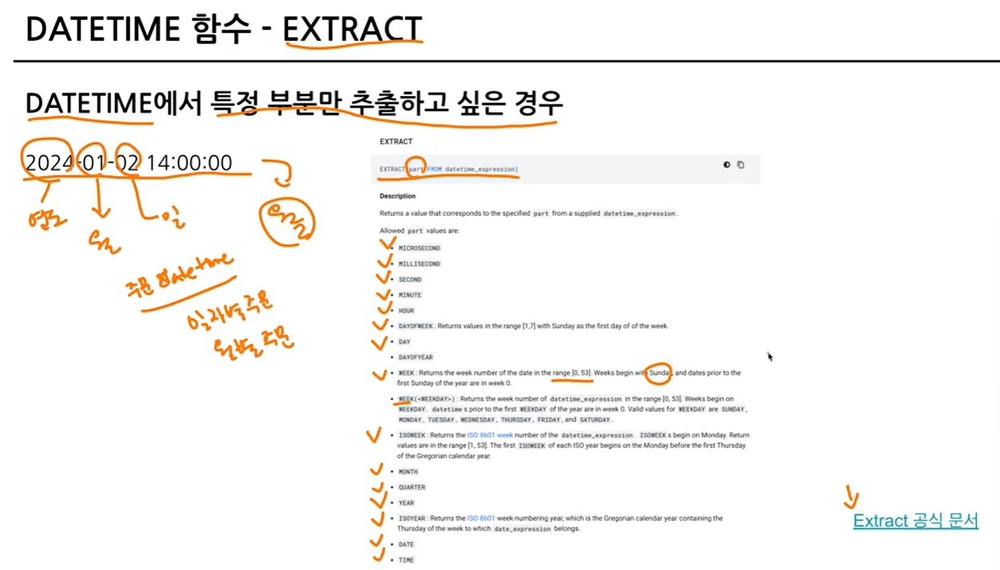
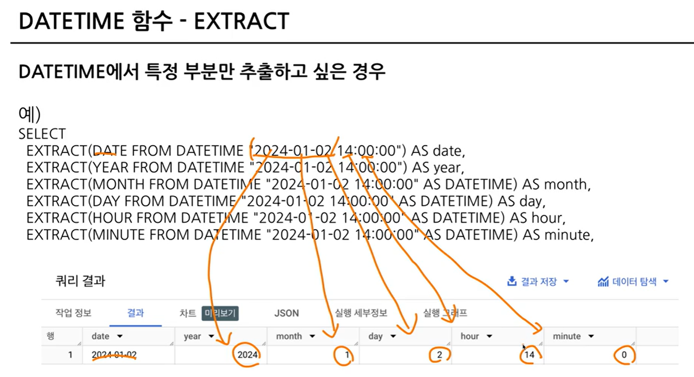
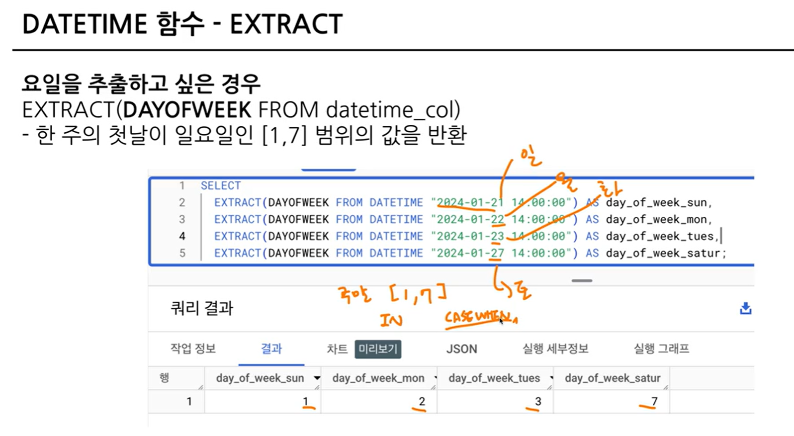

# 4-4. 

## CURRENT_DATETIME([time_zone]) : 현재 DATETIME 출력

SELECT
 CURRENT_DATE() AS current_date, // 타임존이 없는 것과

 CURRENT_DATE("Asia/Seoul") AS asia_date, // 있는 것.

 CURRENT_DATETIME() AS current_datetime,

 CURRENT_DATETIME("Asia/Seoul") AS current_datetime_asia;

## EXTRACT
: DATETIME에서 특정 부분만 추출하고 싶은 경우




요일을 추출하고 싶은 경우
```EXTRACT(DAYOFWEEK FROM datetime_col)```
- 한 주의 첫날이 일요일인 [1, 7] 범위의 값을 반환



## DATETIME_TRUNC 
- 원하는 데이터까지만 불러오고 나머지는 다 버린다는 메타.
- hour_trunc 를 가장 많이 사용할 듯~!

## PARSE_DATETIME
: 문자열로 저장된 DATETIME을 DATETIME 타입으로 바꾸고 싶은 경우.

```PARSE_DATETIME('문자열의 형태', 'DATETIME 문자열') AS datetime```
```
ex. 
SELECT
 PARSE_DATETIME('%Y-%m-%d %H:%M:%S', '2024-01-11 12:35:35') AS parse_datetime;
```
파싱하다 : 문자열 데이터를 분석하여 알맞은 것으로 배치한다.

## FORMAT_DATETIME
: DATETIME 타입 데이터를 특정 형태의 문자열 데이터로 변환하고 싶은 경우.

### 정리
```
=> 문자열 -> DATETIME : PARSE_DATETIME
     DATETIME -> 문자열 : FORMAT_DATETIME
```
### LAST_DAY
마지막 날을 알고 싶은 경우 : 자동으로 월의 마지막 값을 계산해서 특정 연산을 할 경우
```LAST_DAY(DATETIME) : 월의 마지막 값을 반환```

## DATETIME_DIFF
: 두 DATETIME의 차이를 알고 싶은 경우

```DATETIME_DIFF(첫 DATETIME, 두번째 DATETIME, 궁금한 차이)```

-> 궁금한 차이 : DAY/MONTH/WEEK , 보통 큰 값을 앞에 배치.


# 4-5. 연습문제

## 1. 트레이너가 포켓몬을 포획한 날짜(catch_date)를 기준으로, 2023년 1월에 포획한 포켓몬의 수를 계산해주세요.

 - 쿼리를 작성하는 목표, 확인할 지표 : 포켓몬의 수
 - 쿼리 계산 방법 : COUNT
 - 데이터의 기간 : 2023년 1월
 - 사용할 테이블 : trainer_pokemon
 - Join KEY : X 
 - 데이터 특징 : 직접 봐야함!
 ```
	-- catch_date : DATE 타입
	-- catch_datetime : UTC. TIMESTAMP 타입 => 컬럼의 이름은 	datetime인데 TIMESTAMP 타입으로 저장되어 있다.
	-----> datetime이면 뒤에 UTC가 붙지않고 중간에 T 붙은 식.
	-- catch_date에 대한 직접적인 명시X -> KR 기준/ UTC 기준 쳌!
	-- catch_date 컬럼과 catch_datetime 컬럼을 비교 => 	DATE(DATETIME(catch_datetime, "Asia/Seoul"))
	-- catch_date != DATE(DATETIME(catch_datetime, "Asia/Seoul")) 	
    => 있다면 catch_date의 사용은 힘들 수 있다.
```
```
SELECT
COUNT(*)
FROM(

SELECT
id,
catch_date,
DATE(DATETIME(catch_datetime, "Asia/Seoul")) As catch_datetime_kr_date
FROM basic.trainer_pokemon
)

WHERE
catch_date != catch_datetime_kr_date


SELECT
COUNT(DISTINCT id) AS cnt
FROM basic.trainer_pokemon
WHERE
 EXTRACT(YEAR FROM_DATETIME(catch_datetime, "Asia/Seoul")) = 2023
# catch_datetime은 TIMESTAMP로 저장되어 있으므로, DATETIME으로 변경해야 함.

AND EXTRACT(MONTH FROM_DATETIME(catch_datetime, "Asia/Seoul")) =1
```
### 문제 출제 의도 : 요청한 사람 또는 문제를 그대로 볼 경우 틀릴 수 있으니 컬럼을 꼭! 파악하고(정의 확인) 쿼리를 작성하자!


## 2. 배틀이 일어난 시간(battle_datetime)을 기준으로, 오전 6시에서 오후 6시에 일어나 배틀의 수를 계산해주세요.

- 쿼리를 작성하는 목표, 확인할 지표 : 오전 6시-오후 6시 배틀의 수
- 쿼리 계산 방법 : COUNT
- 데이터의 기간 : 일자는 상관없고, 오전 6시-오후 6시
- 사용할 테이블 : battle
- Join KEY : X 
- 데이터 특징 : 직접 봐야함!
```
-- battle_date : battle_datetime을 기반으로 만들어진 DATE
-- battle_datetime : DATETIME
-- battle_datetime이랑 DATETIME(battle_timestamp, "Asia/Seoul") 같은지 확인! -> countif 쿼리 이용해서 확실히 확인해주기!
```
```
SELECT
id,
battle_datetime,
DATETIME(battle_timestamp, "Asia/Seoul") AS battle_timestamp_kr,
COUNTIF(battle_datetime = DATETIME(battle_timestamp, "Asia/Seoul")) AS battle_datetime_same_battle_timestamp_kr
/*
COUNTIF(battle_datetime != DATETIME(battle_timestamp, "Asia/Seoul")) AS battle_datetime_not_same_battle_timestamp_kr
*/
FROM basic.battle
```
### sol1
```
SELECT
COUNT(DISTINCT id) AS battle_cnt
FROM basic.battle
WHERE
EXTRACT(HOUR FROM battle_datetime) >=6
AND EXTRACT(HOUR FROM battle_datetime) <18
```
### sol2 - extract가 너무 반복되니까 'between' 사용해서 표현.(시간이니까~)
```
/*
EXTRACT(HOUR FROM battle_datetime) >=6
AND EXTRACT(HOUR FROM battle_datetime) <18
*/
해당 코드 대신에
EXTRACT(HOUR FROM battle_datetime) BETWEEN 6 and 18
```

### 시간대별로 몇 건이 있는가?
```
SELECT
hour,
COUNT(DISTINCT id) AS battle_cnt
FROM (

SELECT
*,
EXTRACT(HOUR FROM battle_datetime) AS hour
FROM basic.battle
)

GROUP BY
hour
ORDER BY
hour
```

## 3. 각 트레이너 별로 그들이 포켓몬을 포획한 첫 날(catch_date)를 찾고, 그 날짜를 'DD/MM/YYYY' 형식으로 출력해주세요. (2024-01-01 -> 01/01/2024)

- 쿼리를 작성하는 목표, 확인할 지표 : 날짜를 특정 형태로 변경! + 포획한 첫 날
- 쿼리 계산 방법 : 문자열, FORMAT_DATETIME + MIN
- 데이터의 기간 : X
- 사용할 테이블 : trainer_pokemon
- Join KEY : X 
- 데이터 특징 : catch_date는 UTC 기준의 데이터, 한국 기준으로 하려면 catch_datetime을 사용해야 한다!

포획한 첫 날을 찾으면서 ROW 수를 줄일 수 있으니, 포획한 첫 날을 먼저 찾고, 날짜를 변경할 것~!
```
SELECT
trainer_id,
FORMAT_DATE("%d/%m/%Y", min_catch_date) AS new_min_catch_date

FROM
(
SELECT
trainer_id,
MIN(DATE(catch_datetime, "Asia/Seoul")) AS min_catch_time
FROM basic.trainer_pokemon
GROUP BY
trainer_id
ORDER BY
trainer_id
)
```
-- order by : select 제일 바깥에서 1번만 하면 됨.

모든 row를 확인해서 재정렬하는 것이므로 연산이 많이 소요 -> 시간이 오래 걸린다.

## 4. 배틀이 일어난 날짜(battle_date)를 기준으로, 요일별로 배틀이 얼마나 자주 일어났는지 계산해주세요.

- 쿼리를 작성하는 목표, 확인할 지표 : 요일별로 배틀이 얼마나 자주 일어났는가? 배틀의 건!
- 쿼리 계산 방법 : 요일별로 count!
- 데이터의 기간 : X
- 사용할 테이블 : battle
- Join KEY : X 
- 데이터 특징 : battle_date가 정상적임.
	-- 요일을 어떻게 추출할 것인가?
```
SELECT
day_of_week,
COUNT(DISTINCT id) AS battle_cnt
FROM(
SELECT
*,
EXTRACT(DAYOFWEEK FROM battle_date) AS day_of_week
FROM basic.battle
)
GROUP BY
day_of_week
ORDER BY
day_of_week
```

## 5. 트레이너가 포켓몬을 처음으로 포획한 날짜와 마지막으로 포획한 날짜의 간격이 큰 순으로 정렬하는 쿼리를 작성해주세요.

- 쿼리를 작성하는 목표, 확인할 지표 : 트레이너의 처음과 마지막의 DIFF 큰 순 정렬
- 쿼리 계산 방법 : 처음 포획한 날짜(MIN) + 마지막으로 포획한 날짜(??) -> 차이를 구하고(DATETIME_DIFF) -> 차이가 큰 순으로 정렬(ORDER BY)
- 데이터의 기간 : X
- 사용할 테이블 : trainer_pokemon
- Join KEY : X 
- 데이터 특징 : catch_date는 UTC 기반으로 만들어진 일자.        
catch_datetime을 사용해야 한다.
```
SELECT
*,
DATETIME_DIFF(max_catch_datetime, min_catch_datetime, DAY) AS diff
FROM
(
SELECT
trainer_id,
MIN(DATETIME(catch_datetime, "Asia/Seoul")) AS min_catch_datetime,
MAX(DATETIME(catch_datetime, "Asia/Seoul")) AS max_catch_datetime,
FROM basic.trainer_pokemon
GROUP BY
trainer_id
)
ORDER BY
diff DESC
```
# 4-6. 조건문(CASE WHEN, IF)

- 조건에 따라 다른 값을 표시하고 싶을 때 사용
- 특정 조건이 충족되면, 어떤 행동을 하자
- 특정 조건이 참일 때 A, 아니면 B

- 데이터 분석을 하다보면, 특정 카테고리를 하나로 합치는 전처리 필요.

## CASE WHEN

: 여러 조건이 있을 경우 유용

### 문법
```
SELECT
CASE
WHEN 조건1 THEN 조건1이 참일 경우 결과
WHEN 조건2 THEN 조건2가 참일 경우 결과
ELSE 그 외 조건일 경우 결과
END AS 새로운_컬럼_이름
```
## CASE WHEN 예시

포켓몬 데이터 : type1, type2

### Rock(바위) 타입과 Ground(땅) 타입이 결국 비슷
-> "Rock&Ground"라는 타입을 새로 만들면 어떨까?

 - 쿼리를 작성하는 목표, 확인할 지표 : type이 Rock 또는 Ground라면 Rock&Ground라고 수정하겠다!
- 쿼리 계산 방법 : CASE WHEN
- 데이터의 기간 : X
- 사용할 테이블 : pokemon
- Join KEY : X 
- 데이터 특징 : type이 type1, type2로 나뉘어서 두 가지 타입 모두 고려 필.
```
SELECT
*,
CASE
WHEN (type1 IN ("Rock", "Ground")) or (type2 IN ("Rock", "Ground")) THEN "Rock&Ground"
ELSE type1
END AS new_type1
FROM basic.pokemon
```
### '순서' 굉장히 중요하다~! (row 순으로 진행되므로)

- 조건1, 조건2에 둘 다 해당되면 앞선 순서를 따름
- 문자열 함수(특정 단어 추출)에서 이슈 자주 발생

## IF

: 단일 조건일 경우 유용

### 문법

```IF(조건문, True일 때의 값, False일 때의 값) AS 새로운_컬럼_이름```

```
SELECT
IF(1=1, '동일한 결과', '동일하지 않은 결과') AS result1,
IF(1=2, '동일한 결과', '동일하지 않은 결과') AS result2
```

# 4-7. 조건문 연습 문제

## 1. 포켓몬의 'Speed'가 70 이상이면 '빠름', 그렇지 않으면 '느림'으로 표시하는 새로운 컬럼 'Speed_Category'를 만들어 주세요.

 - 쿼리를 작성하는 목표, 확인할 지표 : speed 컬럼을 이용해 새로운 speed_category 만들어야 함.
- 쿼리 계산 방법 : CASE WHEN/ IF -> 조건이 단일이다. IF. 70 이상
- 데이터의 기간 : X
- 사용할 테이블 : pokemon
- Join KEY : X 
- 데이터 특징 : MIN speed : 5, MAX speed : 140
```
SELECT
MIN(speed) AS min_speed,
MAX(speed) AS max_speed
FROM basic.pokemon
```
```
SELECT
id,
kor_name,
speed,
IF(speed>=70, "빠름", "느림") AS Speed_Category
FROM basic.pokemon
```
## 2. 포켓몬의 'type1'에 따라 'Water', 'Fire', 'Electric' 타입은 각각 '물', '불', '전기'로, 그 외 타입은 '기타'로 분류하는 새로운 컬럼 'type_Korean'을 만들어 주세요.

- 쿼리를 작성하는 목표, 확인할 지표 : type1을 사용해서 특정 조건을 만족하는 것은 값을 변경, 기타 -> type_Korean
- 쿼리 계산 방법 : CASE WHEN/ IF -> 조건이 여러 개. water->물, fire->불, electric->전기. CASE WHEN
- 데이터의 기간 : X
- 사용할 테이블 : pokemon
- Join KEY : X 
- 데이터 특징 : 타입이 여러가지 있음.
```
SELECT
id,
kor_name,
type1,
CASE
WHEN type1="Water" THEN "물"
WHEN type1="Fire" THEN "불"
WHEN type1="Electric" THEN "전기"
ELSE "기타"
END AS type1_Korean
FROM basic.pokemon
```

## 3. 각 포켓몬의 총점(toal)을 기준으로, 300 이하면 'Low', 301에서 500 사이면 'Medium', 501 이상이면 'High'로 분류해주세요.

- 쿼리를 작성하는 목표, 확인할 지표 : total 컬럼 -> 조건에 맞는 값을 변경, 모두 숫자!
- 쿼리 계산 방법 : CASE WHEN
- 데이터의 기간 : X
- 사용할 테이블 : pokemon
- Join KEY : X 
- 데이터 특징 : total 컬럼이 정수(INTEGER)

```
SELECT
*
FROM
(
SELECT
id,
kor_name,
total,
CASE
WHEN total >=501 THEN "High"
WHEN total BETWEEN 301 AND 500 THEN "Medium"
/*
WHEN total < 300 THEN "Low"
*/
ELSE "Low"
END AS total_grade
FROM basic.pokemon
)
WHERE 
total_grade="Low"
```

## 4. 각 트레이너의 배지 개수(badge_count)를 기준으로, 5개 이하면 'Beginner', 6개에서 8개 사이면 'Intermediate', 그 이상이면 'Advanced'로 분류해주세요.

- 쿼리를 작성하는 목표, 확인할 지표 : badge_count -> 조건에 만족하는 값 변경
- 쿼리 계산 방법 : CASE WHEN
- 데이터의 기간 : X
- 사용할 테이블 : trainer
- Join KEY : X 
- 데이터 특징 : X

```
SELECT
trainer_level
COUNT(DISTINCT id) AS trainer_cnt
FROM
(
SELECT
id,
name,
badge_count,
CASE
WHEN badge_count >=9 THEN "Advanced"
WHEN badge_count BETWEEN 6 AND 8 THEN "Intermediate"
ELSE "Beginner"
END AS trainer_level
FROM basic.trainer
)
GROUP BY
trainer_level
```

## 5. 트레이너가 포켓몬을 포획한 날짜(catch_date)가 '2023-01-01' 이후면 'Recent', 그렇지 않으면 'Old'로 분류해주세요.

- 쿼리를 작성하는 목표, 확인할 지표 : 포획한 날짜 기준 값을 변경
- 쿼리 계산 방법 : IF
- 데이터의 기간 : X
- 사용할 테이블 : trainer_pokemon
- Join KEY : X 
- 데이터 특징 : catch_date는 UTC 기준. catch_datetime은 TIMESTAMP
```
SELECT
recent_or_old,
COUNT(id) AS cnt
FROM
(
SELECT
id,
trainer_id,
pokemon_id,
catch_datetime,
IF(DATE(catch_datetime, "Asia/Seoul") > "2023-01-01", "Recent" ,"Old") AS recent_or_old
FROM basic.trainer_pokemon
)
GROUP BY recent_or_old
```

## 6. 배틀에서 승자(winner_id)가 player_id와 같으면 'Player 1 wins', player2_id와 같으면 'Player 2 wins', 그렇지 않으면 'Draw'로 결과가 나오게 해주세요.

- 쿼리를 작성하는 목표, 확인할 지표 : 승패 여부를 알 수 있는 컬럼 만들기
- 쿼리 계산 방법 : case when 
- 데이터의 기간 : X
- 사용할 테이블 : battle
- Join KEY : X 
- 데이터 특징 : X

```
SELECT
id,
winner_id,
player1_id,
player2_id,
CASE
WHEN winner_id = player1_id THEN "Player 1 Wins"
WHEN winner_id = player2_id THEN "Player 2 Wins"
ELSE "Draw"
END AS battle_result
FROM basic.battle
```

# 4-8. 정리 (생략 !)

# 4-9. BigQuery 공식 문서 확인하는 법

찾는 방법
"기술명 + documentation"으로 검색

- bigquery는 기능이 많고 발전이 오래된 제품이라 공식 문서에 자료가 많음!
- google cloud skills boost
- 공식 문서 (Ctrl+F)에서 문법 찾기

BigQuery xxxxx 라고 검색
xxxxx : 특정 행위

RSS Feed(Really Simple Syndication)