# 5-1. opening

join : vlookup처럼 연결시켜주는 것. 

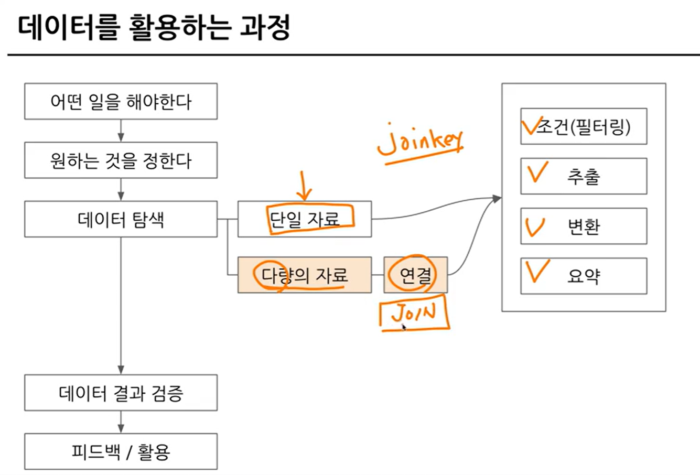

# 5-2. join 이해하기
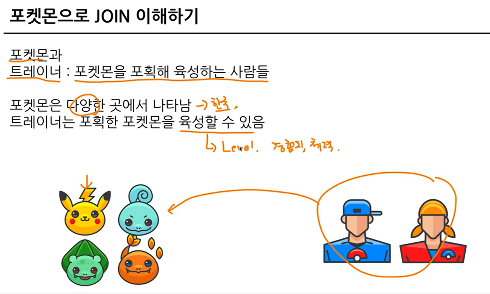

서로 다른 데이터 테이블을 연결하는 것.
``` 
두 데이터(trainer, pokemon)를 연결할 수 있는 공통 값이 없음!
-> trainer_pokemon을 통해 연결 가능.
-> trainer_id & pokemon_id

trainer에서의 'id' == trainer_pokemon에서의 'trainer_id'
key = 'id', 'trainer_id'
``` 
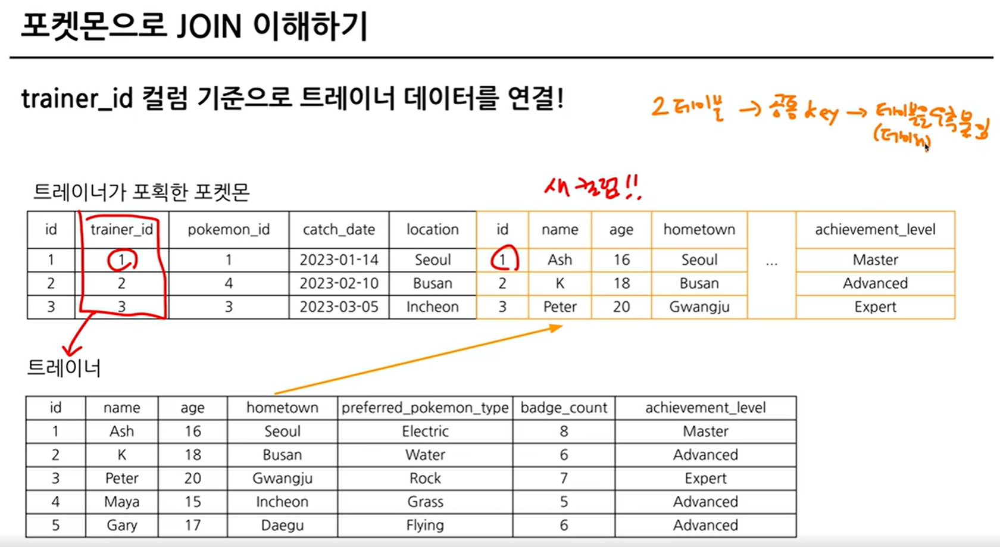

보통 id 값을 key로 많이 사용하고, 특정 범위(ex. Date)로 JOIN이 가능.

JOIN이 어려운 것이 아니고 테이블 구조에 익숙하지 않아 어려움을 느낄 확률이 높음. 

``` tip ! : 저장될 형태 -> Join 후의 모습 예상 -> 쿼리실행 -> 결과``` 

# 5-3. 다양한 join 방법
### Join을 해야하는 이유 - 데이터가 저장되는 형태에 대한 이해

- 관계형 데이터베이스(RDBMS) 설계시 정규화 과정을 거침
	- 정규화는 중복을 최소화하게 데이터를 구조화
	- User Table은 유저 데이터만, Order Table은 주문 데이터만
	- 따라서 데이터를 다양한 Table에 저장해서 필요할 때 Join.

- 데이터 분석 관점에서는 미리 join되어 있는 것이 좋을 수 있으나, 개발 관점에서는 분리되어 있는 것이 좋음 -> '데이터 마트' 활용

### join 종류

- (inner) join : 두 테이블의 공통 요소만 연결
- left/right (outer) join : 왼쪽/오른쪽 테이블 기준으로 연결
- full (outer) join : 양쪽 기준으로 연결
- cross join : 두 테이블의 각각의 요소를 곱하기

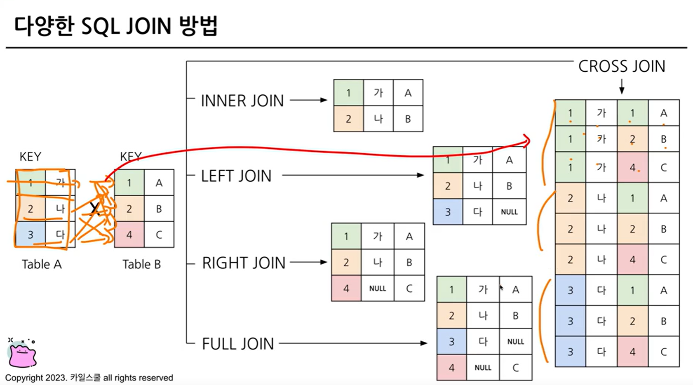

>집합 개념으로 이해하면 수월하다!!

# 5-4. join 쿼리 작성하기

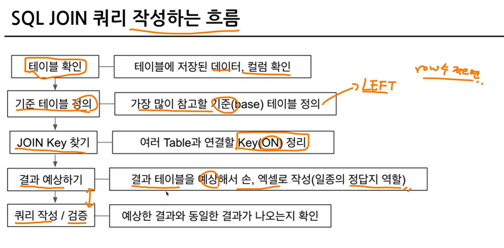

> from 하단에 join할 table을 작성하고 on 뒤에 공통된 컬럼(key) 작성.
``` 
select
a.col1,
a.col2,
b.col1, 
b.col2
from table1 as a
left join table2 as b
on a.key = b.key # alias(별칭)를 사용할 수 있음
``` 
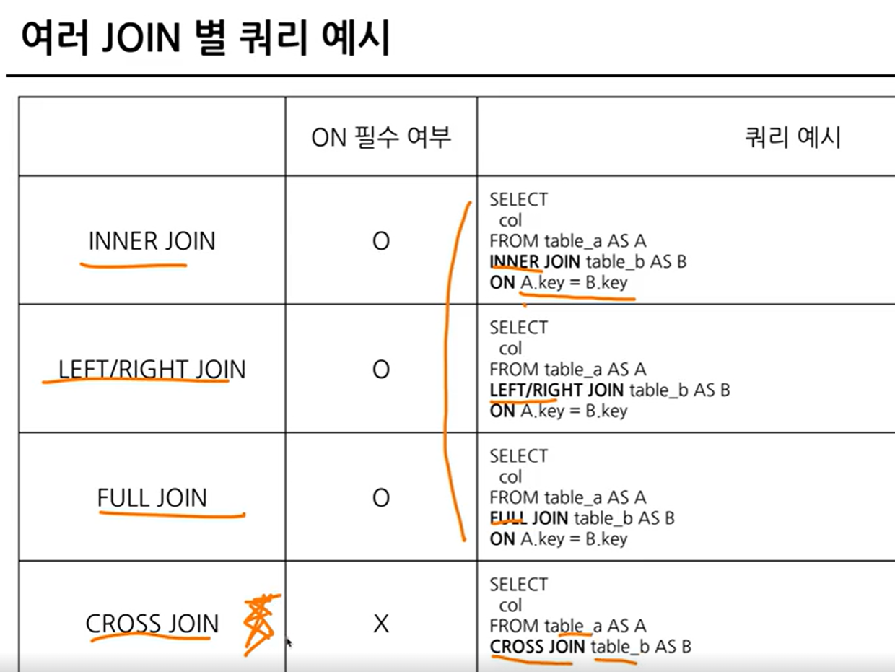
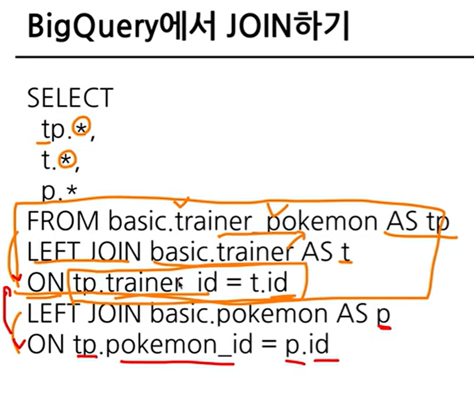

cf. cross join의 경우 다 곱하는 거기 때문에 on 이런 거 없어도 걍 써주면 돼.

* left : trainer_pokemon
* right : trainer
* right : pokemon
``` 
select
tp.id,
tp.trainer_id,
tp.pokemon_id,
/* t.id as trainer_id, # id라는 결과가 중복이라서 명시 */
t.* /* except(id) */ , # trainer_id => tp에 있으니 그걸 활용
p.* /* except(id) */ # 이걸 써줘야 select 문에도 p가 적용되어 결과 나타남!! # 이것도 마찬가지로 tp에 있으니 그걸 활용.
from basic.trainer_pokemon as tp
left join basic.trainer as t
on tp.trainer_id = t.id
# on : join key를 기입

left join basic.pokemon as p
on tp.pokemon_id = p.id
``` 
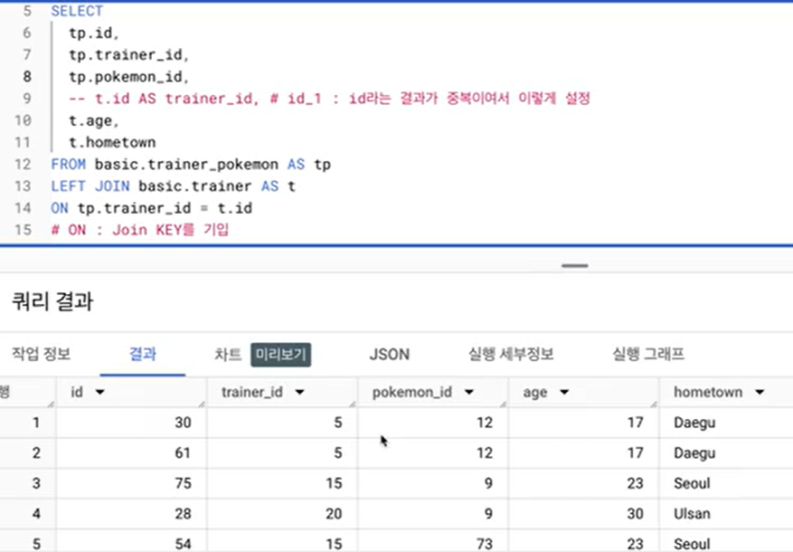


# 5-5. join을 처음 공부할 때 헷갈렸던 부분

1) 여러 join 중 어떤 것을 사용해야 할까?
2) 어떤 table을 왼쪽에 두고, 어떤 table이 오른쪽에 가야할까?
3) 여러 table을 연결할 수 있는 걸까?
4) 컬럼은 모두 다 선택해야 할까?
5) null이 뭐냐?


### 1) 여러 join 중 어떤 것을 사용해야 할까?

- 하려고 하는 작업의 목적에 따라 join 선택해보기
	- 교집합 : inner
	- 모두 다 조합 : cross
	- 그게 아니라면 left or right : left 추천, 하나를 계속 해보는 걸 추천
- 쿼리 작성 템플릿에 예상하는 결과를 작성하고, 중간 결과도 생각하면서 찾아보기


### 2) 어떤 table을 왼쪽에 두고, 어떤 table이 오른쪽에 가야할까?

- left join의 경우
	- 기준이 되는 table을 왼쪽에 두기
- 기준에는 기준값이 존재하고, 우측에 데이터를 계속 추가

### 3) 여러 table을 연결할 수 있는 걸까?

- join의 개수에 한계는 없음
- 너무 많이 join하고 있는지 확인
``` 
select
table_a.col1,
table_b.col2,
from table_a
left join table_b
on table_a.key = table_b.key
``` 
### 4) 컬럼은 모두 다 선택해야 할까?

- task에 따라 다름
- 사용하지 않을 컬럼은 선택하지 않는 것이 비용 줄이기 가능
- id 같은 값은 unique한지 확인하기 위해 자주 사용되므로 id는 자주 사용하는 편

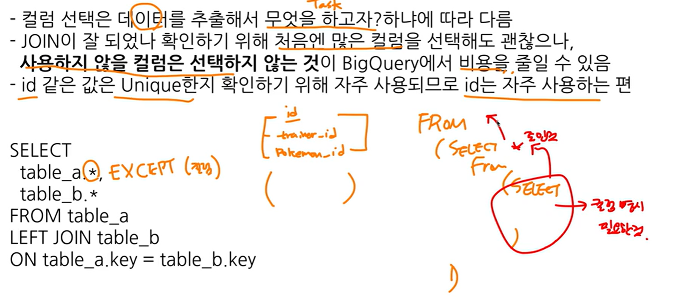

### 5) null이 뭐냐?

- null : 값이 없음, 알 수 없음
- 0이나 공백과 다르게 값이 아예 없는 것
- join의 경우 연결할 값이 없는 경우 나타남

# 5-6. 연습문제

## 1.트레이너가 보유한 포켓몬들은 얼마나 있는지 알 수 있는 쿼리 작성하기
cf. '보유했다'의 정의 : status가 'active', 'training'인 경우, 'released' : 방출했다

- 쿼리를 작성하는 목표, 확인할 지표 : 포켓몬들이(이름 명시) 얼마나 있는지 알고 싶다 ! 포켓몬의 수.

- 쿼리 계산 방법 : trainer_pokemon(status가 active, training) + pokemon join -> 그 후에 group by 집계(count)

- 데이터의 기간 : X

- 사용할 테이블 : trainer_pokemon, pokemon

- join key : trainer_pokemon.pokemon_id = pokemon.id

- 데이터 특징 : 
1) trainer_pokemon에서 status가 active, training인 경우에만 필터링(where)
	- 1)을 먼저 하는 게 좋을까? 혹은 join을 하고 그 후에 active, training을 필터링하는 것이 좋을까?

-> join을 할 테이블들을 일단 줄이고(row 수를 줄인다) 그 후에 join.
-> 연산량 관점에서 먼저 줄이고 join하는 것이 효율적.

2) 필터링한 결과를 pokemon table과 join

3) 2)의 결과에서 pokemon_name, count(pokemon_id) as pokemon_cnt
``` 
select
tp.*,
p.id,
p.kor_name
from (
select
id,
trainer_id,
pokemon_id,
status
from basic.trainer_pokemon
where
status in ("active", "training")
) as tp
left join basic.pokemon as p
on tp.pokemon_id = p.id
group by
kor_name
order by
pokemon_cnt desc
``` 
* column name id is ambiguous : id가 모호하다. 
    
    : 더 구체적으로 말해달라 -> join에서 사용하는 테이블에 중복된 컬럼의 이름이 있으면 꼭 어떤 테이블의 컬럼인지 명시해야 함.

     ex. id => tp.id

* select from (join) where group by
* 1=1 : 무조건 true 반환.

## 2. 각 트레이너가 가진 포켓몬 중에서 'grass' 타입의 포켓모 수를 계산해주세요(단, 편의를 위해 type 1 기준으로)

- 쿼리를 작성하는 목표, 확인할 지표 : 트레이너가 보유한 포켓몬 중에서 grass 타입의 포켓몬 수를 알고 싶다!

- 쿼리 계산 방법 : 트레이너가 보유한 포켓몬 조건 설정 -> grass 타입으로 where 조건 걸어서 count

- 데이터의 기간 : X

- 사용할 테이블 : trainer_pokemon, pokemon

- join key : trainer_pokemon.pokemon_id = pokemon.id

- 데이터 특징 : 1번과 동일.
``` 
select
/* tp.*, */
p.type1,
count(tp.id) as pokemon_cnt
from(
select
id,
trainer_id,
pokemon_id,
status
from basic.trainer_pokemon
where
status in ("active", "training")
) as tp
left join basic.pokemon as p
on tp.pokemon id = p.id
where
type1="grass"
group by
type1
order by
2 desc # 2 대신에 pokemon_cnt도 가능.
``` 

## 3. 트레이너의 고향(hometown)과 포켓몬을 포획한 위치(location)를 비교하여, 자신의 고향에서 포켓몬을 포획한 트레이너의 수를 계산.
참고 - status 상관없이 구해주세요

- 쿼리를 작성하는 목표, 확인할 지표 : 트레이너 고향과 포켓몬의 포획 위치가 같은 트레이너의 수를 계산하기!

- 쿼리 계산 방법 : trainer(hometown), trainer_pokemon(location) join -> hometown = location => 트레이터의 수 count

- 데이터의 기간 : X

- 사용할 테이블 : trainer_pokemon, trainer

- join key : trainer_pokemon.pokemon_id = trainer.id
 -> trainer를 왼쪽에 두고 쿼리를 작성.

- 데이터 특징 : 1번과 동일.

```
select
*
from basic.trainer as t
left join basic.trainer_pokemon as tp
on t.id = tp.trainer_id
where
name='goh'
```
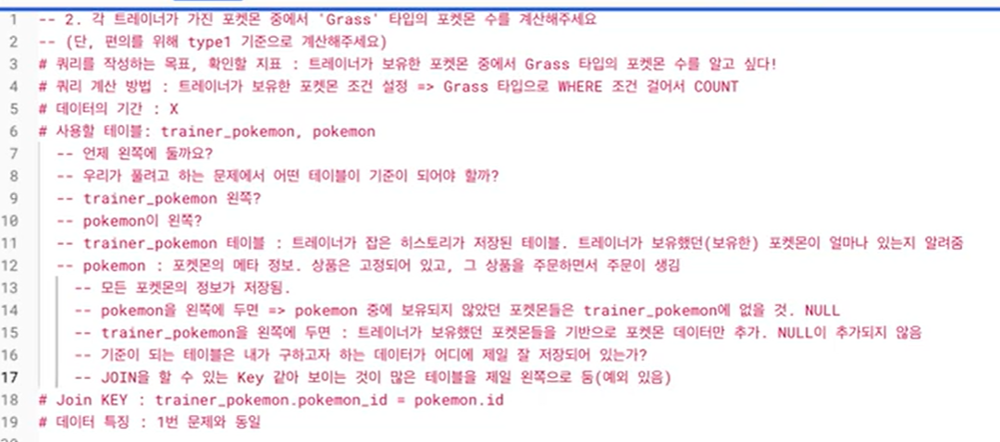
```
select
count(distinct tp.trainer_id) as trainer_uniq
from basic.trainer as t
left join basic.trainer_pokemon as tp
on t.id = tp.trainer_id
where
tp.location is not null
and t.hometown = tp.location
```
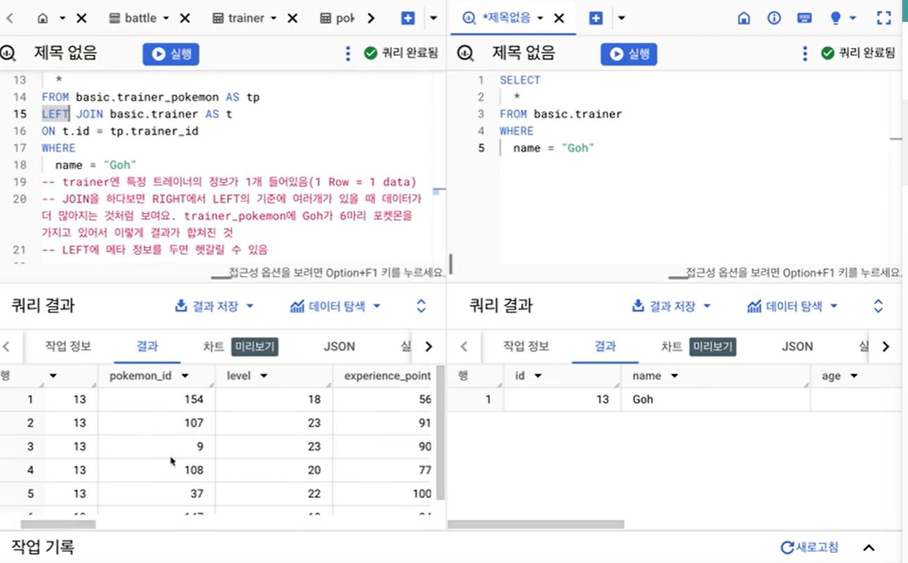

## 4. Master 등급인 트레이너들은 어떤 타입(type 1)의 포켓몬을 제일 많이 보유하고 있을까요?

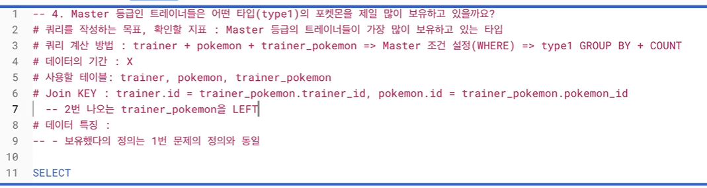

- 쿼리 작성 목표, 확인할 지표: Master 등급의 트레이너들이 가장 많이 보유하고 있는 타입
- 쿼리 계산 방법: trainer+pokemon+trainer_pokemon -> Master 조건 설정 (WHERE) -> type1 GROUP BY + COUNT
- 데이터의 기간: X
- 사용할 테이블: trainer, pokemon, trainer_pokemon
- Join KEY: trainer.id = trainer_pokemon.trainer_id, pokemon.id = trainer_pokemon.pokemon_id
- 데이터 특징: 1번과 동일(보유의 정의)
```
SELECT
  type1,
  COUNT(tp.id) AS pokemon_cnt
FROM(
SELECT
  id,
  trainer_id,
  pokemon_id,
  status
FROM basic.trainer_pokemon
WHERE status IN ('Active', 'Training')
) AS tp
LEFT JOIN basic.trainer AS t
ON tp.trainer_id = t.id
LEFT JOIN basic.pokemon AS p
ON tp.pokemon_id = p.id
WHERE
  t.achievement_level = "Master"
GROUP BY
  type1
ORDER BY
  2 DESC
LIMIT 1
```
## 5. Incheon 출신 트레이너들은 1세대, 2세대 포켓몬을 각각 얼마나 보유하고 있나요?

- 쿼리 작성 목표, 확인할 지표: Incheon 출신 트레이너들이 보유한 포켓몬 세대 구분하기(1, 2)

- 쿼리 계산 방법: trainer+pokemon+trainer_pokemon -> Incheon 조건(WHERE) -> 세대(generation)로 GROUP BY COUNT

- 데이터의 기간: X

- 사용할 테이블: trainer, pokemon, trainer_pokemon

- Join KEY: trainer.id = trainer_pokemon.trainer_id, pokemon.id = trainer_pokemon.pokemon_id

- 데이터 특징: 보유의 정의(1번과 동일)
```
SELECT
  generation,
  COUNT(tp.id) AS pokemon_cnt
FROM(
SELECT
  *
FROM basic.trainer_pokemon
WHERE status IN ('Active', 'Training')
) AS tp
LEFT JOIN basic.trainer AS t
ON tp.trainer_id = t.id
LEFT JOIN basic.pokemon AS p
ON tp.pokemon_id = p.id
WHERE
  t.hometown = "Incheon"
GROUP BY
  generation
```
>만약에 세대가 점점 데이터가 늘어나서 3세대도 생긴다면?

-> 3세대가 생기면 3세대도 나오게 : 쿼리 그대로 사용

-> 3세대가 생겨도 1, 2 세대만 나오게 : where 조건에 generation  in(1,2)

# 5-7. 정리
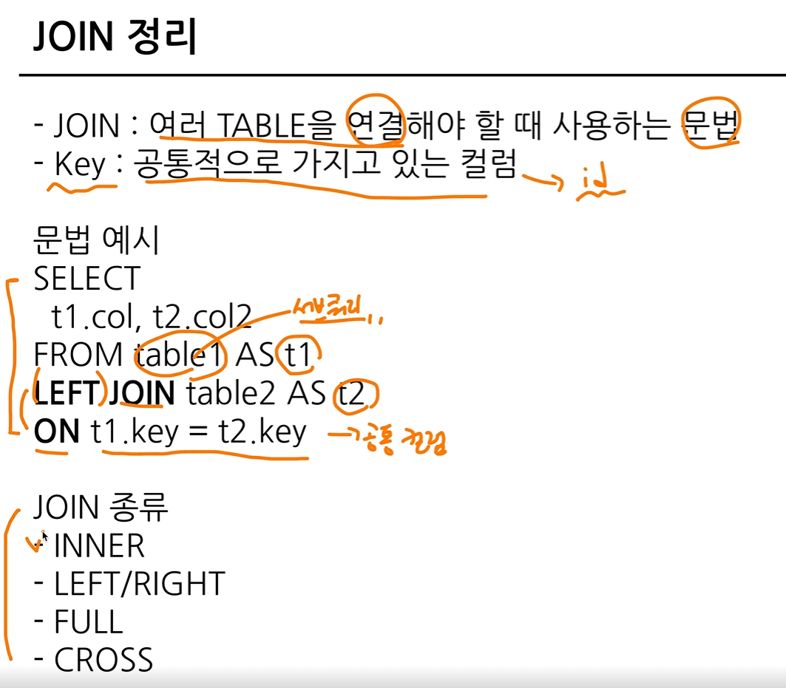