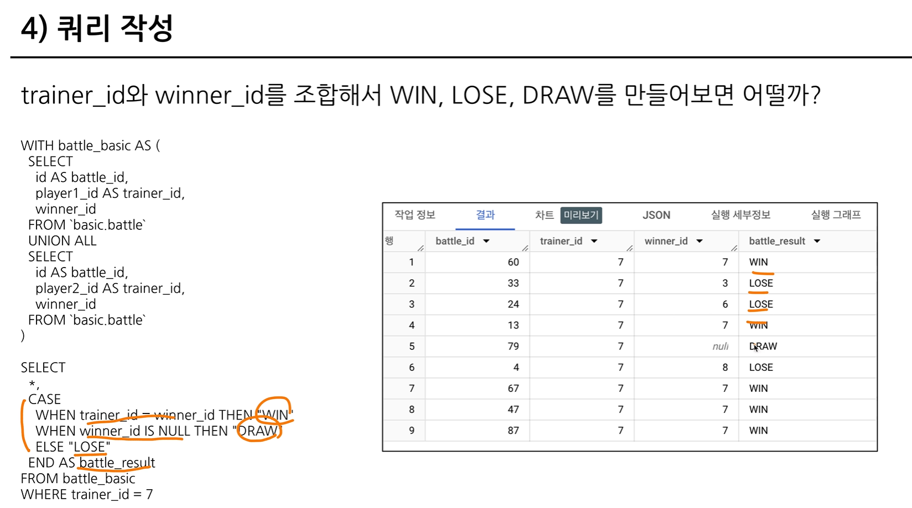

# 6-1. intro


경험적인 측면에서의 활용을 다룬다.

# 6-2.

- 문법 공부
- 데이터 파악, 컬럼정보에 대한 파악
- 단순화하기

## mozilla(firefox) & sql styleguide

### firefox의 대표적인 가이드

### 1. 예약어는 대문자로 작성
-> SQL에서 문법적인 용도로 사용하고 있는 문자들

-> 쿼리 파악에 용이

예약어 예시 : SELECT, FROM, WHERE, AS 각종 함수

### 2. 컬럼 이름은 snake_case로 작성
파이썬처럼 변수 이름 결정 시 'CamelCase' or 'snake_case'

-> 일관성이 중요

### 3. 명시적 vs 암시적인 이름
Alias로 별칭을 지을 때는 명시적인 이름을 적용

### 4. 왼쪽 정렬이 기본

### 5. 예약어나 컬럼은 한 줄에 하나씩 권장
컬럼을 바로 주석처리할 수 있다는 장점이 있다.

### 6. 쉼표는 컬럼 바로 뒤에
BigQuery는 마지막 쉽표를 무시해서 뒤에 작성해도 무방


# 6-3. 가독성을 챙기기 위한 WITH문&파티션

아래 쿼리가 다른 곳에서도 필요하면 반복하는 부분-> 복잡해짐.

-> WITH문 사용

-> CTE : Common Table Expression

-> SELECT 구문에 이름을 정해주는 것으로 이해

-> 쿼리 내에서 반복적으로 사용할 수 있음. 


### 'PARTITION'
1) 쿼리 성능 향상
2) 데이터 관리 용이
3) 비용적 이점

계속 참조를 통해 보기 편하게 쿼리 작성 가능.

> 뷰 저장 -> 쿼리 식 저장되어 계속 데이터 변경 시 활용 가능.

# 6-4. 데이터 결과 검증 정의

- 갑작스러운 데이터 추출 시 오류가 있었을 수 있음.

- 결과 검증 및 정의에 이슈O.

- 실수할 수 있으나 반복을 줄여야지~!

- 분석 결과의 정확성, 신뢰성 확보
    - 데이터 결과 검증
    1. 내가 기대하는 예상 결과 정의
    2. 쿼리 작성
    3. 일치하는지 비교

* 도메인의 특수성(규칙) 잘 파악하기!


결과 검증 활용 방식


# 6-5. 데이터 결과 검증 예시


user_id 선정 시 player1 or player2 total 생각해야함.

1) 임의로 id=7 선택
``` 
SELECT
*
FROM 'basic.battle'
WHERE
player1_id=7
``` 

2) 데이터 확인 및 특정 user_id 선정
``` 
SELECT
*
FROM 'basic.battle'
WHERE
(player1_id=7) OR (player2_id=7)
``` 

3) 승률 직접 count -> 결과 예상, 따로 써두기!

4) 쿼리 작성


-> 통합 데이터 생성(player 1, 2 구분 안해도 되는 테이블)





# 6-6. 정리
생략.