# 총 정리 문제 풀이

## 1. 각 트레이너별로 가진 포켓몬의 평균 레벨을 계산하고, 그 중 평균 레벨이 높은 top3 트레이너의 이름과 보유한 포켓몬의 수, 평균 레벨을 출력해주세요.

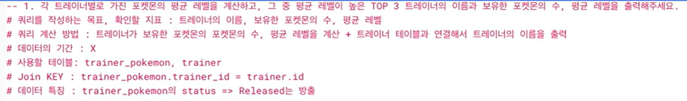

* (1) : 서브 쿼리 -> 평균 레벨 계산
``` 
with trainer as
{
select
trainer_id,
avg(level) as avg_level,
count(id) as pokemon_cnt
/* distinct status */ # 컬럼의 고윳값 확인 가능
from basic.trainer_pokemon
where
status != "released"
group by  # 집계함수가 있으므로
trainer_id
}
``` 
* (2) : (1)에서 만든 테이블 + trainer 테이블을 합쳐서 trainer의 name을 출력
``` 
select
/* distinct */ # 그럴 일 없겠지만 만약 있을 중복을 제거하기 위해
t.name,
tal.avg_level,  # max/min 적절히 활용O
tal.pokemon_cnt
from basic.trainer as t
left join trainer_avg_level as tal
on t.id = tal.trainer_id
order by
avg_level desc
limit 3
``` 

## 2. 각 포켓몬 타입1을 기준으로 가장 많이 포획된(방출 여부 상관없음) 포켓몬의 타입1, 포켓몬의 이름과 포획 횟수를 출력해주세요.

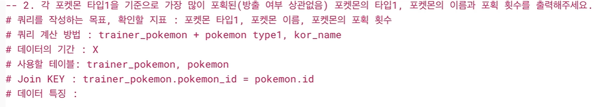

``` 
select
type1,
kor_name,
count(tp.id) as cnt # 포획 횟수
from basic.trainer_pokemon as tp
left join basic.pokemon as p
on tp.pokemon_id = p.id
group by
type1,
kor_name
order by
cnt desc
 /* limit 1 */ # 원하는 출력 수
 ``` 

## 3. 전설의 포켓몬을 보유한 트레이너들은 전설의 포켓몬과 일반 포켓몬을 얼마나 보유하고 있을까요? (트레이너 이름과 함께 출력)

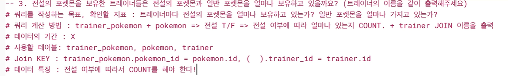

- 데이터 특징 -> countif, sum(case when~)
 ```
with legendary_cnts as (
select
tp.trainer_id,
tp.pokemon_id,
p.kor_name,
sum(case
when p.is_legendary is true then 1 else 0 end) as legendary_true
sum(case
when p.is_legendary is not true then 1 else 0 end) as legendary_false
# legendary_false == normal_true # 전설의 포켓몬이 아니다 : 일반 포켓몬
from basic.trainer_pokemon as tp
left join basic.pokemon as p
on tp.pokemon_id = p.id
where tp.status in ("Active", "Training")
group by
tp.trainer_id,
tp.pokemon_id,
p.kor_name
)
 ```
- sum( ~ end) : 값이 1인 것들의 수를 다 세겠다는 의미.
- sum은 집계함수이므로 group by와 함께 써줘야 함.

- sum 내부의 'is true'는 생략이 가능하다.
- is not true -> 앞에서 case when not 으로 쓰고 생략이 가능하다.

### legendary_cnts + trainer
 ```
select
t.name as trainer_name,
lc.legendary_cnt,
lc.normal_cnt
from basic.trainer as t
left join legendary_cnts as lc
on t.id = lc.trainer_id
where
lc.legendary_cnt >= 1
 ```
### sum(case when - )

## 4. 가장 승리가 많은 트레이너 ID, 트레이너의 이름, 승리한 횟수, 보유한 포켓몬의 수, 평균 포켓몬의 레벨을 출력해주세요. (단, 포켓몬의 레벨을 소수점 둘째 자리에서 반올림.) # 참고_ 반올림 함수 : ROUND


### (1) winner_id, count(승리 횟수)
 ```
with(
select
winner_id,
count(winner_id) as win_count
from basic.battle
where
winner_id is not null
group by
winner_id
),
 ```

### (2) 이름 추가
 ```
top_winner as(
select
wc.winner_id,
wc.win_counts,
t.name as trainer_name
from winner_counts as wc
left join basic.trainer as t
on wc.winner_id = t.id
order by
win_counts desc
limit 1
)
 ```
### (3) 평균 포켓몬 레벨, 포켓몬 수 추가
 ```
select
tw.trainer_id,
tw.trainer_naeme,
tw.win_count
count(tp.pokemon_id) as pokemon_cnt,
round(avg(tp.level), 2) as avg_level
from top_winner as tw
left join basic.trainer_pokemon as tp
on tw.trainer_id = tp.trainer_id
where
tp.status in ("Active", "Training")
group by
tw.trainer_id,
tw.trainer_name,
tw.win_counts
 ```

### join이 3번, with 문을 잘 사용하자!


## 5. 트레이너가 잡았던 포켓몬의 총 공격력(attack)과 방어력(defense)의 합을 계산하고, 이 함이 가장 높은 트레이너를 찾으세요.

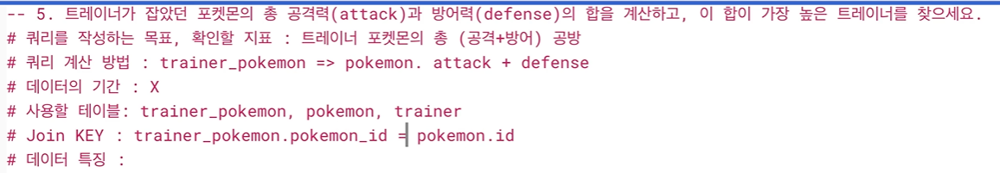

 ```
with total_stats as (select
tp.trainer_id,
/*p.attack,
p.defense, 
p.attack + p.defense as stat */ # 컬럼끼리 더할 때는 '+' 이용 가능
sum(p.attack + p.defense) as total_stat
from basic.trainer_pokemon as tp
left join basic.pokemon as p
on tp.pokemon_id = p.id
group by
tp.trainer_id
)

select
t.name,
ts.trainer_id
ts.total_stat
from total_stats as ts
left join basic.trainer as t
on ts.trainer_id = t.id
order by
total_stats desc
limit 1
 ```

## 6. 각 포켓몬의 최고 레벨과 최저 레벨을 계산하고, 레벨 차이가 가장 큰 포켓몬의 이름을 출력하세요.

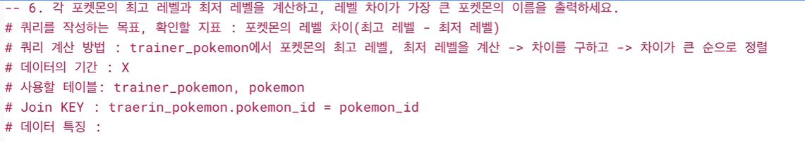
 ```
with level_diff as (
select
tp.pokemon_id,
/* tp.level */
min(tp.level) as min_level,
max(tp.level) as max_level,
max(tp.level) - min(tp.level) as level_difference
from basic.trainer_pokemon as tp
left join basic.pokemon as p
where
pokemon_id =12
order by
tp.level
)
 ```
> pokemon_id => min level : 6, max level : 22, level_difference = 14

 ```
select
kor_name,
level_difference
from level_diff
order by level_difference desc
limit 1
 ```

 ## 7. 각 트레이너가 가진 포켓몬 중에서 공격력(attack)이 100 이상인 포켓몬과 100 미만인 포켓몬의 수를 각각 계산해주세요. 트레이너의 이름과 두 조건에 해당하는 포켓몬의 수를 출력해주세요.

 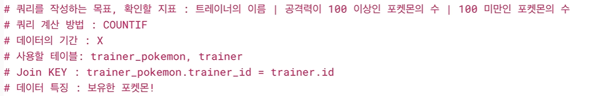

 ```
with active_and_training_pokemon as (
select
*
from basic.trainer_pokemon
where
status in ("Active", "Training")
)

select
atp.trainer_id,
# trainer_name은 이후에 join
countif(p.attack >= 100) as high_attack_cnt,
countif(p.attack < 100) as low_attack_cnt
from active_and_training_pokemon as atp
group by
atp.trainer_id ), trainer_high_and_low_attack_cnt as (
 ```
> 확인하고 싶은 것 : trainer_id = 5, high_attack_cnt = 0, low_attack_cnt = 7
 ```
select
atp.trainer_id,
atp.pokemon_id,
p.attack
from active_and_training_pokemon as atp
left join basic.pokemon as p
on atp.pokemon_id = p.id
where
trainer_id = 5

)

select 
t.name,
thalac.*
from trainer_high_and_low_attack_cnt as thalac
left join basic.trainer as t
on thalac.trainer_id = t.id
 ```

 # 총 정리

 - select, from, where
 - group by

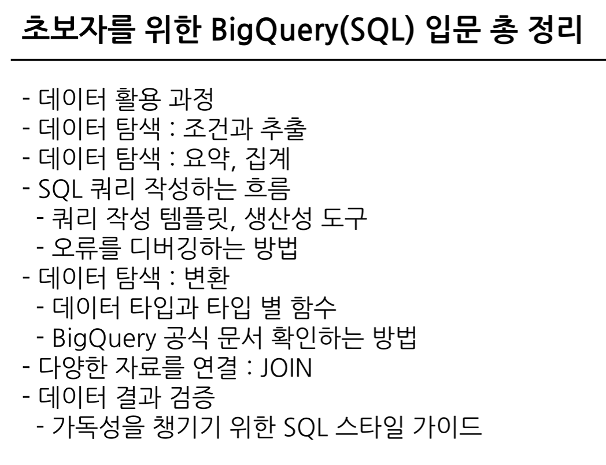
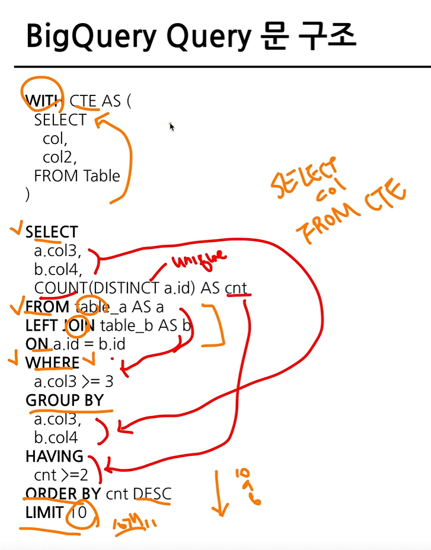
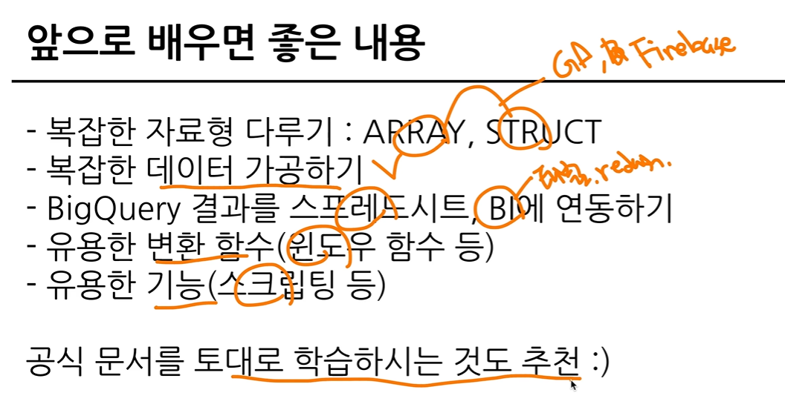
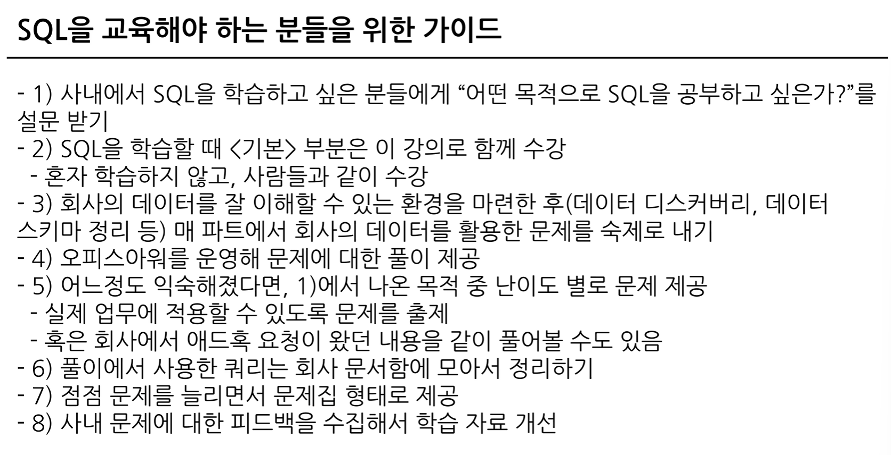

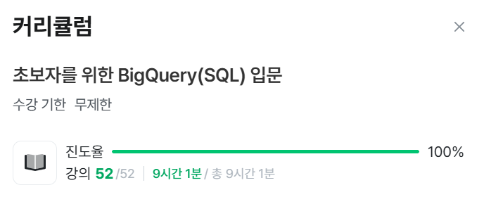
 ```
우와 진짜 끝났다는 게 실감이 안나지만.. 끝이 났네욥
아무도 안보겠지만 수고 많았어용 ~~~ ><
 ```
