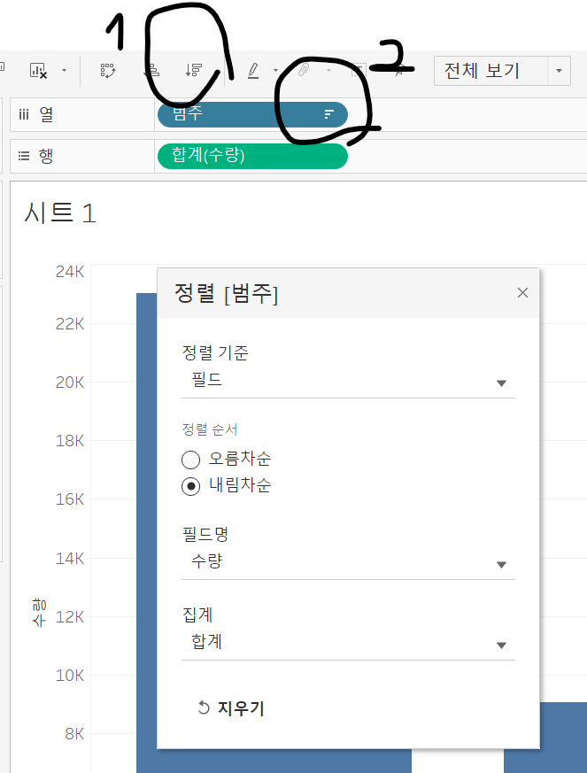
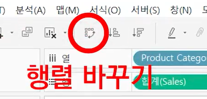
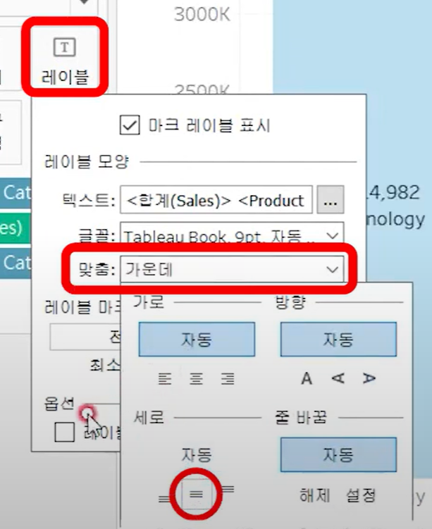
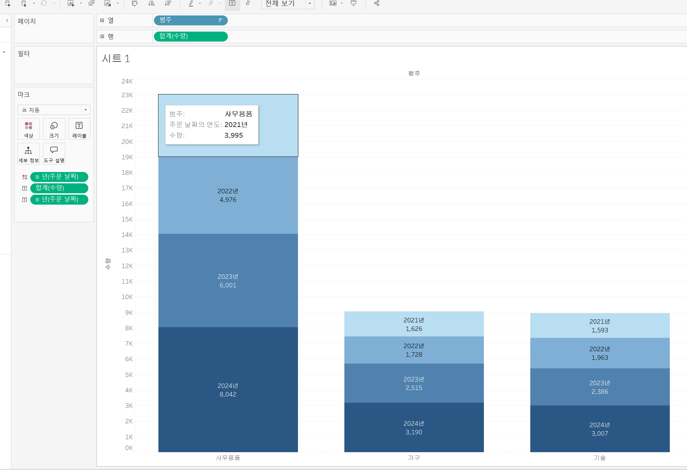
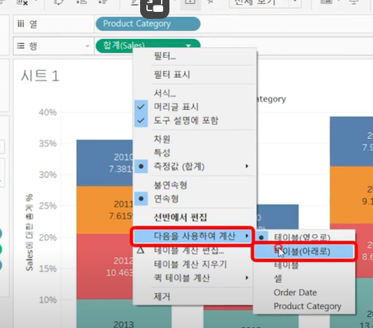
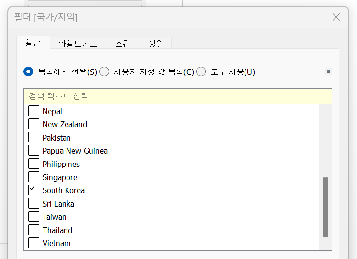
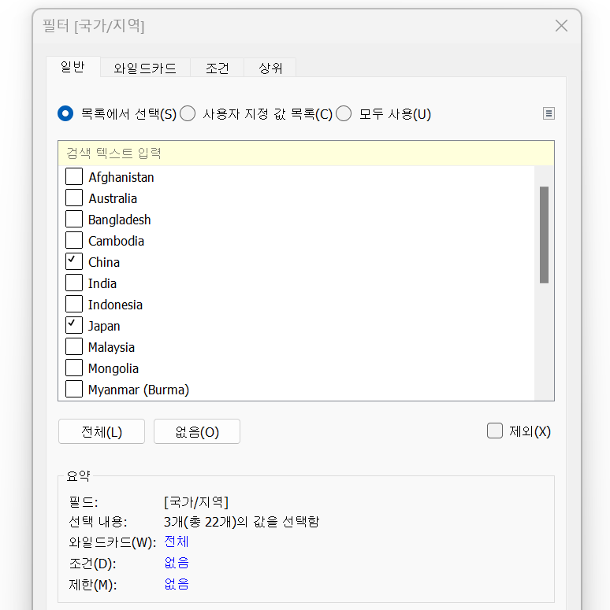
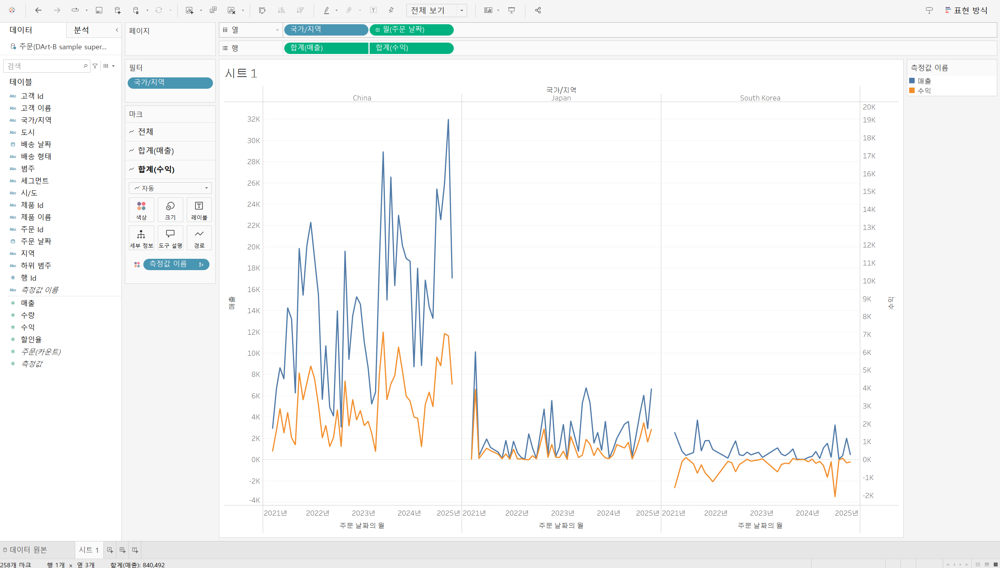

# Second Study Week

- 10강: [차원과 측정값](#10강-차원과-측정값)

- 11강: [시각화](#11강-시각화)

- 12강: [막대그래프](#12강-막대그래프)

- 13강: [누적막대그래프](#13강-누적막대그래프)

- 14강: [병렬막대그래프](#14강-병렬막대그래프)

- 15강: [누적병렬막대그래프](#15강-누적병렬막대그래프)

- 16강: [라인그래프](#16강-라인그래프)

- 17강: [맵작성](#17강-맵작성)

- 18강: [텍스트테이블](#18강-텍스트테이블)

- 19강: [트리맵과 하이라이트테이블](#19강-트리맵과-하이라이트테이블)

- 문제1 : [문제1](#문제1)

- 문제2 : [문제2](#문제2)

- 참고자료 : [참고자료](#참고-자료)


## Study Schedule

| 강의 범위     | 강의 이수 여부 | 링크                                                                                                        |
|--------------|---------|-----------------------------------------------------------------------------------------------------------|
| 1~9강        |  ✅      | [링크](https://youtu.be/3ovkUe-TP1w?si=CRjj99Qm300unSWt)       |
| 10~19강      | ✅      | [링크](https://www.youtube.com/watch?v=AXkaUrJs-Ko&list=PL87tgIIryGsa5vdz6MsaOEF8PK-YqK3fz&index=75)       |
| 20~29강      | 🍽️      | [링크](https://www.youtube.com/watch?v=AXkaUrJs-Ko&list=PL87tgIIryGsa5vdz6MsaOEF8PK-YqK3fz&index=65)       |
| 30~39강      | 🍽️      | [링크](https://www.youtube.com/watch?v=e6J0Ljd6h44&list=PL87tgIIryGsa5vdz6MsaOEF8PK-YqK3fz&index=55)       |
| 40~49강      | 🍽️      | [링크](https://www.youtube.com/watch?v=AXkaUrJs-Ko&list=PL87tgIIryGsa5vdz6MsaOEF8PK-YqK3fz&index=45)       |
| 50~59강      | 🍽️      | [링크](https://www.youtube.com/watch?v=AXkaUrJs-Ko&list=PL87tgIIryGsa5vdz6MsaOEF8PK-YqK3fz&index=35)       |
| 60~69강      | 🍽️      | [링크](https://www.youtube.com/watch?v=AXkaUrJs-Ko&list=PL87tgIIryGsa5vdz6MsaOEF8PK-YqK3fz&index=25)       |
| 70~79강      | 🍽️      | [링크](https://www.youtube.com/watch?v=AXkaUrJs-Ko&list=PL87tgIIryGsa5vdz6MsaOEF8PK-YqK3fz&index=15)       |
| 80~89강      | 🍽️      | [링크](https://www.youtube.com/watch?v=AXkaUrJs-Ko&list=PL87tgIIryGsa5vdz6MsaOEF8PK-YqK3fz&index=5)        |


<!-- 여기까진 그대로 둬 주세요-->
<!-- 이 안에 들어오는 텍스트는 주석입니다. -->

# Second Study Week

## 10강: 차원과 측정값

<!-- 차원과 측정값에 관해 배우게 된 점을 적어주세요 -->

> **🧞‍♀️ 차원과 측정값의 고유한 특성에 대해 설명해주세요.**

```
데이터 원본에 연결하는 경우, 태블로는 데이터의 열을 필드로 만들고 데이터의 유형에 따라 필드를 차원 또는 측정값으로 할당한다.
위쪽 : 차원(정성적인 값, 집계/계산되지 않는 독립적인 필드, *불연속형 필드), 아래 : 필드값(정량적인 값, 집계되는 값, *연속형 필드)
-> 이처럼 '차원'과 '측정값'은 영역을 기준으로 중심이 구분된다.
-> ++ 불연속형/연속형은 각각 파란색/녹색으로 구분된다.

*불연속형 필드 : 개별적으로 구분되는 값
ex. 카테고리/이름처럼 하나의 독립된 값을 가지고 있는 디지털 시계
*연속형 필드 : 단절이 없는 무한한 범위의 값
ex. 값이 끊어지지 않는 범위를 갖는 아날로그 시계

# 주의할 점
차원/측정값, 불연속성/연속성 -> 이 둘은 서로 다른 개념이므로 통합해서 생각해선 안된다. 차원이 연속형일 수도 있음! (시각화 방식에 따라 적절히 필드를 변경해야 한다.)
```

*Quiz: 차원은 불연속형이고, 측정값은 연속형이다 (o, x)*
```
X (-> 위 '주의할 점' 참고)
```


## 11강: 시각화

<!-- 시각화 관해 배우게 된 점을 적어주세요 -->
```
1.
뷰를 작성할 때는 이 데이터 패널의 필드를 시트로 추가하면 됨.
ex. 주문 날짜별로 매출 데이터를 시각화 하고 싶으면 주문 날짜 더블클릭+매출 필드 더블클릭 -> 알아서 처음과 측정값에 따라 자동 시각화.

2.
시트 없애고
열 선반으로 주문 일자 drag&drop
행 선반으로 매출 drag&drop

=> 표현 방식에 따라 다른 시각화 방식을 적용할 수 있다.

3.
주문 일자 필드를 선택 후, 매출도 선택 후 Ctrl키와 누른 채로 시트에 드랍.

4. 마크 창 이용
주문 일자를 열 선반, 매출 필드를 마크 창의 텍스트에 drag&drop
```

*Quiz: 차원은 대부분 불연속형이며 표 형태로 시각화했을 때 머리글로 표시되고, 측정값은 대부분 연속형이므로 표 형태로 시각화 진행했을 때 패널로 추가된다.(o, x)*

## 12강: 막대그래프

<!-- 막대그래프에 관해 배우게 된 점을 적어주세요 -->
### 막대그래프

: 여러 범주의 데이터를 비교할 때 유용하게 활용될 수 있다.
```
1) 세로 막대 차트

view : 표준 -> 전체 보기(화면 비율에 맞춤.)

매출을 기준으로 정렬.
```

```
2) 가로 막대 차트
= 세로 막대그래프에서 행렬을 바꿔주면 된다.
```

```
3) 색상 구분을 통한 효과적인 시각화

행에다 넣었던 범주(Product Category) 데이터를 '마크'의 색상에 drop.
-> 카테고리별로 다른 3개의 막대그래프가 그려짐.
-> 오른쪽 상단에서 범례 또한 나타남.(범례의 정렬 순서 또한 변경 가능)
-> 마크에서 색상도 따로 지정이 가능하다.
```
```
4) 데이터 레이블(숫자) 표시
매출 값 직접 표시하고 싶으면, 매출 필드를 마크 탭에 drop.
마찬가지로 카테고리를 표시하고 싶으면, 카테고리 탭을 레이블로 drop.
-> 만약, 값을 막대그래프에 직접 표시하고 싶으면 레이블 설정에서 수동으로 설정할 수 있다.
```

```

5) 매출이 큰 순서대로 그래프의 두께를 조정

매출 필드를 마크 창의 '크기'로 drop.
```


## 13강: 누적막대그래프

<!-- 누적막대그래프에 관해 배우게 된 점을 적어주세요 -->

<!-- 테이블(아래로)와 테이블(옆으로)의 계산 방식을 습득해보세요. 이에 관련해 아래 참고자료도 있습니다 :) -->
```
차원별로 측정값의 비중을 보여주기 위한 목적으로 사용.
축을 활용하여 구성비의 변화를 제공할 수 있다.

카테고리별 주문날짜 매출을 누적한 그래프
주문-> 마크에서 막대로.
열 선반의 주문 년도를 마크 창의 세부 정보로 drop.
-> 색상에 drop하면 색상 별로 나타낼 수 있음.
ctrl 누른 채로 레이블에 drop.
```

```
백분율 표시할 때 주의할 점
``` 

``` 
테이블 계산 필드에서 계산 유형 변경 가능
-> 다음을 사용하여 계산 -> 특정 차원 -> project category 해제
```

## 14강: 병렬막대그래프

<!-- 병렬막대그래프에 관해 배우게 된 점을 적어주세요 -->
```
주문 일자 필드가 불연속형으로 되어 있어서 전체가 합쳐져서 나타는 이슈.
병렬그래프를 그릴 때는 필드를 연속형으로 설정해야 각 막대의 수평위치를 고정하여 그룹을 형성한다.
월이 불연속형일 때, 년을 연속형으로 변경해야 한다.
1) 테이블 원본에서 직접 변환 -> 번거로울 수 있으며, 유형에 충돌O.
2) 선반에서 변환 -> 데이터 유형 변환O.
3) 데이터를 열 선반으로 가져올 때 ctrl 누른 채로 이동
```


> *🧞‍♀️ 끊어진 색상으로 배치되어 표현되는 경우와 이어지는 그라데이션 색으로 표현되는 경우 두 가지가 있습니다. 위 사진의 경우 왜 색깔이 끊어지는 색상으로 표시되지 않고 그라데이션으로 표시되었나요? 데이터의 특성과 관련하여 이야기해 봅시다.*

```
열 선반이 불연속형, 행 선반이 연속형일 때 vs 열 선반 또한 연속형으로 바꿔줬을 때
```

## 15강: 누적병렬막대그래프

<!-- 누적병렬막대그래프에 관해 배우게 된 점을 적어주세요 -->
```
지역별(열)로 수익과 매출 데이터(측정값, 행)를 카테고리(열)로 누적해서 볼 수 있다.
병렬일 때는 날짜 필드를 연속형으로 변환.
연도가 연속형/불연속형일 때 구분이 없으므로 차이가 없음.

이중 축 이용하기
할인은 지역에 따라, 매출은 상품 카테고리에 따라.
두가지 데이터를 하나의 축을 이용해 나타내는 방식.
```


> *🧞‍♀️ 위 사진에서는 Profit과 Sales를 측정값으로 두었습니다.  개별 칼럼(태블로에서는 #필드라 명칭합니다)을 열/행에 두는 대신, '측정값'을 사용하고 측정값 선반에 필드를 올려둡니다. 이런 방식을 사용하는 이유가 무엇일지, 어떻게 사용할 수 있을지 고민해보세요*

```
profit과 sales 같은 여러 측정값을 하나의 차트로 시각화하여 간단히 비교 할 수 있다. 또한, 각각의 값들/특정 차원과 관련해서 어떻게 변동하는 지 등을 파악할 수 있다.
```

<!-- 정답은 없습니다 -->

## 16강: 라인그래프

<!-- 라인그래프에 관해 배우게 된 점을 적어주세요 -->
```
열에 날짜 필드가 있으면 자동으로 라인 그래프 만들어줌.
주문 일자가 열 선반에서 불연속형으로 되어 있어서 라인이 끊어져 있는데, 다 날리고, 월 데이터를 연속형으로 바꿔주면 끊이지 않게 나타낸다.

이중 축을 만들면 양쪽의 세로축이 서로 다른 값을 나타내기 때문에 값 해석의 왜곡 가능성O. -> 축 동기화.

값에 따른 표현형식 변경 -> 마크창의 색상 이용.
```


## 17강: 맵작성

<!-- 맵차트 관해 배우게 된 점을 적어주세요 -->
```
태블로가 지원하는 지리적 역할에 값을 부여하면 위도와 경도가 자동으로 생성되어 원하는 맵을 그릴 수 있다.

미국의 주 단위로 맵 그리기

맵의 위치설정 확인-> 국가/지역: 미국

마크 창 -> 맵

++ 매출 데이터로 표시(색상, 크기) + 이중 축 설정

다양한 위치를 표시하는 방법

마크 계층은 투명 오버레이처럼 작동하며 각 계층은 고유한 마크와 캡션, 색상 등을 가질 수 있다.

마크 -> 맵 변경.
++위치 필드를 '주'로 변경.

=> 주 단위는 매출로, 도시 단위는 수입으로 표현할 수 있다.
```

```js
## 참고
Country/Region - 나라/지역
State/Province - 시/도
City - 시
County - 군
Postal Code - 우편번호
Area Code - 지역 코드
Airport - 공항
MSA/CBSA (Metropolitan Statistical Area) - 광역 통계 지역
Longitude - 경도
Latitude - 위도
```

## 18강: 텍스트테이블

<!-- 텍스트테이블에 관해 배우게 된 점을 적어주세요-->
```
텍스트 테이블에 데이터 drop.
-> 소계, 열 총합계, 행 총합계를 표시 뷰 생성.
-> 테이블(아래로) : 연도 별 하위 범주
-> 패널(아래로) : 범주 기준
-> 서식 변경을 통해 소수점 자리 등 변경 가능.
```

## 19강: 트리맵과 하이라이트테이블

> *🧞‍♀️하이라이트 테이블 등에서 두개 이상의 측정값을 사용하는 경우, 함께 색을 표현하게 되면 단위가 달라 정확한 값을 표현할 수 없습니다. 이때 클릭해야 하는 항목은?*

```
범례 이용 -> 범위 구분!
```


## 문제1

```js
지민이는 superstore의 한국 수출 관리 업무를 맡고 있습니다. 국가/지역이 우리나라, 즉 'South Korea'인 데이터만을 필터링하여, 상품 하위범주 별로 각 하위범주가 매출의 비율 중 얼마만큼을 차지하는지를 트리맵으로 확인하고 싶습니다. 트리맵의 각 네모 안에 표시되는 텍스트에는 **해당 범주의 이름과 전체에서 해당 범주가 차지하는 비율**이 표시되었으면 합니다.

지민이를 도와주세요! (풀이를 찾아가는 과정을 기술해주세요)
```

```
1. 테이블의 '국가/지역' 데이터를 필터 선반에 drag&drop한 후 'south korea' 선택하여 국가를 south korea로 지정한다.
```

```
2. 다음 사진처럼 적절히 drag&drop하고 퀙 테이블 계산에서 구성비율 선택하여 원하는 조건인 '해당 범주의 이름과 전체에서 해당 범주가 차지하는 비율'을 표시한다.
```


## 문제2

```js
주현이는 국가/지역별로 매출과 수익의 증감을 시간에 흐름에 따라 표현하고자 합니다. 특히 **한국/중국/일본**을 비교하고자 해당 3국을 남기고 필터링했고, 3개 국가를 매출과 수익이라는 두 가지 지표로 확인해보았습니다.

아래는 위 설명을 표현해본 예시입니다.
```


<!--js
레퍼런스와 꼭 같지 않아도 자유롭게 표현하고, 그 과정을 기술해주세요.
-->

```
국가 : 한국/중국/일본 3개국 지정.
-> 1번과 마찬가지로 국가/지역 데이터를 필터 선반에 drag&drop한 후 'south korea', 'china', 'japan' 선택 후 지정.
```

```
적절히 drag&drop한다.
최종적으로 수익 데이터를 이중 축으로 지정하여 나타낸다.
```



### 참고 자료

```js
테이블 계산에서 '다음을 사용하여 계산'에는 테이블 당 계산과 패널 당 계산이 있습니다. 이에 대해 이해하는 것이 꼭 필요하기 때문에, 외부 레퍼런스를 참고하여 이 단계에서 꼭! 학습 후, 넘어가주세요 :)
```


[참고 외부자료 링크는여기를클릭하십시다](https://velog.io/@eunsuh/Tableau-%EB%A0%88%EB%B2%A8UP-%EA%B0%95%EC%9D%98-%EC%A0%95%EB%A6%AC-1-%ED%85%8C%EC%9D%B4%EB%B8%94-%EA%B3%84%EC%82%B0)