# Third Study Week

- 20강: [파이와 도넛차트](#20강-파이와-도넛차트)

- 21강: [워드와 버블차트](#21강-워드와-버블차트)

- 22강: [이중축과 결합축](#22강-이중축과-결합축)

- 23강: [분산형 차트](#23강-분산형-차트)

- 24강: [히스토그램](#24강-히스토그램)

- 25강: [박스플롯](#25강-박스플롯)

- 26강: [영역차트](#26강-영역차트)

- 27강: [간트차트](#27강-간트차트)

- 28강: [필터](#28강-필터)

- 29강: [그룹](#29강-그룹)


- 문제1 : [문제1](#문제1)

- 문제2 : [문제2](#문제2)

- 참고자료 : [참고자료](#참고-자료)


## Study Schedule

| 강의 범위     | 강의 이수 여부 | 링크                                                                                                        |
|--------------|---------|-----------------------------------------------------------------------------------------------------------|
| 1~9강        |  ✅      | [링크](https://youtu.be/3ovkUe-TP1w?si=CRjj99Qm300unSWt)       |
| 10~19강      | ✅      | [링크](https://www.youtube.com/watch?v=AXkaUrJs-Ko&list=PL87tgIIryGsa5vdz6MsaOEF8PK-YqK3fz&index=75)       |
| 20~29강      | ✅      | [링크](https://www.youtube.com/watch?v=Qcl4l6p-gHM)      |
| 30~39강      | 🍽️      | [링크](https://www.youtube.com/watch?v=e6J0Ljd6h44&list=PL87tgIIryGsa5vdz6MsaOEF8PK-YqK3fz&index=55)       |
| 40~49강      | 🍽️      | [링크](https://www.youtube.com/watch?v=AXkaUrJs-Ko&list=PL87tgIIryGsa5vdz6MsaOEF8PK-YqK3fz&index=45)       |
| 50~59강      | 🍽️      | [링크](https://www.youtube.com/watch?v=AXkaUrJs-Ko&list=PL87tgIIryGsa5vdz6MsaOEF8PK-YqK3fz&index=35)       |
| 60~69강      | 🍽️      | [링크](https://www.youtube.com/watch?v=AXkaUrJs-Ko&list=PL87tgIIryGsa5vdz6MsaOEF8PK-YqK3fz&index=25)       |
| 70~79강      | 🍽️      | [링크](https://www.youtube.com/watch?v=AXkaUrJs-Ko&list=PL87tgIIryGsa5vdz6MsaOEF8PK-YqK3fz&index=15)       |
| 80~89강      | 🍽️      | [링크](https://www.youtube.com/watch?v=AXkaUrJs-Ko&list=PL87tgIIryGsa5vdz6MsaOEF8PK-YqK3fz&index=5)        |


<!-- 여기까진 그대로 둬 주세요-->
<!-- 이 안에 들어오는 텍스트는 주석입니다. -->

# Third Study Week

## 20강: 파이와 도넛차트
<!-- 파이와 도넛차트에 관해 배우게 된 점을 적어주세요 -->
```
파이차트 : 전체에 대한 비율을 표시할 때 주로 사용.
파이차트에서 구멍 뚫린 모양 -> 도넛차트
```
> **🧞‍♀️ 도넛차트를 생성하는 법을 기록해주세요.**

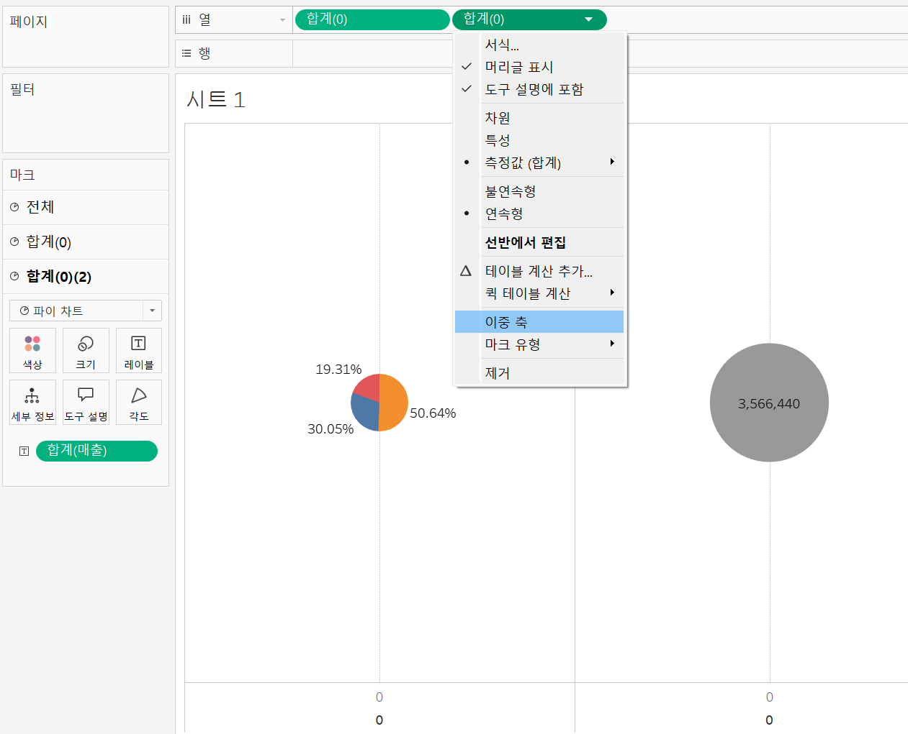 : 파이차트 이중 축 설정하는 법
```
1. 차례로 '세그먼트', '매출' 더블 클릭.
2. '매출'을 레이블에 drag&drop -> 데이터 레이블 표시(수치 표현).
3. 표현 방식을 '파이 차트'로 설정.
4. 보기 방식을 '표준'에서 '전체 보기'로 설정.
5. 내림차순 정렬로 설정.
6. 실제 값보다는 구성 비율로 표현하는 것이 파악에 용이.
7. 레이블 필드를 마우스 오른쪽 클릭 -> 퀵 테이블 계산 -> 구성 비율
-> but 구성 비율로만 나타내면 총합계를 알 수 없기에 전체 매출을 표현해주는 것이 좋음.
-> 이중 축을 활용하여 도넛차트 만들기 ! (= 우리가 그린 파이차트 위에 작은 원을 하나 더 그려서 올려주는 것으로 이해)
-> 이때, 파이 차트는 따로 축이 없으므로 임의의 축을 설정해줘야 함.
8. 열 선반의 빈 공간을 더블 클릭하여 필드 직접 생성.
-> 필드에 '0' 입력하여 축 생성 -> 'ctrl' 키 누른 채 필드 복사 -> 두 개의 파이차트 나타낼 수 있다.
```
## 21강: 워드와 버블차트
<!-- 워드와 버블차트에 관해 배우게 된 점을 적어주세요 -->
```
버블차트 : 수치적 데이터를 원의 크기로 표현하는 차트.

ctrl 키를 누른채 '국가/지역'과 '매출' 클릭 -> 표현 방식에서 버블 차트
=> 국가별 매출에 따른 버블 차트 생성 완 !
-> '매출'을 색상 마크에 넣어서 색상으로도 시각화 O -> 전체 보기
```
```
워드 클라우드 : 문서 내에서 target 키워드가 얼마나 자주 등장하는지를 텍스트 크기로 표현하여 직관적으로 시각화할 수 있는 차트.

-> 데이터에서 어떤 지역이 몇 번 등장했는지 횟수를 카운트하고 이에 따른 크기를 표현하기 위해서
-> 데이터 테이블에서 '국가/지역'을 우클릭한 채 드래그하여 크기 마크에 drag&drop. 
```
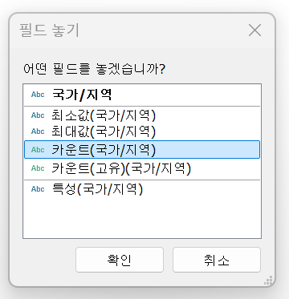
```
-> 또 다시 '국가/지역'을 레이블 마크에 drag&drop.
-> 히트맵(자동)으로 표현된 차트를 워드 클라우드로 변경하기 위해 설정을 '텍스트'로 변경.
```
## 22강: 이중축과 결합축
<!-- 이중축과 결합축에 관해 배우게 된 점을 적어주세요 -->
```
이중 축 : 하나의 뷰 안에서 축을 이중으로 사용하는 차트.
-> 이중축을 사용할 경우 마크를 각각의 축에 개별 적용O.

ex. 주문 일자의 분기를 기준으로 매출과 수익 비교.
주문 날짜 테이블 우클릭 채 열 선반 drag(-> 필드 놓기 탭 생성) -> 연속형 분기 선택 -> '매출'과 '수익' 필드 각각 더블 클릭 -> 두 view 확인
-> 합치고자 하는 필드('수익' 필드)에 이중 축 설정(from 열 선반)
-> 축 동기화 -> 머리글 표시 해제(//범례O)  -> 마크 창 각각 생성됨 확인 => 이중 축에서는 독립적으로 마크를 수정할 수 있다.
```
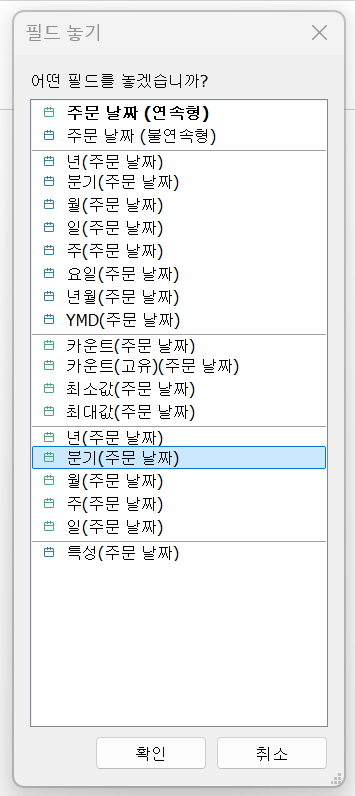 
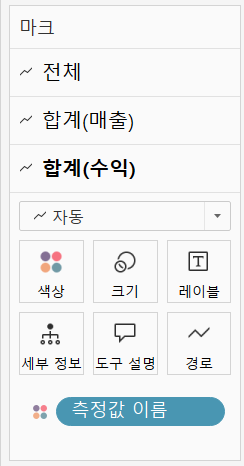
```
* 수익 필드를 드래그 해서 시트 오른쪽에 drop하면 이중 축 생성됨.

결합 축 : 하나의 축을 공유하는 차트.
-> 축을 공유하는 측정값을 필요에 따라 추가할 수 있다.

* 수익 필드를 드래그 해서 시트 왼쪽에 drop하여 결합 축 생성.
```
## 23강: 분산형 차트
<!-- 분산형 차트에 관해 배우게 된 점을 적어주세요 -->

js
강의 영상과 달리, 우리 파일에는 '제조 업체' 필드가 없습니다. 필요한 경우, 계산된 필드를 이용해 'SPLIT([제품 이름], ' ', 1)'를 '제조 업체'로 정의하시고 세부 정보에 놓아주세요.
```
분산형 차트 : 파라미터 간의 상관관계를 파악하는데 유용한 그래프.

ex. 매출과 수익 간의 상관관계 파악.

열 선반에 '매출' 필드, 행 선반에 '수익' 필드 drag&drop.
-> 세부 정보 마크에 '제조 업체' 필드 drag&drop.

* '제조 업체' 필드 생성하는 법 *
상단 '분석' 탭에서 계산된 필드 만들기 클릭 -> 필드 name & func 입력.

-> '범주' 필드를 색상 마크에 drag&drop. ++ 도형 마크에서 모양 변경O.
 
'추세선'을 많이 활용하는 분산형 차트 ! 

ex. 범주별로 추세선 추가해보기

왼쪽 상단의 데이터 탭에서 분석 탭으로 전환 후 '추세선' 누르면서 시트 선형에 drag&drop. -> 매출에 따른 수익의 추세선 생성.

if 범주에 상관없이 전체 추세를 파악하고 싶다면 추세선 우클릭 -> 전체 추세선 편집에서 범주 옵션 제거
```
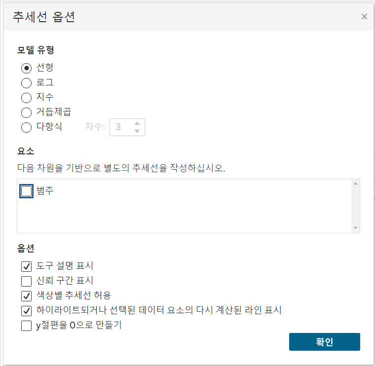
```
=> '이중 축'을 활용하여 제품별 추세선과 전체 추세선을 한 뷰에서 같이 볼 수 있다.

열 선반에서 '매출' 필드를 ctrl 누른 채 drag하여 복사.
-> 한 쪽에서 추세선 옵션에서 '범주' 선택 후 이중 축 설정.
-> 생성된 머리글은 우클릭 및 머리글 표시 해제하여 정리.

* 범주(범례)에서 보고자 하는 데이터 클릭하여 하이라이트 확인 가능.
```
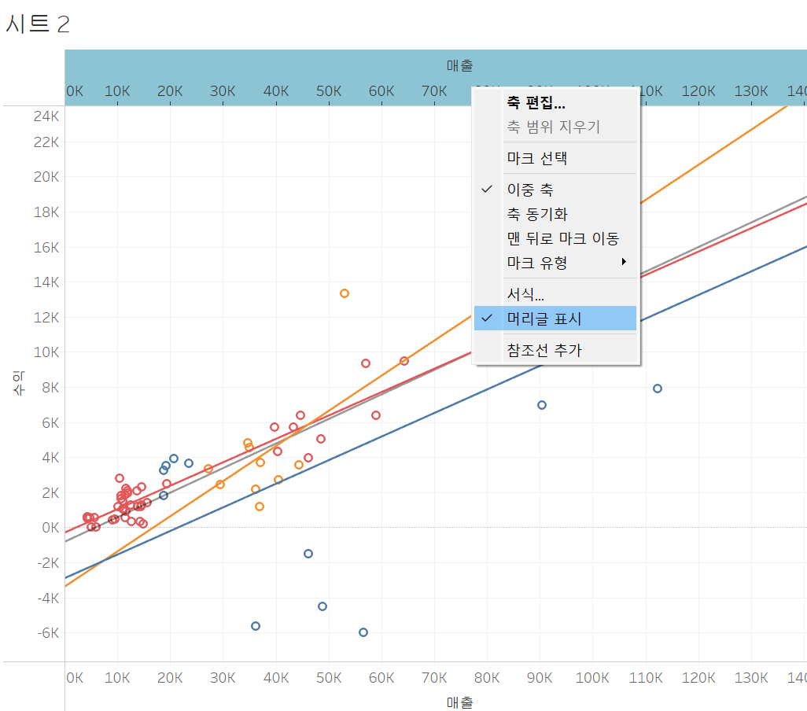

## 24강: 히스토그램
<!-- 히스토그램에 관해 배우게 된 점을 적어주세요 -->
```
히스토그램 : 분포 형태를 표시하는 차트.

모양은 막대그래프와 유사하나, 불연속형이 아닌 연속형 측정값을 범위 혹은 *구간 차원으로 그룹화한다는 점에서 차이가 있다.

차원 필드 없이 측정값만으로 그래프를 그릴 때 주로 활용.

# 구간 차원을 생성하여 히스토그램 만들기

*구간 차원 : 일정한 크기의 포켓을 만들어 그 안에 값을 담아 표현시키기 위한 도구로 이해하자.
```
** 구간 차원 생성하는 법
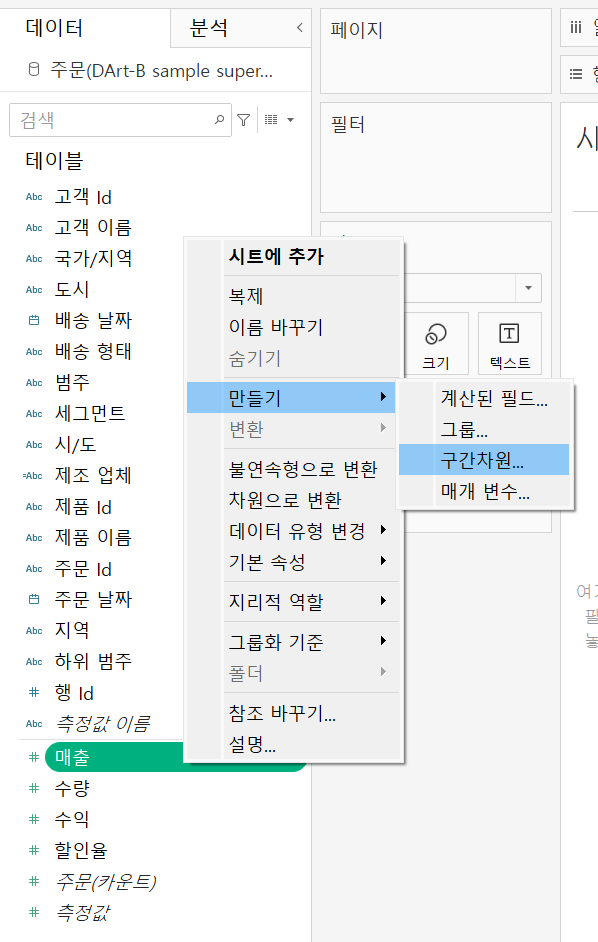

```
구간차원 크기 : 구간별로 담을 포켓의 크기.

생성된 매출(구간차원) 필드 열 선반에 drag&drop -> '연속형'으로 설정
매출 필드 행 선반에 drag&drop -> 측정값을 '카운트'로 설정
when 중복 값을 제외하고 카운트하고자 하면 '카운트(고유)'로 설정.

# 구간 차원 생성하지 않고 히스토그램 만들기

'수익' 필드 열 선반에 drag&drop -> 표현 방식을 히스토그램으로 설정 -> [*태블로 자체에서 세 가지 작업이 진행된다.]

1. 뷰가 연속형 세로 막대를 표시하도록 표현된다.
2. 열 선반에 배치하여 합계로 집계됐던 수익의 측정값이 연속형(초록색)의 수익 구간 차원으로 변경된다.
3. 수익 측정값이 행 선반으로 이동되고 집계가 합계에서 카운트로 변경된다.

++   
- 수익(구간차원) 필드 편집에서 구간차원 크기 설정 가능.
- 최대와 최소 차이가 커서 그래프 표현이 극단적일 때 축 편집에서 눈금을 
'로그'로 설정하여 스케일링 가능.
```
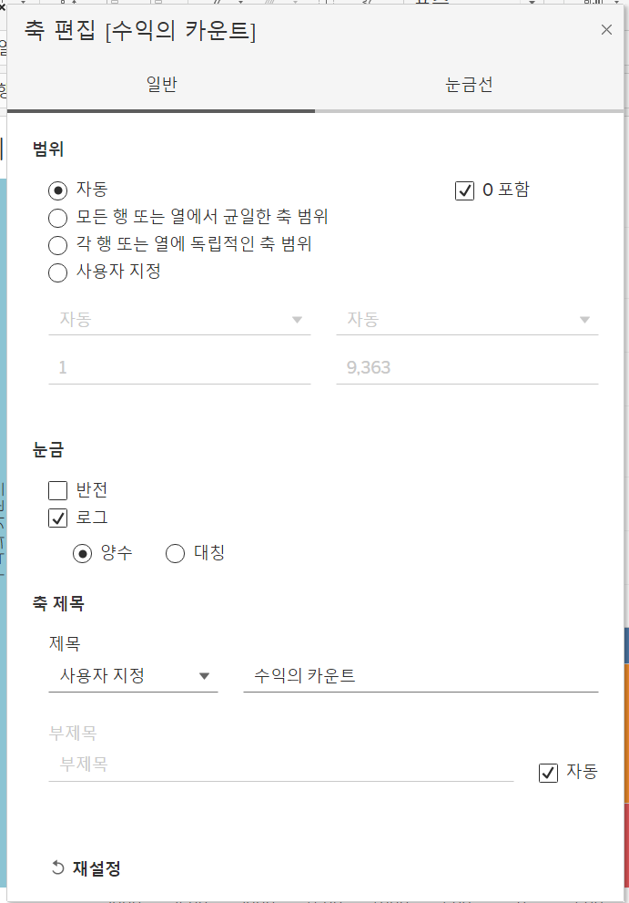

## 25강: 박스플롯
<!-- 박스플롯에 관해 배우게 된 점을 적어주세요 -->
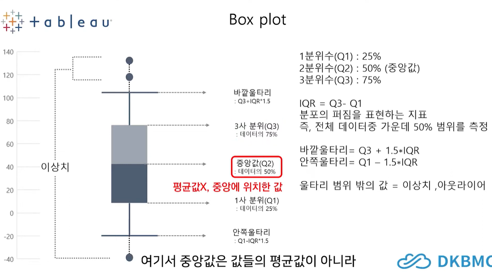

```
박스플롯(상자 수염 그림)은 다섯 개의 구간 범위를 그림으로 표현해 분포와 이상치 등을 한눈에 볼 수 있다는 장점이 있다.
-> 데이터 전처리와 분포 분석을 통한 인사이트 도출에 많이 사용.

실습 : 지역 및 고객 세그먼트별 매출을 표시하는 박스 플롯 만들기

세그먼트와 지역별 매출 총합으로 자동 집계되어 박스가 아니라 평평한 형태로 나타나짐.
-> 고객별 매출로 시각화하기 위해서 고객 이름을 마크의 세부정보로 드래그.
```

## 26강: 영역차트
<!-- 영역차트에 관해 배우게 된 점을 적어주세요 -->
```
영역차트 : 라인과 축 사이의 공간이 색상으로 채워진 라인 차트.
즉, 영역을 색상으로 채우는 차트임. -> 연속형 데이터의 누계를 표현하는 데 사용된다.

실습 : 주문 날짜에서 분기별로 매출을 살펴보자!

누계차트인 영역차트로 보여주기 위해서 표현방식에 영역 차트 연속형으로 수정한다.
```
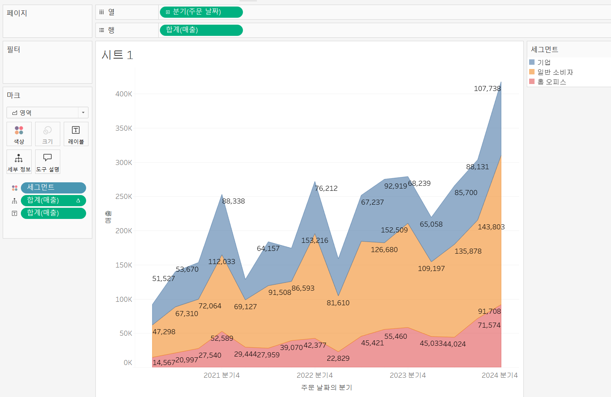

## 27강: 간트차트
<!-- 간트차트에 관해 배우게 된 점을 적어주세요 -->
```
실습 : 제품 범주별 배송 기간을 배송 형태로 구분해서 간트 차트로 시각화하기

배송 기간을 월별로 보기 위해 불연속형의 월을 선택.
배송 기간 = 배송날짜 - 주문날짜
-> 계산된 필드에서 '배송 기간' 필드 생성.
-> datediff('day', [배송날짜], [주문날짜])

기본적으로 배송기간 필드를 마크 창에 drag&drop하면 합계로 집계가 되어 있는데 기간을 합계로 집계하면 배송기간이 그 각각의 배송기간이 아니라 월 모든 배송기간의 합을 나타내므로 원하는 시각화 얻을 수 X.
-> 마크의 배송기간 필드 편집에서 측정값을 합계에서 '평균'으로 변경.

'고객 이름'을 필터로 걸어 보고자하는 고객의 데이터만 살펴보고자 함.

-> 단일 값 드롭 다운 형식으로 보려고 설정O.
```
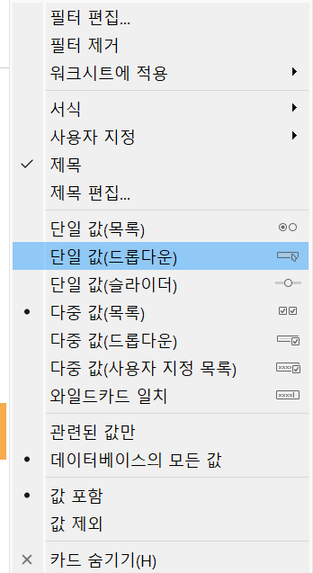
## 28강: 필터
<!-- 필터에 관해 배우게 된 점을 적어주세요 -->
```
'필터링' : 데이터 분석에서 필수적인 부분이다. 뷰뿐만 아니라 쿼리 속도나 데이터 용량 측면에서도 필터 핸들링에 따라 성능 차가 확실하다.

[태블로가 필터를 실행하는 순서]
추출, 데이터원본, 컨텍스트, 차원, 측정값, 필터 순으로 동작.

1. 추출
데이터원본으로 가서 추출 클릭 -> 오른쪽에 편집 단추 생성
필터 설정 후 시트 이동 -> 추출을 통해 일부만 따로 저장해서 이 저장 주소에 있는 로컬 데이터와만 연동해서 작업할 수 있다. (따로 저장O)

데이터를 가져올 때나 저장할 때 최우선으로 필터링이 저장된다.

2. 데이터원본
작업을 위한 데이터 중 일부만 워크 스페이스에 불러올 때 사용.

3. 컨텍스트
필터 중 상위 필터.
태블로는 각 필터가 다른 필터에 관계 없이 모든 행에 액세스하도록 작동하는데 여러 필터를 설정했을 때 컨텍스트 필터로 지정해주게 되면 다른 필터가 컨텍스트 필터에 종속되어 작동한다.

[실습]
범주, 제품 이름 행 선반에, 매출은 마크창에 drag&drop(or just click)
제품 이름에 합계 기준으로 상위 10개 필터링, 범주 중 '기술'만 선택.
범주 중 기술 파트를 가장 상위 필터로 설정하기 위해 컨텍스트 추가!

컨텍스트 필터가 적용되면 필터 선반에서 맨 위로 정렬되어 재정렬이 불가하다.

종속 필터를 필터 선반에 두기 이전에 컨텍스트 필터를 먼저 설정하면 쿼리 속도가 향상된다!

4. 차원
```

## 29강: 그룹
<!-- 그룹에 관해 배우게 된 점을 적어주세요 -->
```
그룹을 이용해 수동으로 필드에 있는 항목들을 묶을 수 있으며, 기존 데이터 원본에 없는 사용자 지정 그룹 필드를 만들 수 있다.

[실습]
제품과 수익을 보여주는 막대 차트.
제품 이름 : 열, 수익 : 행 -> 각 회사별 제품들이 얼마나 많은 수익 냈는지 -> 회사별 그룹 만들기

1. 뷰에서 그룹 만들기
뷰에서 해당 회사의 제품들 드래그 -> 그룹 지정 -> 마크 창에 제품 이름(그룹) 생성.


데이터 창에서 제품 이름(그룹) -> 그룹 편집에서 그룹 기준 확인 가능

2. 직접 항목별로 묶을 필드를 선택해 만드는 방법
데이터 창에서 제품 이름 필드 우클릭 -> 그룹 만들기, shift 이용해서 직접 그룹 설정하기, shift를 제외한 거는 '기타 포함' 이용. 

*적절하게 행 선반과 마크 창 필드 이용하기!(++기타 포함 여부 선택)
```

## 문제 1.

```js
유정이는 superstore 데이터셋에서 '주문' 테이블을 보고 있습니다.
1) 국가/지역 - 시/도- 도시 의 계층을 생성했습니다. 계층 이름은 '위치'로 설정하겠습니다.
2) 날짜의 데이터 타입을 '날짜'로 바꾸었습니다.

코로나 시기의 도시별 매출 top10을 확인하고자
1) 배송 날짜가 코로나시기인 2021년, 2022년에 해당하는 데이터를 필터링했고
2) 위치 계층을 행으로 설정해 펼쳐두었습니다.
이때, 매출의 합계가 TOP 10인 도시들만을 보았습니다.
```


```
겉보기에는 전체 10개로, 잘 나온 결과처럼 보입니다. 그러나 유정이는 치명적인 실수를 저질렀습니다.
오늘 배운 '컨텍스트 필터'의 내용을 고려하여 올바른 풀이 및 결과를 구해주세요.
```
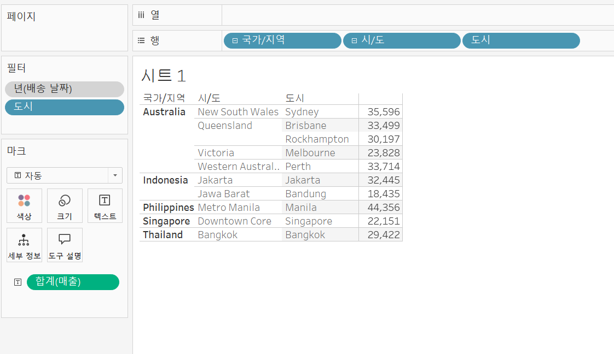
```
기본적으로 연도가 2021, 2022년인 데이터에서 매출 합계가 top 10인 데이터를 필터링해야 하는 것이므로 연도가 매출 합계보다 더 상위 기준임을 알 수 있다. 따라서 배송 날짜(연도)에 컨텍스트 필터를 적용하여 시각화함으로써 문제를 해결할 수 있다.
```

<!-- DArt-B superstore가 아닌 개인 superstore 파일을 사용했다면 값이 다르게 표시될 수 있습니다.-->

## 문제 2.

```js
태영이는 관심이 있는 제품사들이 있습니다. '제품 이름' 필드에서 '삼성'으로 시작하는 제품들을 'Samsung group'으로, 'Apple'으로 시작하는 제품들을 'Apple group'으로, 'Canon'으로 시작하는 제품들을 'Canon group'으로, 'HP'로 시작하는 제품들을 'HP group', 'Logitech'으로 시작하는 제품들을 'Logitech group'으로 그룹화해서 보려고 합니다. 나머지는 기타로 설정해주세요. 이 그룹화를 명명하는 필드는 'Product Name Group'으로 설정해주세요.

(이때, 드래그보다는 멤버 찾기 > 시작 문자 설정하여 모두 찾아 한번에 그룹화해 확인해보세요.)
```


```js
해당 그룹별로 어떤 국가/지역이 주문을 많이 차지하는지를 보고자 합니다. 매출액보다는 주문량을 보고 싶으므로, 주문Id의 카운트로 계산하겠습니다.

기타를 제외하고 지정한 5개의 그룹 하위 목들만을 이용해 아래와 같이 지역별 누적 막대그래프를 그려봐주세요.
```


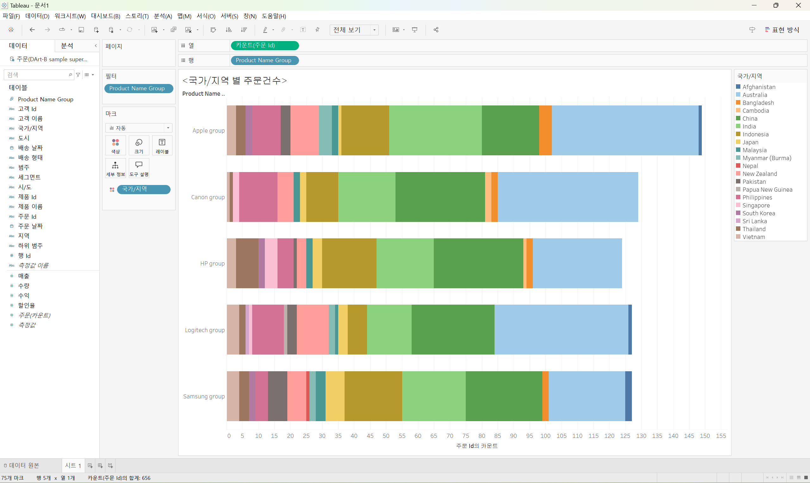