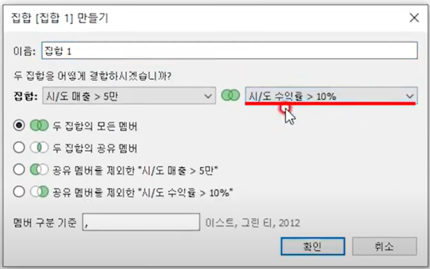
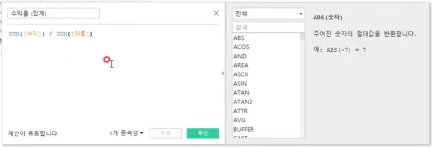
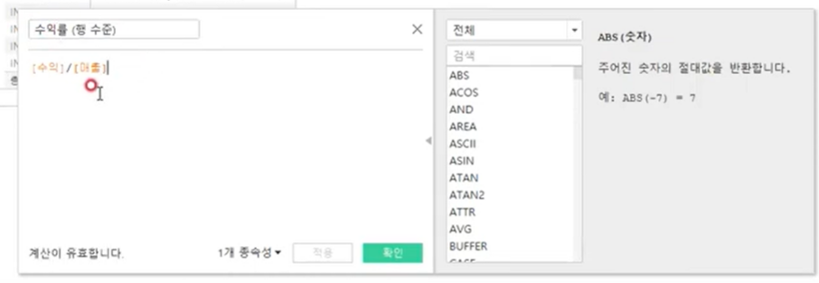
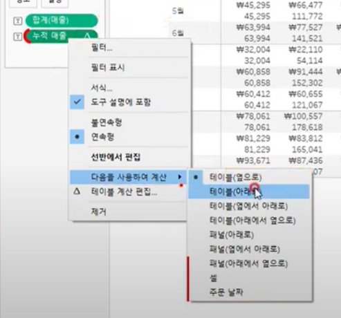
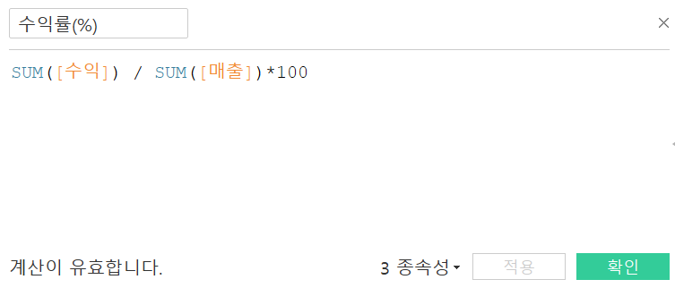
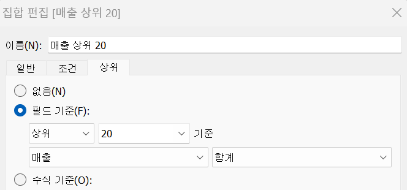
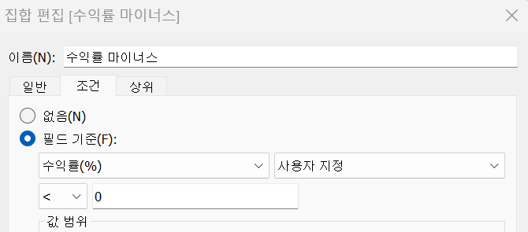
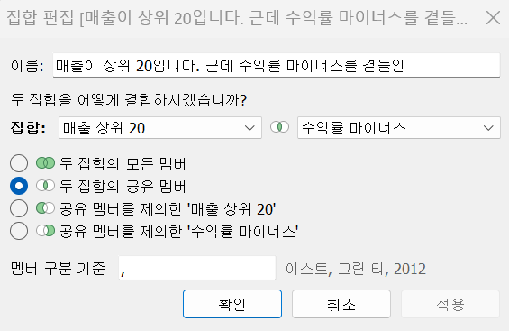
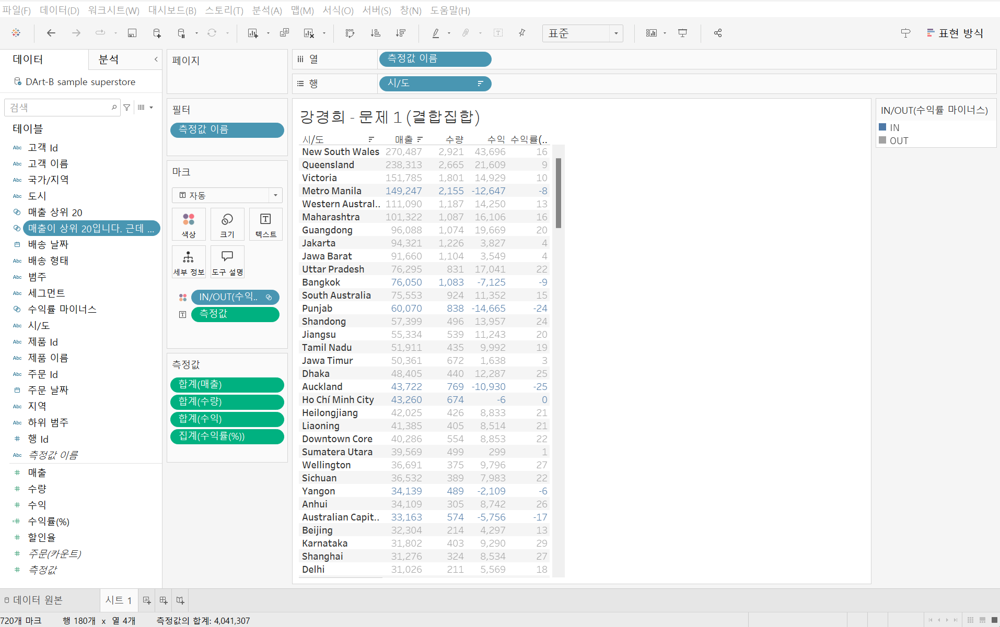

# Fourth Study Week

- 30강: [계층](#30-계층)

- 31강: [집합](#31-집합)

- 32강: [결합집합](#32-결합집합)

- 33강: [계산된 필드](#33-계산된-필드)

- 34강: [행수준계산](#34-행수준계산)

- 35강: [집계계산](#35-집계계산)

- 36강: [테이블계산](#36-테이블계산)

- 37강: [퀵테이블계산(1)](#37-퀵테이블계산1)

- 38강: [퀵테이블계산(2)](#38-퀵테이블계산2)

- [문제1](#문제-1)

- [문제2](#문제-2)

- [문제3](#문제-3)

## Study Schedule

| 강의 범위     | 강의 이수 여부 | 링크                                                                                                        |
|--------------|---------|-----------------------------------------------------------------------------------------------------------|
| 1~9강        |  ✅      | [링크](https://www.youtube.com/watch?v=AXkaUrJs-Ko&list=PL87tgIIryGsa5vdz6MsaOEF8PK-YqK3fz&index=84)       |
| 10~19강      | ✅      | [링크](https://www.youtube.com/watch?v=AXkaUrJs-Ko&list=PL87tgIIryGsa5vdz6MsaOEF8PK-YqK3fz&index=75)       |
| 20~29강      | ✅      | [링크](https://www.youtube.com/watch?v=AXkaUrJs-Ko&list=PL87tgIIryGsa5vdz6MsaOEF8PK-YqK3fz&index=65)       |
| 30~38강      | ✅      | [링크](https://youtu.be/e6J0Ljd6h44?si=nhGbB7GsdOCqj15f)       |
| 39~49강      | 🍽️      | [링크](https://www.youtube.com/watch?v=AXkaUrJs-Ko&list=PL87tgIIryGsa5vdz6MsaOEF8PK-YqK3fz&index=45)       |
| 50~59강      | 🍽️      | [링크](https://www.youtube.com/watch?v=AXkaUrJs-Ko&list=PL87tgIIryGsa5vdz6MsaOEF8PK-YqK3fz&index=35)       |
| 60~69강      | 🍽️      | [링크](https://www.youtube.com/watch?v=AXkaUrJs-Ko&list=PL87tgIIryGsa5vdz6MsaOEF8PK-YqK3fz&index=25)       |
| 70~79강      | 🍽️      | [링크](https://www.youtube.com/watch?v=AXkaUrJs-Ko&list=PL87tgIIryGsa5vdz6MsaOEF8PK-YqK3fz&index=15)       |
| 80~89강      | 🍽️      | [링크](https://www.youtube.com/watch?v=AXkaUrJs-Ko&list=PL87tgIIryGsa5vdz6MsaOEF8PK-YqK3fz&index=5)        |

<!-- 여기까진 그대로 둬 주세요-->

> **🧞‍♀️ 오늘의 스터디는 지니와 함께합니다.**


## 30. 계층

<!-- 계층 구조와 관련된 개념, 사용 방법 등을 적어주세요. -->
```
계층 : 뷰에서 데이터를 "Drill Down"해 값을 세부적으로 찾을 때 유용.
ex. 배송날짜 데이터 -> 좌측 기호를 통해 drill down해서 분기별, 월별, 일별로 매출 데이터 확인O.

기존에 이미 만들어진 계층 : '위치' 데이터 -> 지역, 국가, 시/도, 도시

순서는 직접 지정할 수 있다.
```
## 31. 집합

<!-- 집합의 정의 및 활용 방법에 대해 알게 된 점을 적어주세요. -->
```
집합 : 사용자가 직접 어떤 조건을 설정하고 그 조건을 기반으로 데이터 구분.

ex. 수익을 많이 낸 상위 10개 도시 
시/도 -> 행 선반
시/도 데이터 마우스 우클릭 -> 집합 만들기 -> 상단에 3개의 탭 확인O(이반 : 그룹 때처럼 직접 수동으로 설정, 조건 : 사용자가 설정한 조건이 충족되면 데이터들을 묶어준다, 상위 : 필드 기준별로 상위 또는 하위 순서로 데이터를 묶어 준다.) -> 상위 탭에서 필드 기준 : 상위 수익 설정

해당 집합을 색상 마크에 drag&drop

in/out 색상을 따로 지정하여 구분O.
in : 충족된 데이터
out : 남은 데이터
```

## 32. 결합집합

<!-- 결합집합의 개념 및 사용 사례를 적어주세요. -->
```
저번 시간 집합 개념에 따르면 지정 조건에 따라 데이터 구분이 가능했음. 기본적으로 집합을 만들 때는 하나의 조건을 설정할 수 있지만 만약 두 가지 이상의 조건을 설정하려면? -> 결합집합 이용.

ex. 매출이 5만원 이상이고, 수익률이 10% 이상인 도시의 데이터 구분이 필요하다면,,

1) 조건 탭에서 매출 기준 -> 50000 설정 (A)
2) 마찬가지 조건 탭에서 수익률 기준 -> 0.1 설정 (B)

1) -> 마우스 우클릭 -> 결합된 집합 만들기 -> 만들어뒀던 2) 집합 마저 선택 -> 네 가지 옵션으로 결합 방식 선택가능 -> 확인

- 두 집합의 모든 멤버(AUB)
- 두 집합의 공유 멤버(AnB)
- 공유 멤버를 제외한 1) (A-B)
- 공유 멤버를 제외한 2) (B-A)

```



## 33. 계산된 필드

<!-- 계산된 필드를 사용하는 방법과 예시를 적어주세요. -->
```
데이터 원본에 있는 필드를 활용하여 새로운 필드를 만드는 기능.
-> 기존데이터 이외에 계산해야 할 데이터가 추가로 필요한 경우에 계산된 필드를 만들어 사용한다. 

*만드는 방법*
1. 데이터 패널을 통해 생성하는 방법
2. 분석 탭을 활용해 생성하는 방법
3. 사용하고자 하는 필드 위에 마우스 우 클릭 후 만드는 방법

계산된 필드 공간에 계산식을 입력하는 순간에 관련 함수들이 나열되어 나타난다.
해당 칸에 필드를 입력하는 방법도 여러 가지다.
1. 직접 drag&drop
2. 입력창에 필드 이름을 입력하는 것.

계산 필드 내에 문자 값을 입력할 경우에는 작은따옴표 안에 써야함
주석은 //

ex. 제품별로 어느 정도 수익을 냈는지 백분율로 표시.
수익률(%) 필드 만들기
= sum([수익]) / sum([매출]) -> 기본 숫자 형식을 백분율로 설정.
집계 함수를 사용하지 않으면 행 수준으로 계산되게 되어 해당 값이 정확하지 않을 것.
```

## 34. 행수준계산

<!-- 행수준 계산의 의미와 적용 방법을 적어주세요. -->
```
계산된 필드 크게 세 가지로 구분.
- 기본 계산
- 테이블 계산
- LOD 표현식

1. 기본 계산 : 데이터 원본에 대한 행 수준 계산 또는 집계 계산.
-> 행 수준 계산을 데이터의 각 레코드를 통해 계산하는 방식.
-> 집계 계산 : 현재 뷰에서 보이는 기준으로 계산하는 방식.

집계 계산으로 만든 '수익률' 필드는 SUM 함수를 사용해서 전체 수익 합계를 전체 매출 합계로 나눈 계산식.
행 수준 계산은 수익을 매출로 나눈 항목별 레코드를 다 합계한 계산식.

ex. '고객 이름'을 성과 이름으로 분리.
계산된 필드 만들기 -> SPLIT([고객 이름], ' ', 1) : 성 part
if 이름 part를 구하고 싶다 -> 숫자가 1 -> 2

ex. 수익성 필드 만들기
IF[수익]>0 THEN '수익성 있음'
ELSEIF[수익]<0 THEN '수익성 없음'
ELSE '손익 평형'
END

생성된 계산된 필드 행 선반에 D&D -> 수익성 여부 확인O.

ex. 주문한 날짜로부터 주문이 배송된 날까지 일 수를 찾기 위해 '주문 처리 일수'라는 계산된 필드를 만들어보자.

DATEDIFF('day', [주문 날짜], [배송 날짜])

주문 id, 년(주문 날짜), 년(배송 날짜) 행 선반에 D&D -> 행 선반에서 년(주문 날짜) 마우스 우 클릭 후 '사용자 지정' 선택, 사용자 지정 날짜 창에서 '연도/월/일' 선택 -> '주문 처리 일수' 필드를 마크 카드의 텍스트 위로 D&D -> 주문 ID마다 주문 처리 일수를 나타냄. 

=> 4가 나와야 하는데 12가 나오고 있다구요..?
: 어떤 주문 ID들이 여러 개의 제품 레코드를 가지고 있어서 계산된 필드에서 일 수를 전부 합계해버리기 때문에 해당 필드를 측정값에서 차원 값으로 변경해서 사용해야 한다.
```
 집계 계산
 행 수준 계산

## 35. 집계계산

<!-- 집계계산의 정의 및 활용 사례에 대해 알게 된 점을 적어주세요. -->
```
태블로는 뷰에서 필드 레벨에 따라 해당 레벨에 관련된 레코드를 통해 계산해서 원하는 값을 반환해서 데이터를 확인한다. 
* 필드 우 클릭 후 '기본 속성'에 '집계'를 선택해 원하는 집계를 선택할 수 있다.

계산된 필드 창에서 드롭 다운 메뉴를 통해 '집계' 목록 선택 후 해당 집계함수들을 사용할 수 있다.

직접 집계 함수 지정 : [합계 매출 집계 계산] = sum([매출])
제조업체-매출-합계 매출 집계 계산 필드 모두 더블 클릭 후 측정값 선반에 필드들 확인 -> 두 필드 사이에 차이 발생o. 

직접 만든 필드에 대해서는 '집계'가 표시되어 있으나, 태블로에서는 자동으로 만든 필드가 '합계' 표시가 되어 있다.

태블로가 만들었던 필드에 마우스 우 클릭 -> 집계 변경이 가능하다.
반면, 우리가 직접 만든 집계 필드는 계산 수단 옵션이 없음을 확인할 수 있다.(계산 수단x_측정값)

즉, 사용자가 집계 계산된 필드를 만들면 해당 필드에 '집계'가 나타나고 마우스 우 클릭을 통한 수정이 불가하다.

ex. 연도별 주문건수
'고유 주문 건수' = COUNTD([주문 ID]) 
주문 ID 중 하나의 ID가 여러 제품을 주문하면 해당 주문 ID가 모든 제품들에 표시되기 때문에 'COUNTD' 함수를 사용한다.

즉, 집계 계산은 뷰에서 보이는 기준에 따라 계산한다는 것을 알 수 있다.
```

## 36. 테이블계산

<!-- 테이블 계산의 개념 및 사용 방법을 적어주세요. -->
```
테이블 계산은 뷰에 보이는 내용을 바탕으로 데이터가 계산된다. 

ex. 태블로에서 사용할 수 있는 테이블 계산 함수를 확인하려면 '계산된 필드 만들기'를 클릭해 드롭다운 메뉴에서 '테이블 계산'을 선택한다.

월마다 연도 따라 누적 매출을 찾으려면 RUNNING_SUM(SUM([매출]))

테이블 계산 필드 : 세모 -> 기본적으로 테이블(옆으로) 계산이 실행된다.

'테이블(아래로)' : 뷰에서 누계를 위에서 밑으로 계산을 한다.
테이블 계산된 필드에 마우스 우 클릭 후 '테이블 계산 편집' 옵션 선택.
-> 나타나는 화면에서 계산 방향을 선택할 수 있고, 계산 옵션을 추가할 수 있다. (ex. '특정 차원' 클릭 -> '주문 날짜의 월'만 선택 -> 해당 연도와 분기마다 월 매출들을 누적해 계산한다.)
-> 정렬 기준에 따라 정렬 순서 지정 가능.

sum([매출])-lookup(sum([매출]),-1) : 현재 달과 전월의 매출 차이 계산O.
```


## 37. 퀵테이블계산(1)

<!-- 퀵테이블 계산의 원리 및 예제에 대해 알게 된 점을 적어주세요. -->
```
잘, 자주 쓰이는 테이블 계산 유형들을 클릭만으로 가능하도록 만들어 놓은 기능.

사용 방법 : 사용하고자 하는 필드 위에 마우스 우 클릭 후 '퀵 테이블 계산' 선택 -> 관련 테이블 계산 유형들이 나열되어 나타난다.

누계 : 집계한 값을 누적한 값으로 한 번 더 집계해주는 계산 유형이다.

ex. 분기별 누적 매출 & 월별 매출 차트를 만들어보자.

주문 날짜 필드를 마우스 우 클릭해서 열 선반에 drag해서 열 선반에 올리면 '필드 놓기' 창이 나타나는데 우리는 연속형 '분기(주문 날짜)'를 더블 클릭한다. -> 매출 필드를 행 선반 위로 drag&drop.
-> 이중 축을 사용해 누적 매출과 매출을 동시에 확인 목적
-> 행 선반에 있는 매출합계 필드를 ctrl 누른 채로 옆으로 복제
-> 복제한 매출 필드의 퀵 테이블 계산에서 '누계'를 선택 -> 이중 축 적용

퀵 테이블 계산의 차이를 통해 각 제품에 대한 연도별 매출 차이 알아보기!

주문 날짜 필드 : 열 선반, 범주 필드 : 행 선반, 매출 필드 : 마크 카드의 텍스트 위에 drag&drop.
-> 매출 필드에 마우스 우 클릭 후 '퀵 테이블 계산'에 '차이'를 선택.
차이 : 측정값이 기준 값과 어느 정도 차이가 나는지 구하는 계산 유형.
기준값을 설정할 경우에 '이전'이 기본 설정되어있으며, 옵션에는 '이전', '다음', '첫 번째', '지난' 이 있다.

차이 <-> 비율 차이(Percent Difference)는 측정값들 사이의 성장률 또는 % 차이를 표현한다.

* 다음을 사용하여 계산 -> 패널(옆에서 아래로) 변경

구성비율의 합계가 100%가 되지 않는 것을 확인 -> 계산 옵션 : 패널(아래로)

백분위수 : 전체에서 각 멤버들의 백분위를 표시하도록 한다.
```

## 38. 퀵테이블계산(2)

<!-- 이동평균, YTD 총계, 전년 대비 성장률, YTD 성장률 등 본 강의에서 알게 된 점을 적어주세요. -->
```
이동평균 : 이전의 값부터 현재까지의 값에 대한 평균을 낼 때 사용하며 주식 데이터에서 많이 활용하고 있다.

테이블 계산 편집에서 이동 계산이 어떻게 설정됐는지 확인 -> 평균, 이전 2, 다음 0으로 설정되어 있다.
-> 현재 레이블로 표시되는 각각의 분기를 기준으로 이전 두 분기(이전2)와 현재 분기의 (다음 0) 분기별 평균이라고 할 수 있다. 

YTD(Year To Date) : 특정 시점을 기준으로 해당 연도부터 그 시점까지 총계를 의미.

기본적으로 '누계'와 같은 개념이지만 '연도'보다 하위레벨 필드인 '분기' 또는 '월'이 있어야 사용할 수 있다.

통합 성장률(Compound Growth Rate)
-> 주문 날짜 필드를 행 선반에 올려서 년 분기만 표시되도록 한다.
-> 매출을 더블 클릭하여 년/월별 매출 합계가 표시되도록 한다.

* 태블로에서 자주 사용되는 전년 대비 성장률(Year Over Year Growth)은 같은 월을 기준으로 이전 연도 대비 얼마 정도 성장했는지를 살펴보는데 활용한다. (-> 없으면 공백으로 처리된다.)

YTD 성장률(Year To Date Growth)
-> 주문 날짜를 행 선반에 올려서 년/월만 표시되도록 하고 매출을 더블 클릭 -> 테이블 안에 각 연월 기준 매출 합계 값이 나온다.
-> 마크 탭에서 매출(합계)에서 퀵 테이블 계산 -> 'YTD성장률' 선택.
-> 검증을 위해 매출 더블 클릭 -> 측정값의 퀵테이블이 적용된 매출 필드 더블 클릭 -> '동작을 완료할 수 없다'는 에러가 뜬다.(단일 계산식이 아니기 때문에) -> 해당 필드를 ctrl 누른채로 던져 -> 이름 바꾼 후 다시 측정값에 drag in !
```

## 문제 1.

규석이는 이제껏 매출을 올리는 데에 힘썼었지만, 왠지 모르게 주머니에 들어오는 돈이 없어 속상합니다. 

그래서 매출이 상위 20곳에 속하지만, 수익률(%)이 마이너스인 시/도를 확인하려고 합니다.

> 수익률은 SUM([수익]) / SUM([매출])로 정의합니다.

어떤 집합을 만들었고, 어떤 결합을 하였는지를 중심으로 기술하고, 결과 자료를 첨부해주세요. 

(텍스트 표 형태이며, 색상으로 위 집합을 구분할 수 있게 만들어주세요.)

<!-- 아래 예시 이미지를 삭제하고, 직접 만든 시트 사진을 올려주세요. 시트의 이름은 본인 이름으로 기입해주세요-->

>1. 수익률 필드 만들기


여기서 조심해야 할 점이 수익률이 백분율이라는 점에서 해당 비율에 x100하는 것이 포인트 !

>2. 매출이 상위 20인 그룹 만들기



>3. 수익율이 마이너스인 그룹 만들기



>4. 매출이 상위 20인 곳에 속하지만, 수익률이 마이너스인 시/도를 나타낸 결합 집합 만들기


두 조건을 동시에 만족해야 하므로 교집합의 개념을 생각하여 '두 집합의 공유 멤버' 옵션을 이용한다.



## 문제 2.
선희는 주문 Id별로 주문에서 배송까지에 걸리는 날짜 일수가 궁금했습니다. 
그래서 주문 ID별로 주문에서 배송까지 걸리는 일자를 '배송까지 걸린 일수'라는 계산된 필드로 만들고, 이를 마크에 올린 후 확인해보았습니다. 
이때, 계산된 필드의 식은 'DATEDIFF' 함수를 이용하였습니다.

배송까지 걸린 일수 계산을 위한 DATEDIFF 함수 수식을 적어주세요.

```
DATEDIFF('day', [주문 날짜], [배송 날짜])
```


그런데 위 그림처럼 '주문 날짜'와 '배송 날짜'를 함께 행에 올려 확인해보니, 주문날짜와 배송날짜의 차이가 '배송까지 걸린 일수'와 다릅니다.

ID-2021-11126을 보니, 11월 26일 배송에 11월 30일 배송이면 4일 차이인데, 12일이 걸렸다고 하네요. 왜 이런 문제가 생긴걸까요?

```
어떤 주문 ID들이 여러 개의 제품 레코드를 가지고 있어서 계산된 필드에서 일 수를 전부 합계해버리기 때문에 발생하는 문제이다.
```

그리고 이를 해결하기 위해서는 어떻게 해야 할까요?

```
해당 필드를 측정값에서 차원 값으로 변경해서 사용해야 한다.
 ```


## 문제 3.

다음은 Tableau의 다양한 계산을 사용할 수 있는 경우를 빈칸으로 두고 문제를 작성한 것입니다. 각 빈칸에 적합한 계산 유형을 채워보세요.

보기
> **누계, 차이, 비율 차이, 구성 비율, 순위, 백분위수, 이동 평균, YTD 총계, 통합 성장률, 전년 대비 성장률, YTD 성장률**

| 계산 유형               | 설명                                                                 | 사용 예시                                                                                          |
|-------------------------|----------------------------------------------------------------------|-----------------------------------------------------------------------------------------------------|
| 누계          | 데이터의 누적 합계를 계산                                             | 한 기업이 월별 매출 데이터를 누적하여 연간 매출 추이를 보고 싶을 때 사용                                      |
|차이          | 연속 데이터 포인트 간의 차이를 계산                                    | 한 기업이 월별 매출 데이터에서 전월 대비 매출 증감량을 분석하고 싶은 경우                                        |
| 비율 차이           | 연속 데이터 포인트 간의 비율 변화를 계산                               | 한 기업이 월별 매출 데이터에서 전월 대비 매출 증감률(%)을 분석하고 싶은 경우                                      |
| 구성 비율           | 전체에서 각 데이터 포인트의 비율을 계산                                | 한 기업이 전체 매출에서 각 제품군이 차지하는 비율을 보고 싶을 때 사용                                           |
| 순위            | 데이터의 순위를 매깁니다                                              | 한 기업이 제품별 매출 데이터를 순위별로 정렬하여 상위 10개 제품을 분석하고 싶은 경우                              |
| 백분위수            | 데이터의 백분위를 계산                                               | 한 기업이 고객별 구매 금액 데이터를 백분위수로 나누어 상위 25% 고객을 분석하고 싶은 경우                          |
| 이동 평균           | 일정 기간의 평균을 계산                                               | 한 기업이 주간 매출 데이터에서 4주 이동 평균을 계산하여 트렌드를 분석하고 싶은 경우                              |
| YTD 총계           | 연초부터 현재까지의 총계를 계산                                      | 한 기업이 월별 매출 데이터를 연초부터 현재까지 누적하여 연간 매출 목표 달성 여부를 분석하고 싶은 경우             |
| 통합 성장률           | 일정 기간 동안의 연평균 성장률을 계산                                  | 한 기업이 5년 간 매출 데이터를 바탕으로 연평균 성장률(CAGR)을 계산하고 싶은 경우                                  |
| 전년 대비 성장률         | 전년 동기간 대비 성장률을 계산                                        | 한 기업이 월별 매출 데이터에서 전년 동월 대비 매출 성장률을 분석하고 싶은 경우                                    |
| YTD 성장률           | 연초부터 현재까지의 성장률을 계산                                     | 한 기업이 올해 연초부터 현재까지의 매출이 전년 동기 대비 얼마나 성장했는지 분석하고 싶은 경우                     |

> 사용 예시를 참고하여 실제 경우처럼 생각하며 고민해보아요!