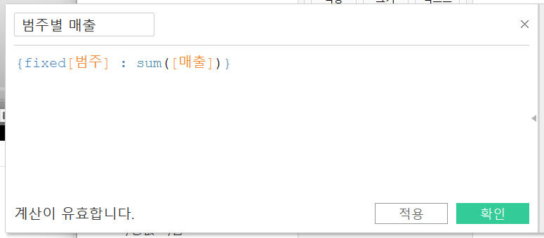
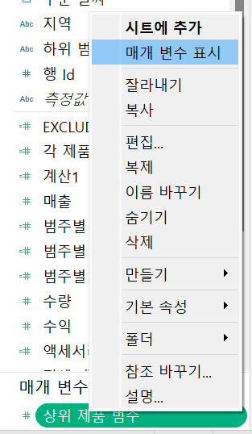

# Fifth Study Week

- 39강: [LOD](#39강-lod)

- 40강: [EXCLUDE](#40-lod-exclude)

- 41강: [INCLUDE](#41-lod-include)

- 42강 : [매개변수](#42-매개변수)

- 43강 : [매개변수 실습](#43-매개변수-실습) 


- 44강: [매개변수 실습](#44-매개변수-실습)

- 45강: [마크카드](#45-워크시트-마크카드)

- 46강: [서식계층](#46-서식-계층)

- 47강: [워크시트](#47-워크시트-서식)

- [문제1](#문제-1)

- [문제2](#문제-2)

## Study Schedule

| 강의 범위     | 강의 이수 여부 | 링크                                                                                                        |
|--------------|---------|-----------------------------------------------------------------------------------------------------------|
| 1~9강        |  ✅      | [링크](https://www.youtube.com/watch?v=AXkaUrJs-Ko&list=PL87tgIIryGsa5vdz6MsaOEF8PK-YqK3fz&index=84)       |
| 10~19강      | ✅      | [링크](https://www.youtube.com/watch?v=AXkaUrJs-Ko&list=PL87tgIIryGsa5vdz6MsaOEF8PK-YqK3fz&index=75)       |
| 20~29강      | ✅      | [링크](https://www.youtube.com/watch?v=AXkaUrJs-Ko&list=PL87tgIIryGsa5vdz6MsaOEF8PK-YqK3fz&index=65)       |
| 30~38강      | ✅      | [링크](https://www.youtube.com/watch?v=e6J0Ljd6h44&list=PL87tgIIryGsa5vdz6MsaOEF8PK-YqK3fz&index=55)       |
| 39~47강      | ✅      | [링크](https://www.youtube.com/watch?v=AXkaUrJs-Ko&list=PL87tgIIryGsa5vdz6MsaOEF8PK-YqK3fz&index=45)       |
| 48~59강      | 🍽️      | [링크](https://www.youtube.com/watch?v=AXkaUrJs-Ko&list=PL87tgIIryGsa5vdz6MsaOEF8PK-YqK3fz&index=35)       |
| 60~69강      | 🍽️      | [링크](https://www.youtube.com/watch?v=AXkaUrJs-Ko&list=PL87tgIIryGsa5vdz6MsaOEF8PK-YqK3fz&index=25)       |
| 70~79강      | 🍽️      | [링크](https://www.youtube.com/watch?v=AXkaUrJs-Ko&list=PL87tgIIryGsa5vdz6MsaOEF8PK-YqK3fz&index=15)       |
| 80~89강      | 🍽️      | [링크](https://www.youtube.com/watch?v=AXkaUrJs-Ko&list=PL87tgIIryGsa5vdz6MsaOEF8PK-YqK3fz&index=5)        |


<!-- 여기까진 그대로 둬 주세요-->

> **🧞‍♀️ 오늘의 스터디는 지니와 함께합니다.**


## 39강. LOD

<!-- INCLUDE, EXCLUDE, FIXED 등 본 강의에서 알게 된 LOD 표현식에 대해 알게 된 점을 적어주세요. -->

LOD(='Level Of Detail') : 뷰의 세부 수준

태블로에서의 LOD 표현식은 현재 뷰에는 영향을 받지 않고 본인이 원하는 세부 수준에서 계산을 수행할 수 있다.

-> 계산할 수준을 세부적으로 제어 가능하도록 한다.

1. 매출 필드를 마크 카드 텍스트에 d&d -> 원본 데이터의 모든 매출 총합계가 나타난다.

2. 지역 필드를 행 선반에 d&d -> 지역이라는 세부 수준으로 각 매출이 계산되어 표시된다.
=> 즉, 뷰에서는 전체 데이터 수준이 아닌 지역 수준에 따라 매출 데이터를 나눠서 표시된다.

----

### 종류 : 'INCLUDE', 'EXCLUDE', 'FIXED'

### 1. 'FIXED'

FIXED LOD는 현재 뷰에 있는 차원과 상관없이 계산된 필드에서 원하는 차원을 계산.

#### (1) 'FIXED에서 설정한 차원이 뷰에 포함되어 있을 때'

cf. 계산식 작성 시 여러 개의 차원을 기준으로 사용할 경우, 각 차원들을 ','로 구분해준다.

 

-> 바로 나타내어 확인 가능하다!


#### (2) FIXED에서 설정한 차원이 뷰에 포함되어 있지 않을 때

------

1. 지역 필드를 행 선반에 d&d, 매출 필드를 마크 카드 텍스트에 d&d

    -> 현재 뷰에서는 각 지역별 매출을 나타내고 있음.

    -> 우리가 원하는 것 : 제품 범주 차원에 따라 매출 표시.

    -> 계산된 필드_범주별 매출 필드 만들기



------

2. 우리가 원하는 것 : 제품별 매출 구성 비율(%)

```
퀵 테이블 계산을 통해 '구성 비율'을 나타낼 수 있다.
```


-> 현재 뷰에서 매출을 세부 수준인 제품의 범주 기준으로 구성 비율을 나타내며, 표시된 하위 범주들을 통해 구성 비율을 계산한다.


-> 필터 표시_직접적으로 하위 범주 편집 가능

------

-> 필터로 하위 범주 제거해도 계산 시에는 해당 하위 범주들을 포함하기 위해 FIXED 사용.

LOD 표현식에서는 차원을 입력하지 않으면 전체 데이터 기준에 따라 계산한다.

```전체 매출 필드 = {FIXED : SUM([매출])}```


계산된 필드 -> '제품 구성 비율'


-> 제품 구성 비율 필드 우클릭 -> 기본 속성_숫자 형식 : 백분율


## 40. LOD EXCLUDE

<!-- INCLUDE, EXCLUDE, FIXED 등 본 강의에서 알게 된 LOD 표현식에 대해 알게 된 점을 적고, 아래 두 질문에 답해보세요 :) -->


### 2. 'EXCLUDE'

: 현재 뷰에서 특정 차원을 제외하여 계산할 때 사용.

제품의 하위 범주별 매출을 보여주고 있을 때, 범주별 매출을 보기 위해서 'FIXED' 또는 'EXCLUDE'를 사용한다.


-> '분석' 패널에서 '총계' 더블 클릭

-> 두 LOD 표현식이 '하위 범주' 차원이 아니라 설정한 '범주' 차원을 기준으로 계산되고 있다는 것을 확인할 수 있다.

------

> **🧞‍♀️ FIXED와 EXCLUDE을 사용하는 경우의 차이가 무엇인가요?**

```


1. '하위 범주'를 '제조업체' 수준으로 나타내면 FIXED를 사용한 값은 변경되지 않지만 EXCLUDE를 사용한 필드의 경우 '하위 범주' 차원을 무시하고 매출의 합계를 표시하긴 하지만 현재 뷰에 있는 '제조업체' 차원이 '하위 범주' 보다 세부 수준이 더 낮아서 제조업체 기준으로 관련된 매출을 표시한다.

2. '하위 범주' 필드로 필터를 걸어 확인할 수 있다.
필터로 하위 범주 일부 변경 시 EXCLUDE를 사용한 값은 변경이 되는 반면, FIXED를 사용한 값은 변경되지 않고 고정되어 있다.
-> FIXED는 현재 뷰와 상관없이 특성 차원을 사용해 계산하므로 필터의 영향을 받지 않으나, EXCLUDE는 뷰에 있는 차원을 사용해 계산하므로 관련 차원을 필터로 걸어보면 필터가 영향을 받는다.

```


> **실습**

```하위 범주에 있는 제품 중 한 제품의 매출을 기준으로 다른 제품들의 매출과의 차이를 비교해보자!```

액세서리 매출 필드 만들기
-> 각 제품마다 '액세서리'의 매출 값을 표시하는 필드 만들기

=> EXCLUDE_액세서리 : 하위 범주 차원을 무시하고 액세서리의 매출 값만 반환


각 제품들의 매출과 액세서리의 매출 차이를 계산하는 필드 만들기
-> 'ATTR'함수 이용


> **🧞‍♀️ 왜 ATTR 함수를 사용하나요?**

```
- EXCLUDE[하위 범주]로 계산된 매출은 하위 범주가 제외된 집계 수준에서 구해지기 때문에, 모든 하위 범주에 대해 동일한 값을 가진다.

- 시각화의 차원에 따라 하위 범주가 여러 개일 경우, 각 하위 범주마다 해당 매출을 참조하려하려 할때, 단일 값을 보장하기 위해 ATTR로 고정하는 것이다.
```


## 41. LOD INCLUDE

<!-- INCLUDE, EXCLUDE, FIXED 등 본 강의에서 알게 된 LOD 표현식에 대해 알게 된 점을 적고, 아래 두 질문에 답해보세요 :) -->


### 3. INCLUDE

: 현재 뷰에서 특정 차원을 추가하여 계산한다.

EXCLUDE와 같이 차원 필터를 통해 해당 값을 변경할 수 있다.

> **실습**

```각 도시의 고객당 평균 매출을 확인해보자!```

-> 국가/지역별 시/도별 주문 ID에 따른 매출 -> 분석 탭에서 총계_'평균'으로 변경.


> 뷰를 확인해보면 각 도시의 고객당 평균 매출을 표시하고 있으나, 해당 값들은 따로 필드를 생성한 게 아니므로 값을 재사용하기 위해 'INCLUDE LOD' 표현식을 사용한다.

주문 ID에 따른 평균 매출 필드 = ```AVG({INCLUDE[주문 Id]:SUM([매출])})```

-> 주문 ID 차원을 포함해서 합계한 매출의 평균을 반환한다.


```AVG({FIXED[주문 Id]: SUM([매출])})```
-> FIXED LOD를 통해서도 동일한 결과를 나타낼 수 있다.


-----

> **🧞‍♀️ 그렇다면 어떤 경우에 각 표현식을 사용하나요? 예시와 함께 적어보아요**

- 뷰에 표시되는 값이 차원이면, FIXED LOD 표현식만 사용할 수 있다.
```
FIXED LOD 표현식은 차원과 측정값을 반환할 수 있는데, INCLUDE와 EXCLUDE LOD 표현식들은 측정값만 반환한다.
```
- 반환 값이 차원 필터의 영향을 받게 되는 경우, INCLUDE 또는 EXCLUDE LOD 표현식을 사용해야 한다.
```
FIXED LOD 표현식은 차원 필터에 영향을 받지 않지만 INCLUDE와 EXCLUDE LOD 표현식들은 차원 필터에 영향을 받는다.
```

## 42. 매개변수

<!-- 매개변수에 대해 알게 된 점을 적어주세요 -->

매개변수 : 고정된 상수 값이 아닌 동적인 값으로 변경하기 위해 활용.

-> 반드시 '계산식', '필터', '참조선'과 함께 사용된다.

### 필터를 통해 매출 상위 10개 제품 표시


-> 현재 뷰에서 바로 매출 상위 5개 표시하기 위해서 어떻게 할까?
-> 지금 상황에선, 일일이 필터 편집에서 값 변경(귀찮..ㅋ)
--> 이럴 때, '매개변수' 이용.

### 매개변수 만드는 방법
-----
1. 필터를 통해 만드는 방법


2. 필드 위에 마우스 우클릭 -> 만들기_매개 변수

    -> 이 경우에는 선택했던 필드에 데이터 유형이 설정되어 있을 것.

3. 데이터 패널을 통해 매개변수를 만드는 방법




-> 필터에서 직접 편집


```
매개 변수는 반드시 '계산식', '필터', '참조선'과 함께 사용해야 작동이 되므로.
```
-----

> **🧞‍♀️ 집합에도 매개변수를 적용할 수 있나요? 시도해봅시다**


## 43. 매개변수 실습
<!-- 매개변수에 대해 알게 된 점을 적어주세요 -->

국가/지역 : 행 선반, 매출 : 열 선반 -> 각 국가별 매출 나타냄.
-> 뷰에서 표시되어 있는 차원을 '매개 변수'를 활용해 변경해보자!


-> 매개 변수에서 어떤 차원을 선택해서 보여주고 있는지 알 수 없다!

-> 매개 변수에 따른 제목 변경이 되도록 변경.


-----

측정값을 가지고 매개 변수를 만들어 보자!


-> 이 또한 마찬가지로 제목 변경이 되도록 변경.


각각의 측정값에 단위를 표시해보자!

앞서 만든 '측정값 선택' 필드 복제 -> '측정값 단위' 필드 만들기


## 44. 매개변수 실습

<!-- 매개변수에 대해 알게 된 점을 적어주세요 -->

### 매개 변수를 참조선에서 활용하기

> ### 1. 값 -> '새 매개 변수 만들기' -> '목표 매출'

=> 매개 변수에 값 입력하면 해당 값에 따라 참조선이 변경된다.


목표 매출 기준으로 국가별 달성 유무 확인 구분 BY '색상'
=> 계산된 필드 만들기


색상 구분한 결과


> ### 2. 그래프에서 시작 날짜와 마지막 날짜를 선택할 수 있도록 하고, 해당 날짜 범위의 매출 합계를 표시해보자!


-> '시작 날짜' 매개 변수 만들기

마찬가지로 필드 복사해서 '마지막 날짜' 매개 변수도 만들어준다!

분석_참조 구간을 테이블의 주문 날짜 위로 d&d

 : 참조 구간 편집

-> 만든 매개 변수들 표시해주고 범위 지정해보기


해당되는 날짜 범위에 매출 합계를 그래프 제목에 나타내보자!


```
total(sum(if [주문 날짜] >= [시작 날짜] and [주문 날짜] <= [마지막 날짜] then 매출 end))
```

삽입 이용해서 적절히 제목 만들어주기!


## 45. 워크시트 마크카드

<!-- 마크카드에 대해 알게 된 점을 적어주세요 -->

마크의 drop down에서 마크의 표현 방식 선택 가능하다.

기본적으로 d&d하면 Tableau는 자동으로 마크들이 막대로 표시된다.
-> 마크의 drop down에서 직접 변경 -> 차트 유형은 변경되지 않고 마크만 변경된다.

색상의 '후광' 옵션은 '맵 차트'에서만 적용된다.

연속형 필드를 색상에 d&d하면 색상 범위 범례가 나타나고, 불연속형 필드는 항목별 범례가 나타나 사용자가 직접 색상 변경이 가능하다.

한 번에 마크 텍스트 카드에 '매출', '수량', '수익' 넣으면 뭐가 뭔지 구분이 되질 않으니 레이블 편집 이용.


범주 필드를 세부 정보 마크 필드에 d&d
-> 각 국가의 막대들이 제품 범주에 따라 구분된다.

도구 설명 -> 마우스 갖다대면 나타나는 창 변경 가능

라인 차트의 경우 마크 창에 '경로'가 새로 생김을 확인할 수 있다.

차트 유형을 '원'으로 변경 시 '모양'이 새로 생김을 확인할 수 있다.

## 46. 서식 계층

<!-- 서식계층에 대해 알게 된 점을 적어주세요 -->

> **🧞‍♀️ 서식계층을 일반적인 것에서 구체적인 것 순서로 기입해보세요**


해당 서식 계층에서 상위 계층에 서식을 설정했을 때 상위 계층보다 아래 계층인 경우에 서식을 변경하게 되면 해당 아래 계층에 설정한 서식이 적용된다.

> 서식 탭의 통합 문서 편집 이용 적절히 !

1. 시트에서 변경
2. 행/열 서식에서 좀 더 구체적인 설정 가능
-> 이후에는 시트 탭에서 변경해도 해당 서식 변경X
3. 특정 필드 설정

    (1) 서식 패널 상단에 '필드' 선택 -> 서식 변경할 필드 선택하는 방법

    

    (2) 뷰에서 마우스 우클릭 -> '서식'

4. 필드 레이블
해당 필드 레이블에 마우스 우클릭 -> '서식'
5. 마크와 제목
마크 카드의 텍스트에서 레이블 편집

> 서식 탭의 '워크시트 서식 지우기' -> 싹 다 지울 수 있다!


## 47. 워크시트 서식

<!-- 워크시트 서식에 대해 알게 된 점을 적어주세요!-->
```
'음영' 옵션은 다른 옵션들과 달리 '행/열 색상 교차'라는 설정이 있다.
-> 데이터 셀의 구간을 설정해서 음영을 줄 수 있다.

행 색상 교차에서 구간 크기는 각 눈금이 하나의 데이터 셀 단위를 의미.
-> 음영의 간격 조절할 수 있다!
```

## 문제 리스트


## 문제 1.

```
가장 많이 주문한 사람들은 물건 배송을 빨리 받았을까요?
조건을 준수하여 아래 이미지를 만들어봅시다.
1) 국가/지역별(이하 '나라'로 통칭), 범주별로 배송일자가 다를 수 있으니 먼저, 나라별/범주별로 평균 배송일자를 설정한 뒤,
2) 각 나라에서 가장 많이 주문한 사람의 이름을 첫 번째 열,
3) 그 사람이 주문한 제품 이름을 2번째 열,
4) 각 상품이 배송까지 걸린 날 수를 표현하고
5) 그리고 만약 배송이 각 나라/범주별 평균보다 빨랐다면 '빠름', 같다면 '평균', 느리다면 '느림' 으로 print 해주세요. 
```


배송 속도 수준 필드 만들기¡


적절히 필드 배치 후 결과 확인～¡


<!-- 여기까지 오는 과정 중 알게 된 점을 기입하고, 결과는 시트 명을 본인 이름으로 바꾸어 표시해주세요.-->

## 문제 2.

```
채원이는 태블로를 쓰실 수 없는 상사분께 보고하기 위한 대시보드를 만들고 싶어요. 

제품 중분류별로 구분하되 매개변수로써 수익, 매출, 수량을 입력하면 저절로 각각 지표에 해당하는 그래프로 바뀌도록 설계하고자 해요.

 어떤 값이 각 지표의 평균보다 낮은 값을 갖고 있다면 색깔을 주황색으로, 그것보다 높다면 파란색으로 표시하고 싶어요. 그 평균값은 각 지표별로 달라야 해요.
```


<!-- 예시 사진은 지워주세요-->