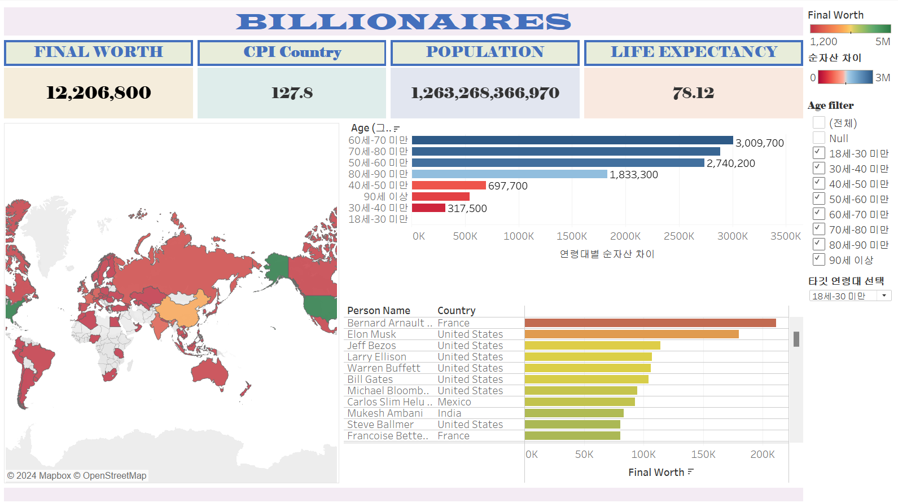
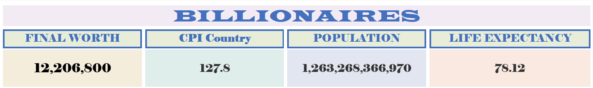
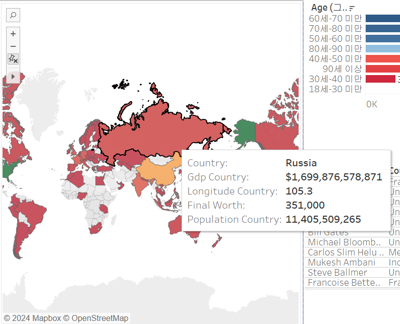
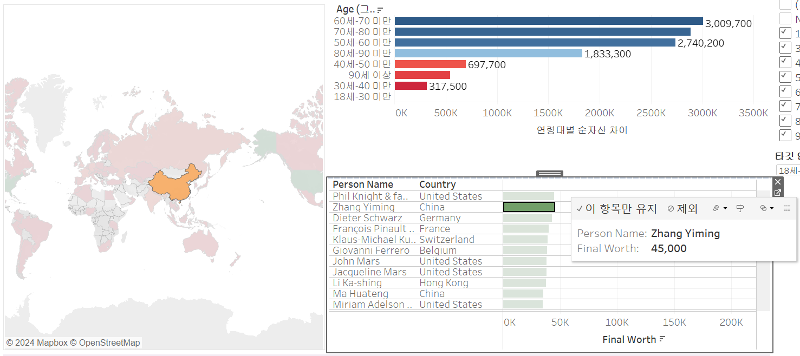
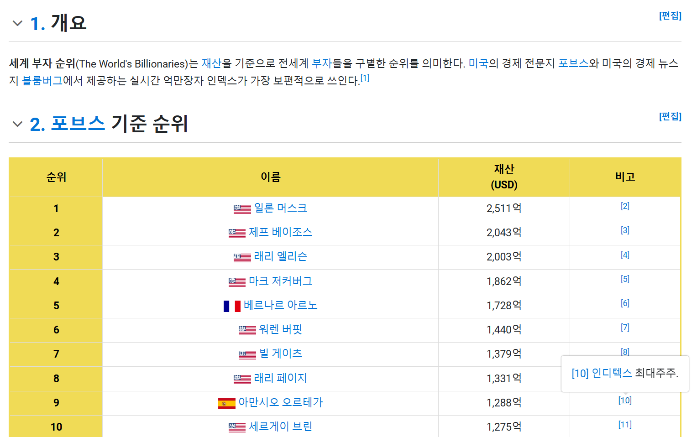
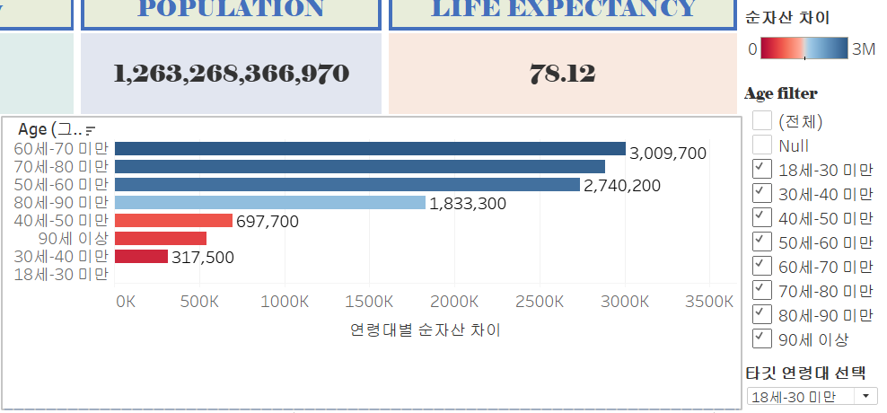

# 9주차 문제

여러 대시보드를 참고하시어, 학술제 주제 관련 데이터(없을 경우, 본인 관심 데이터)를 사용해 나만의 대시보드를 제작해주세요.

**단, 워크시트 3개 이상의 그래프를 표시해야 하며 각 시트 간 상호작용성 필터 or 하이라이트 동작은 꼭 추가되어야 합니다.**

어떤 부분에 가중을 두었는지, 어떤 사용자 편의성을 고려하였는지에 대한 설명이 필요합니다.

---

### 사용한 데이터셋

https://www.kaggle.com/datasets/nelgiriyewithana/billionaires-statistics-dataset

### 대시보드 링크(태블로 퍼블릭)

https://public.tableau.com/app/profile/.10017303/viz/BILLIONAIRES_17332720887890/1?publish=yes

---
### 대시보드 설명

> billionaires 대시보드입니다~!

- 전체 순자산을 확인할 수 있는 final worth
- 부자가 위치한 country의 cpi의 평균을 확인할 수 있는 cpi country
- 전체 population 분포 수를 확인할 수 있는 population
- 부자들의 평균 기대수명을 확인할 수 있는 life expectancy

해당되는 단어에 대한 정확한 정의가 궁금하신 분들을 위해 각 단어 부분을 클릭하시면 관련 사이트 링크로 이동하는 url 동작을 추가하였습니다. 

맵차트의 경우 마우스 오버하시면 해당 국가의 country, gdp, final worth, population을 확인할 수 있도록 설정했습니다.

특히 final worth, population의 경우는 전체 billionaires 값과 바로 비교할 수 있도록 추가해봤습니다.

이 맵 차트의 경우 오른쪽 하단의 'final worth별 사람 이름'을 알려주는 그래프와 상호작용되어 있습니다. 따라서 확인하고픈 사람의 이름을 클릭하시면 해당 사람이 속한 지역이 맵 차트 상에서 하이라이트 됨을 확인하실 수 있습니다.

다만, 'final worth별 사람 이름'을 알려주는 그래프의 경우 마우스 클릭 시 '포브스 선정 세계 부자 순위 top 20'에 대한 나무위키 링크로 이동하기 때문에 사용에 유의 부탁드립니다. 나무위키 상에서 해당되는 사람의 재산과 특징을 확인해볼 수 있습니다.

마지막으로 해당 그래프는 확인하고픈 연령대를 오른쪽의 'age filter'를 통해 고르면 해당 연령대에 해당하는 사람들의 순자산을 확인해볼 수 있습니다.
이때, '타깃 연령대 선택' 부분을 통해 기준 연령대를 지정할 수 있으며, 최종적으로 선택된 기준 연령대와 타 연령대 그룹 간의 순자산 차이가 그래프 상에 표현됩니다. (제가 궁금해서 넣었습니다 ^^)

>> 끗~!
